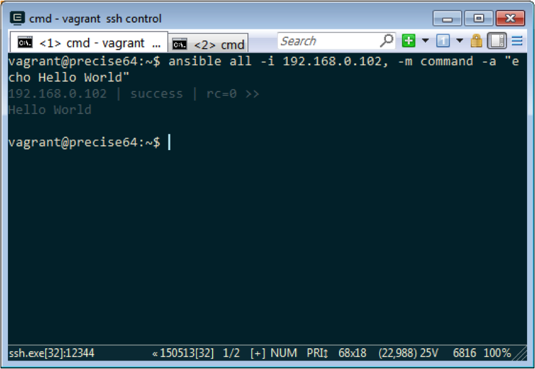
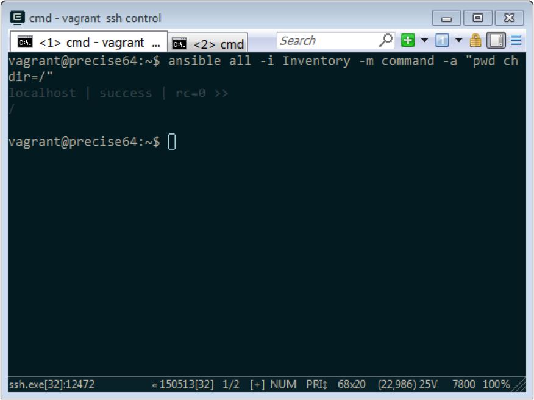
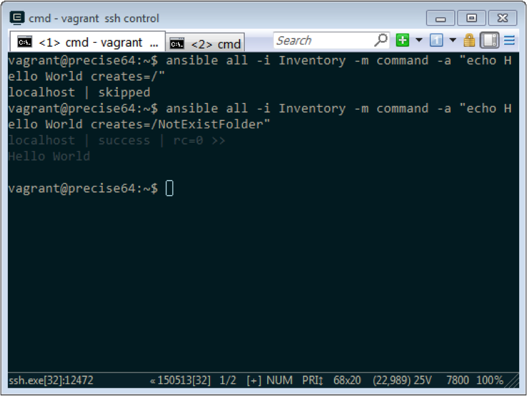
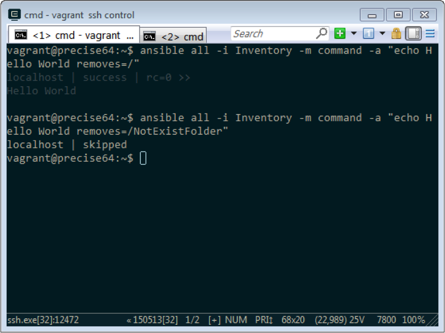

Ansible 的 Command module 可以用來執行命令。  

<!-- More -->

 

可用的參數如下：  

| parameter | required | default | choices | comments |
|:-------------:|:-------------:|:-------------:|:-------------:|:-------------:|
| chdir | no | | | cd into this directory before running the command |
| creates | no | | | a filename or (since 2.0) glob pattern, when it already exists, this step will not be run. |
| executable | no | | | change the shell used to execute the command. Should be an absolute path to the executable. |
| free_form | yes | | | the command module takes a free form command to run. There is no parameter actually named 'free form'. See the examples! |
| removes | no | | | a filename or (since 2.0) glob pattern, when it does not exist, this step will not be run. |
| warn | no | True | | if command warnings are on in ansible.cfg, do not warn about this particular line if set to no/false. |

 

以 Ad-Hoc 模式為例...

 

要讓指定電腦運行指定的命令，可以直接用 -m 指定使用 Command module，並用 -a 指定命令。  

    ansible <Group> -i <IP>, -m command -a "<Command>"
    ansible <Group> -i <Inventory> -m command -a "<Command>"

 

要先切換至指定工作目錄再執行命令，可加帶 chdir 參數指定要切換至的工作目錄。  

 

要在指定的目錄或檔案存在的時才運行指定的命令，可加帶 creates 參數指定目錄或檔案。  

    ansible <Group> -i <IP>, -m command -a "<Command> creates=<FolderOrFile>"
    ansible <Group> -i <Inventory> -m command -a "<Command> creates=<FolderOrFile>"

 

要在指定的目錄或檔案不存在時才運行指定的命令，可加帶 removes 參數指定目錄或檔案。  

    ansible <Group> -i <IP>, -m command -a "<Command> removes=<FolderOrFile>"
    ansible <Group> -i <Inventory> -m command -a "<Command> removes=<FolderOrFile>"

 

Link
----
* [command - Executes a command on a remote node — Ansible Documentation](http://docs.ansible.com/ansible/command_module.html)
