Cake for Visual Studio 擴充套件可讓 Visual Studio 支援 Cake 的使用，可直接開啟 Extensions and Updates 功能...    

<!-- More -->

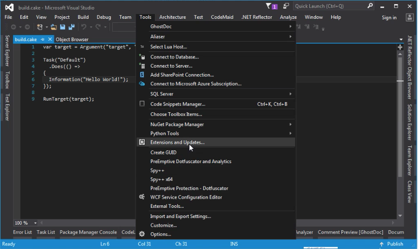

 

搜尋並安裝。  

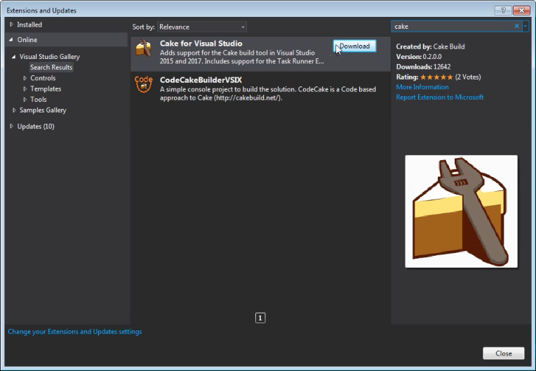

 

安裝好後在 Build 主選單選項下會多 Cake Build 選單選項，裡面的 Install Cake config file 可以用來加入 Cake 設定檔 (cake.config)。  

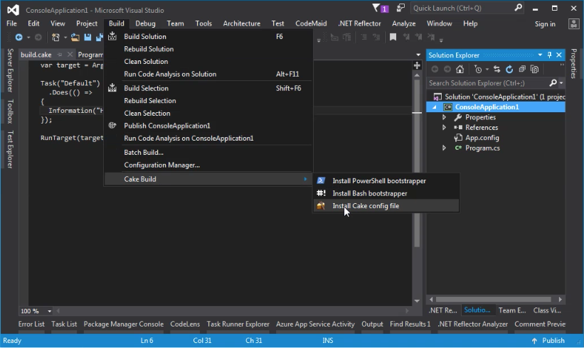

 

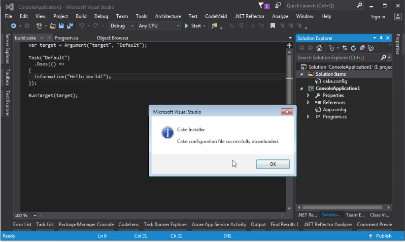

 

裡面的 Install PowerShell bootstrapper 可加入 Cake bootstrapper 檔 (build.ps1)。  

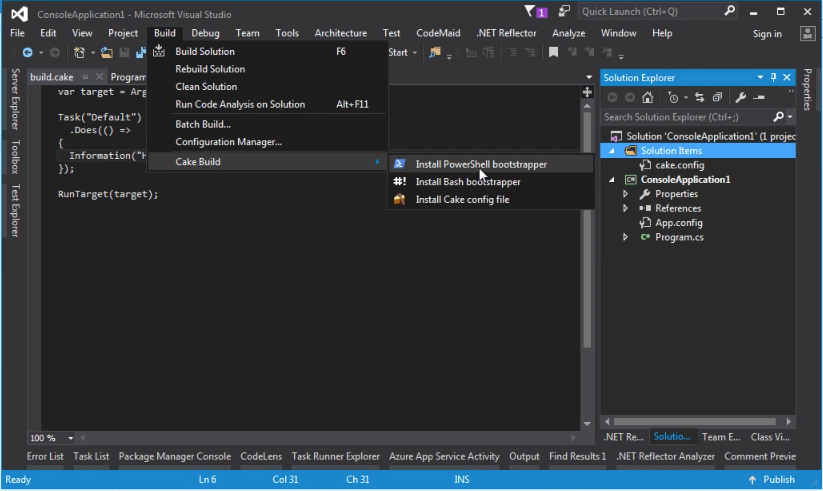

 

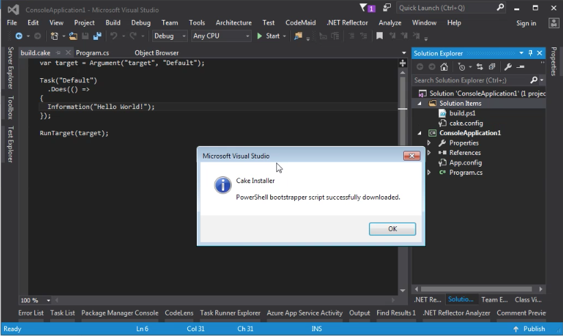

 

要加入 Cake 腳本檔的話，可以用 Cake Build Script 範本加入新項目。  

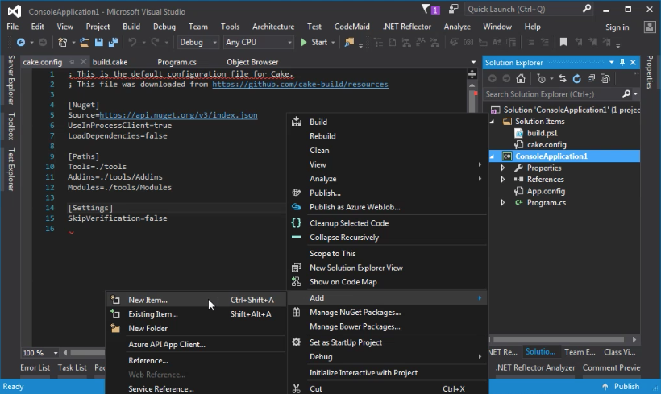

 

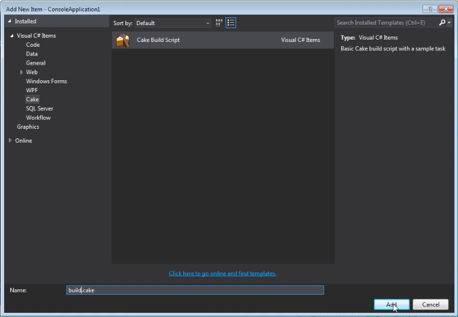

 

如要運行 Cake 腳本，可以叫出 Task Runner Explorer。  

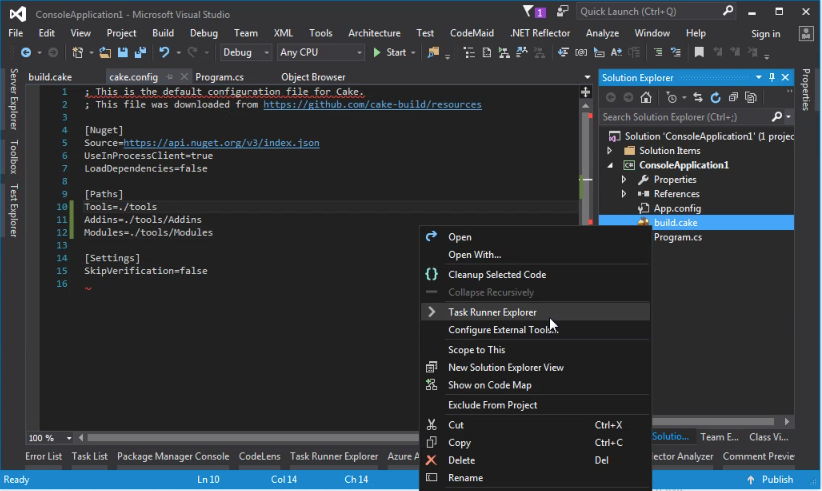

 

透過 Task Runner Explorer 選取 Task 進行運行。  

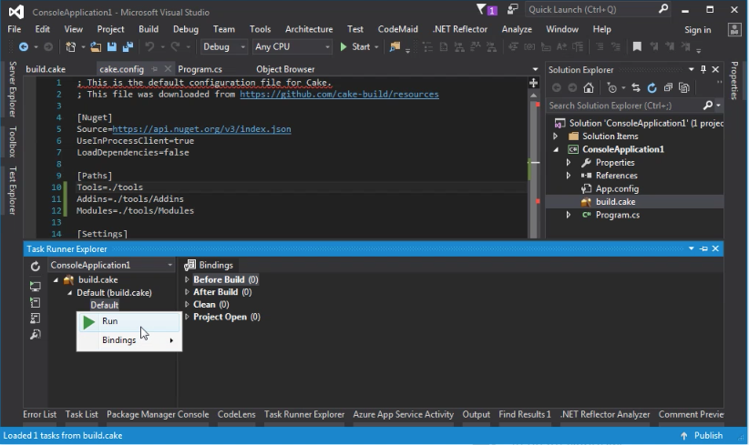

 

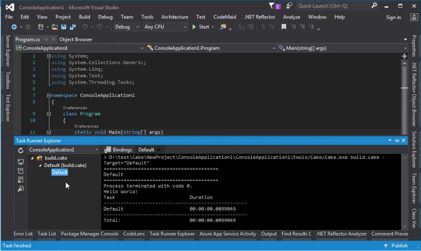

 

Link
----
* [Cake for Visual Studio - Visual Studio Marketplace](https://marketplace.visualstudio.com/items?itemName=vs-publisher-1392591.CakeforVisualStudio)
* [Cake - Visual Studio](https://cakebuild.net/docs/editors/visualstudio)
