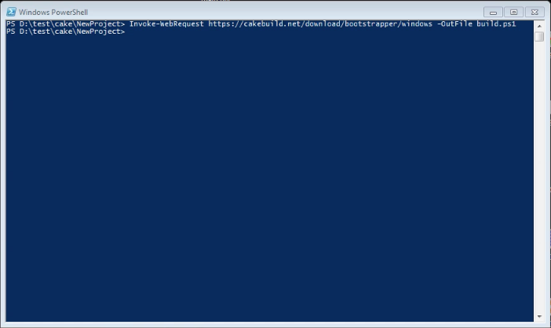
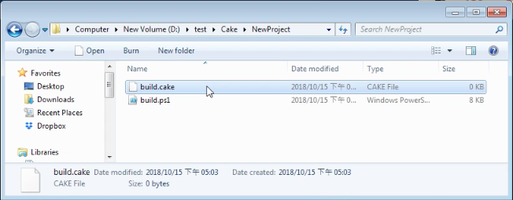
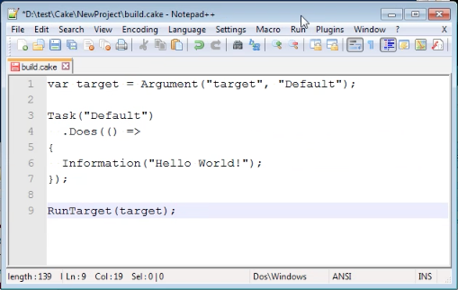

要在新的專案中使用 Cake，首先要下載 bootstrapper。   

<!-- More -->

    Invoke-WebRequest https://cakebuild.net/download/bootstrapper/windows -OutFile build.ps1



<br/>


然後建立 cake 腳本檔。  



<br/>


裡面放置腳本的內容，像是這邊就放置了一個簡單的腳本。腳本運行後會顯示 "Hello World!" 字樣。  

```
var target = Argument("target", "Default");

Task("Default")
  .Does(() =>
{
  Information("Hello World!");
});

RunTarget(target);
```



<br/>


最後只要調用 bootstrapper 運行腳本就可以了。  

    ./build.ps1



<br/>


Link
----
* [Cake - Setting Up A New Project](https://cakebuild.net/docs/tutorials/setting-up-a-new-project)
