要在 ubuntu 12.04 安裝 Calibre Web，可先將 apt-get 更新。  

<!-- More -->

    sudo apt-get update

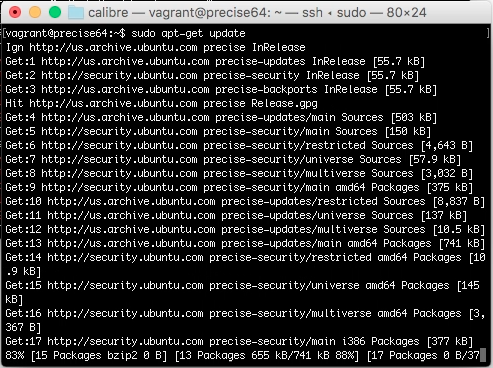

 

因為會用到 pip 與 git，所以用 apt-get 安裝 python-setuptools 與 git。  

    sudo apt-get install python-setuptools git -y

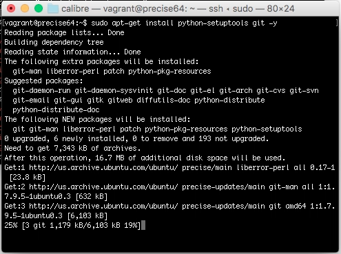

 

使用 easy_install 安裝 pip。  

    sudo easy_install pip

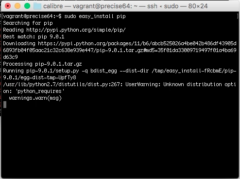

 

將 Calibre Web 下載下來。  

    git clone https://github.com/janeczku/calibre-web.git	

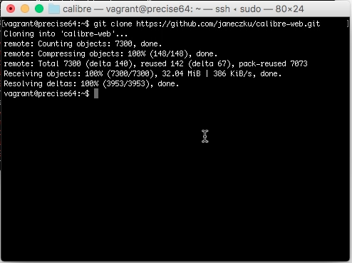

 

下載 KindleGen。  

    wget http://kindlegen.s3.amazonaws.com/kindlegen_linux_2.6_i386_v2_9.tar.gz

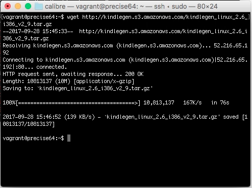

 

將 KindleGen 放至 Calibre Web 下的 vendor 目錄。  

    sudo mkdir calibre-web/vendor 	
    sudo tar -C calibre-web/vendor -xzvf kindlegen_linux_2.6_i386_v2_9.tar.gz

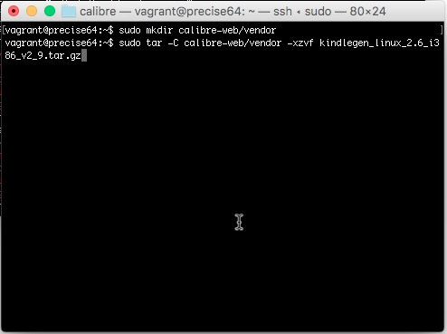

 

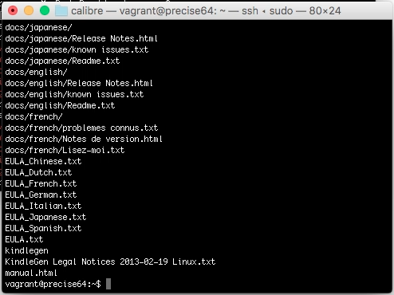

 

使用 pip 安裝 dependencies。  

    sudo pip install --target calibre-web/vendor -r calibre-web/requirements.txt

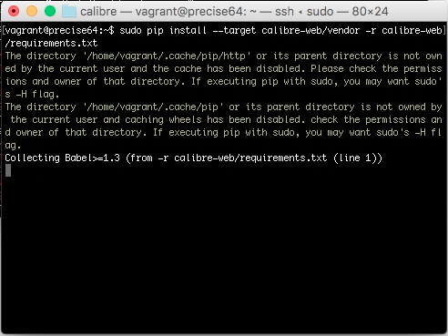

 

如果要讓 Calibre Web 在上傳時從 PDF 擷取書本封面，可加裝 ImageMagick

    sudo apt-get install imagemagick -y

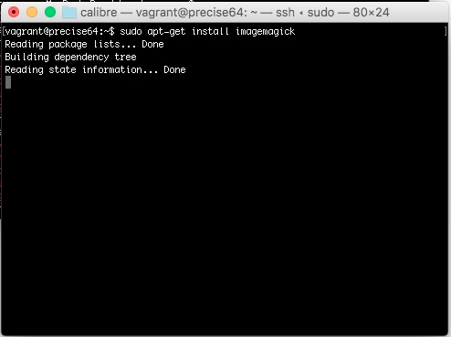

 

如果 urlib3 與 chardet 套件版本不對，Calibre Web 會無法運行，因此這邊筆者會重裝 urlib3 套件。  

    sudo pip uninstall urllib3 -y
    sudo pip install urllib3

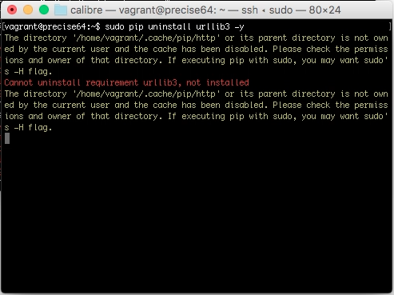

 

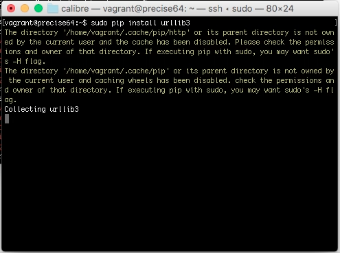

 

重裝 chardet 套件。  

    sudo pip uninstall chardet -y
    sudo pip install chardet

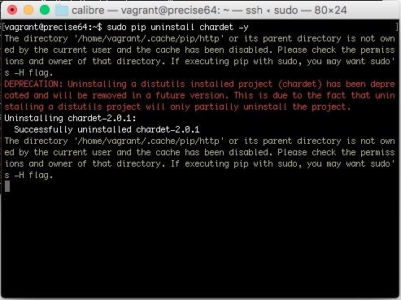

 

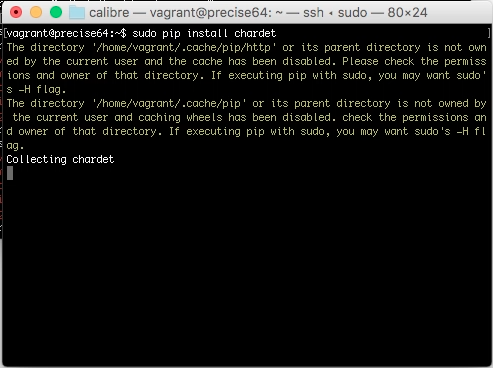

 

將 Calibre Web 服務運行起來。  

    sudo python calibre-web/cps.py

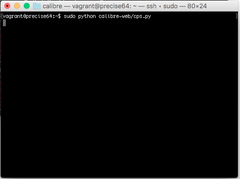

 

訪問 http://localhost:8083，指定 Calibre database 位置，這邊的 Calibre 資料庫指的是 Calibre 桌機版的 Calibre library 目錄下的 metadata.db，可以直接指到同一個檔案，或是將之複製一份放置在欲放置的位置。  

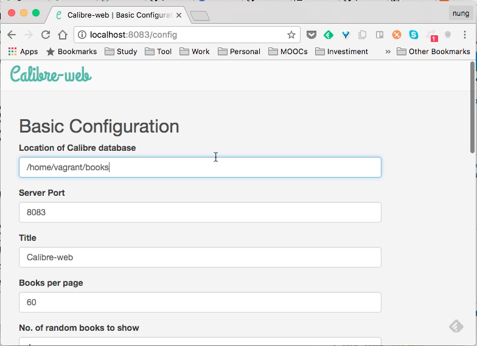

 

設定完導回 http://localhost:8083 首頁，輸入帳密 admin/admin123 登入。  

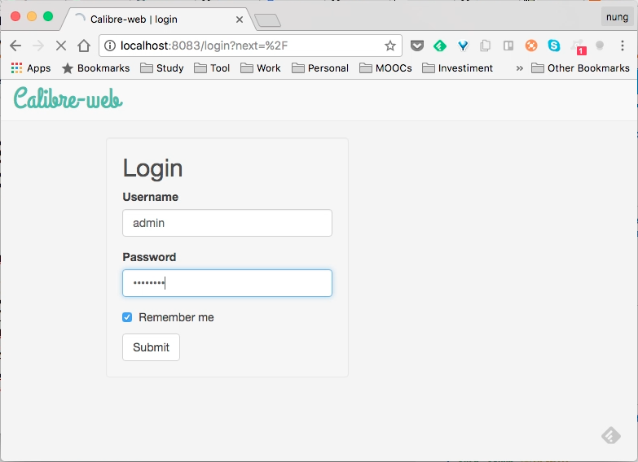

 

即可開始使用 Calibre Web。  

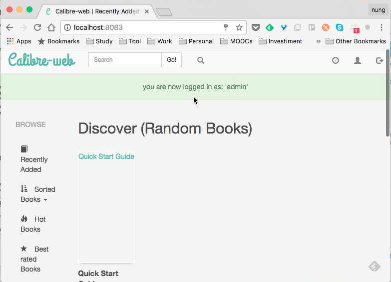

 

Link
----
* [janeczku/calibre-web: Web app for browsing, reading and downloading eBooks stored in a Calibre database](https://github.com/janeczku/calibre-web)
