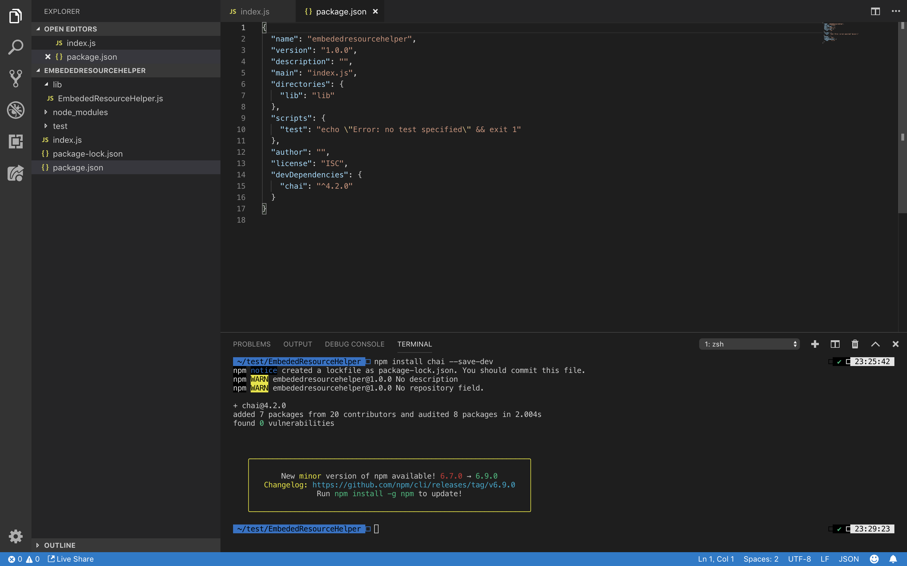
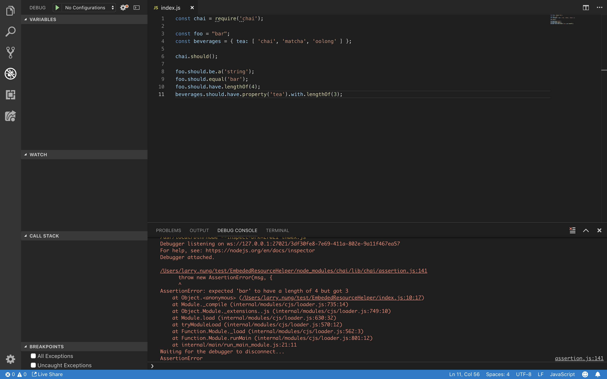
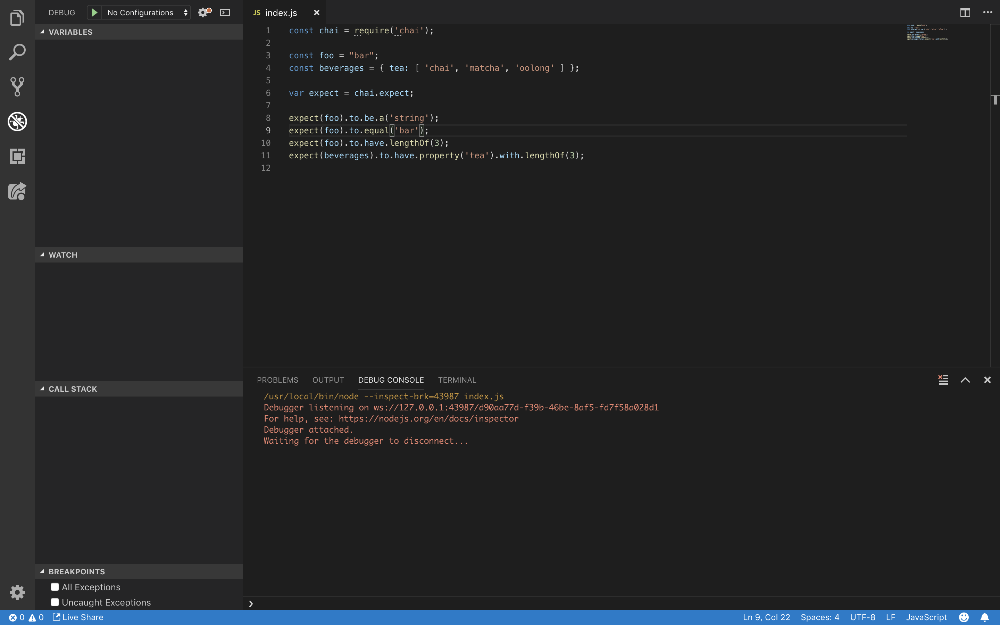
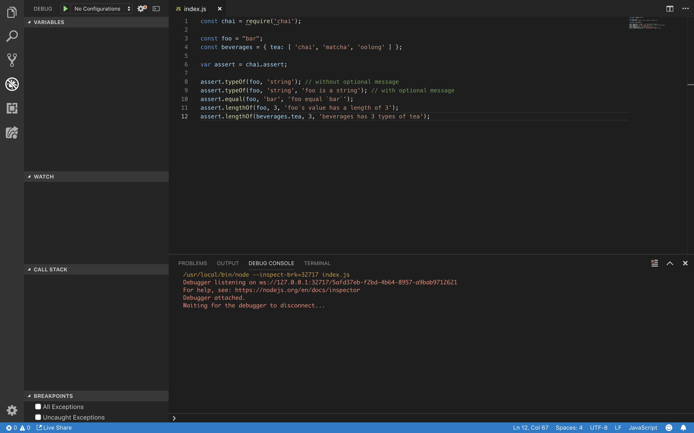

Chai 是 Node.js 的 BDD / TDD 斷言套件。  

<!-- More -->

</br>


使用前先從 Registry 下載套件。  

    npm install chai --save-dev



</br>


Chai 有三種撰寫風格，should、expect、assert，assert 是比較偏向傳統的斷言方式，expect 與 should 則是偏向 BDD style 的斷言方式。  

</br>


無論哪個撰寫風格在撰寫前都需引用 Chai 套件。  

```js
const chai = require('chai');
```

</br>


should 撰寫風格使用上要先告知 Chai 套件使用 should 撰寫風格。  

```js
chai.should();
```

</br>


接著用目標值應該是...、目標值應該等於...、目標值應該有...類似這樣的寫法撰寫斷言。  

```js
...
target.should.be.a(type);
target.should.eaequal(value);
target.should.have.lengthOf(length);
...
```

</br>


程式寫起來會像下面這樣:  

```js
const chai = require('chai');
const foo = "bar";
const beverages = { tea: [ 'chai', 'matcha', 'oolong' ] };
chai.should();
foo.should.be.a('string');
foo.should.equal('bar');
foo.should.have.lengthOf(3);
beverages.should.have.property('tea').with.lengthOf(3);
```


</br>


如果斷言錯誤，可以看到像下面這樣斷言錯誤的訊息。  



</br>


expect 撰寫風格使用上要先取得 expect。  

```js
var expect = chai.expect;
```

</br>


接著用預期目標值是...、預期目標值等於...、預期目標值有...類似這樣的寫法撰寫斷言。  

```js
...                                                     
expect(target).to.be.a(type);
expect(target).to.eaequal(value);                  
expect(target).to.have.lengthOf(length); 
...
```

</br>


程式寫起來會像下面這樣:                            

```js
const chai = require('chai');

const foo = "bar";
const beverages = { tea: [ 'chai', 'matcha', 'oolong' ] };

var expect = chai.expect;

expect(foo).to.be.a('string');
expect(foo).to.equal('bar');
expect(foo).to.have.lengthOf(3);
expect(beverages).to.have.property('tea').with.lengthOf(3);
```



</br>


assert 撰寫風格使用上要先取得 assert。 

```js
var assert = chai.assert;
```

</br>


接著用斷言目標值型態為指定型態、斷言目標值為指定值、預期目標值長度為指定長度...類似這樣的寫法撰寫斷言。  

```js
...         
assert.typeOf(target, type);  
assert.equal(target, value);  
assert.lengthof(target, length);
...
```

</br>


程式寫起來會像下面這樣:  

```js
const chai = require('chai');
const foo = "bar";
const beverages = { tea: [ 'chai', 'matcha', 'oolong' ] };
var assert = chai.assert;
assert.typeOf(foo, 'string'); // without optional message
assert.typeOf(foo, 'string', 'foo is a string'); // with optional message
assert.equal(foo, 'bar', 'foo equal `bar`');
assert.lengthOf(foo, 3, 'foo`s value has a length of 3');
assert.lengthOf(beverages.tea, 3, 'beverages has 3 types of tea');
```



<br/>


Link
----
* [Chai](https://www.chaijs.com/)
* [Assertion Styles - Chai](https://www.chaijs.com/guide/styles/)
* [Assert - Chai](https://www.chaijs.com/api/assert/)
* [Expect / Should - Chai](https://www.chaijs.com/api/bdd/)
