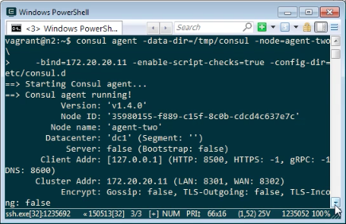
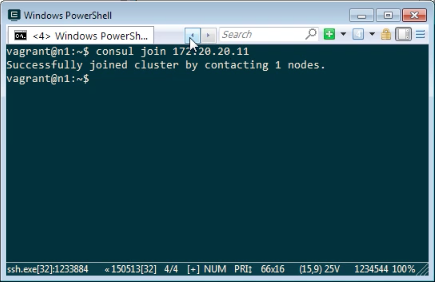
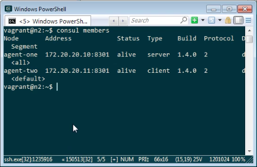

要設定 Consul Cluster，我們可以在一台電腦上用 Consul 命令啟用 Server 模式的 Agent。  

<!-- More -->

    consul agent -server -bootstrap-expect=1 \
    -data-dir=<DataDir> -node=<NodeName> -bind=<IP> \
    -enable-script-checks=true -config-dir=<ConfigDir>

 

然後在另外一台電腦用 Consul 命令啟用 Client 模式的 Agent。  

    consul agent -data-dir=<DataDir> -node=<NodeName> \
    -bind=<IP> -enable-script-checks=true -config-dir=<ConfigDir>

 

使用 Consul 的 join 命令將他們加到同一個 Cluster。  

    consul join <IP>

 

調用 Consul 的 members 命令可查驗 Cluster 的組成，確認 Cluster 是否設定成功。  

    consul members

 

Link
----
* [Consul Cluster | Consul - HashiCorp Learn](https://learn.hashicorp.com/consul/getting-started/join)
