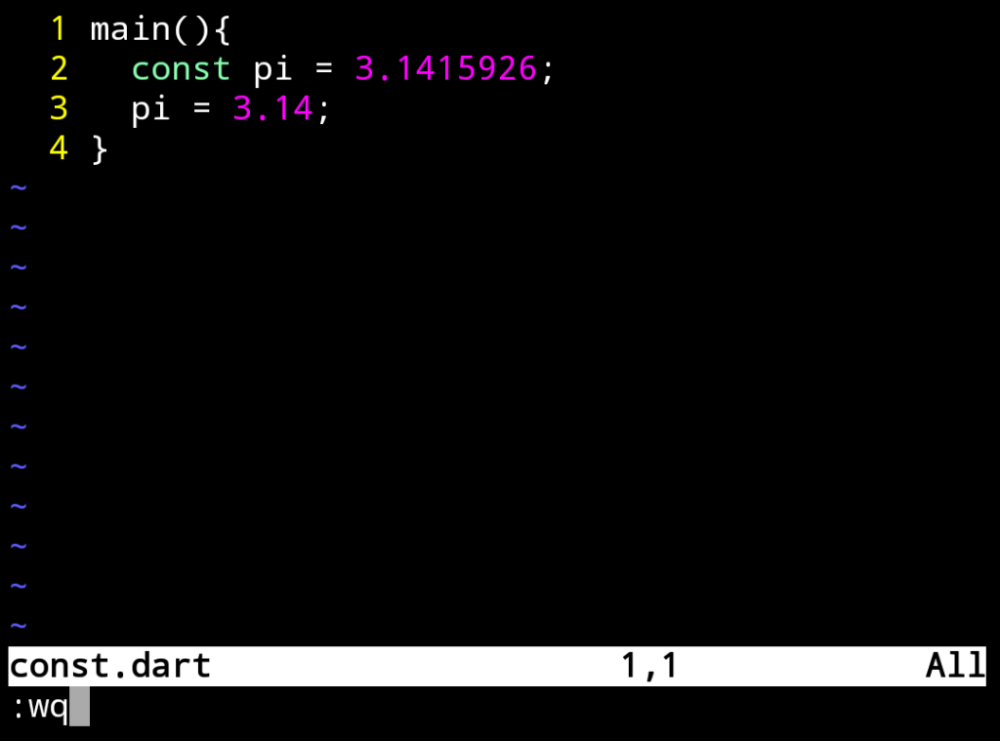
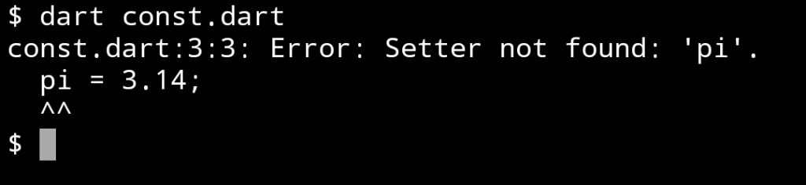
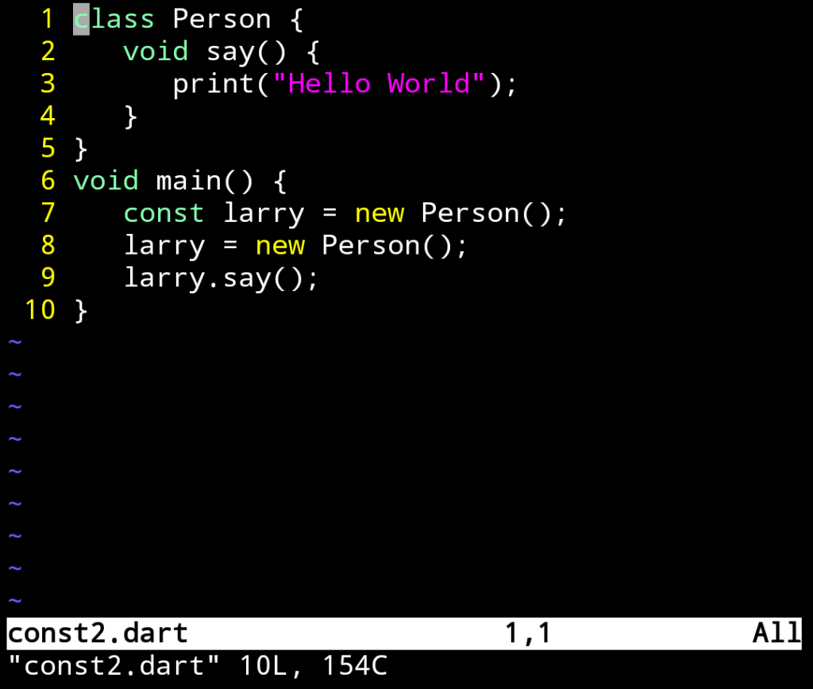
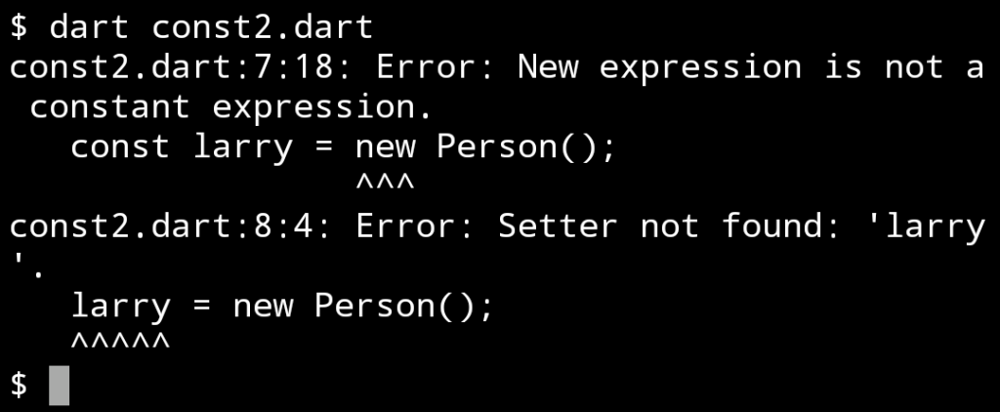

Dart 的 const 關鍵字可用來指定編譯時常數，指定編譯後就不會變動的值。

<!-- More -->

</br>


使用時只要在變數宣告前面加上 const 關鍵字即可。  

```dart
const pi = 3.1415926;
```

</br>


像是下面這樣的程式:

```dart
main(){
 const pi = 3.1415926
 pi = 3.14;
}
```



</br>


運行起來就會發生錯誤，因為透過 const 宣告的是常數，沒有 Setter 可以改變它的值。  



</br>


另外看一個比較複雜的例子，這邊用 const 去接建立出來的物件。  

```dart
class Person {
  2    void say() {
  3       print("Hello World");
  4    }
  5 }
  6 void main() {
  7    const larry = new Person();
  8    larry = new Person();
  9    larry.say();
 10 }
```



</br>


運行後會出錯，因為編譯時常數無法接運行時才產生的物件。  


