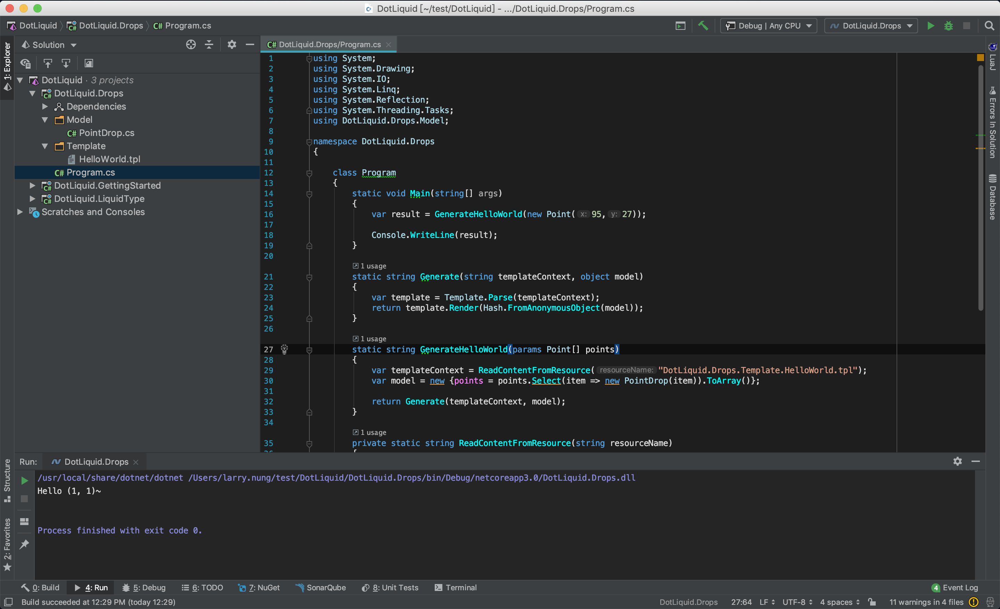

使用 DotLiquid 做範本渲染時，如果需要使用到非基礎型別當作參數，我們可以為其建立對應的 Drop 型別。  

<!-- More -->

<br/>


該 Drop 型別繼承自 DotLiquid 的 Drop 型別，在建構子將原型別實體帶入，將原型別具有的成員屬性封裝並開出。  

```C#
using System.Drawing;

namespace DotLiquid.Drops.Model
{
    public class PointDrop : Drop
    {
        private readonly Point _point;

        public PointDrop(Point point)
        {
            _point = point;
        }

        public int X
        {
            get => _point.X;
        }

        public int Y
        {
            get => _point.Y;
        }
    }
}
```

<br/>


渲染時將參數改成自建的 Drop 型別帶入即可。  

```C#
...
var model = new {points = points.Select(item => new PointDrop(item)).ToArray()};

return Generate(templateContext, model);
...
```

<br/>


程式寫起來會像下面這樣：  

```C#
using System;
using System.Drawing;
using System.IO;
using System.Linq;
using System.Reflection;
using System.Threading.Tasks;
using DotLiquid.Drops.Model;

namespace DotLiquid.Drops
{

    class Program
    {
        static void Main(string[] args)
        {
            var result = GenerateHelloWorld(new Point(95,27));

            Console.WriteLine(result);
        }

        static string Generate(string templateContext, object model)
        {
            var template = Template.Parse(templateContext);
            return template.Render(Hash.FromAnonymousObject(model));
        }

        static string GenerateHelloWorld(params Point[] points)
        {
            var templateContext = ReadContentFromResource("DotLiquid.Drops.Template.HelloWorld.tpl");
            var model = new {points = points.Select(item => new PointDrop(item)).ToArray()};

            return Generate(templateContext, model);
        }
        
        private static string ReadContentFromResource(string resourceName)
        {
            return ReadContentFromResourceAsync(resourceName).Result;
        }

        
        private static async Task<string> ReadContentFromResourceAsync(string resourceName)
        {
            var assembly = Assembly.GetExecutingAssembly();
            using (var stream = assembly.GetManifestResourceStream(resourceName))
            using (var reader = new StreamReader(stream))
            {
                return await reader.ReadToEndAsync();
            }
        }
    }
}
```

<br/>


範本部分很單純，不需要做什麼處理。  

```C#

Hello ({{point.X}}, {{point.Y}})~

```

<br/>


運行起來會看到渲染的結果。    



<br/>


Link
----
* [DotLiquid Drops · dotliquid/dotliquid Wiki](https://github.com/dotliquid/dotliquid/wiki/DotLiquid-Drops)
