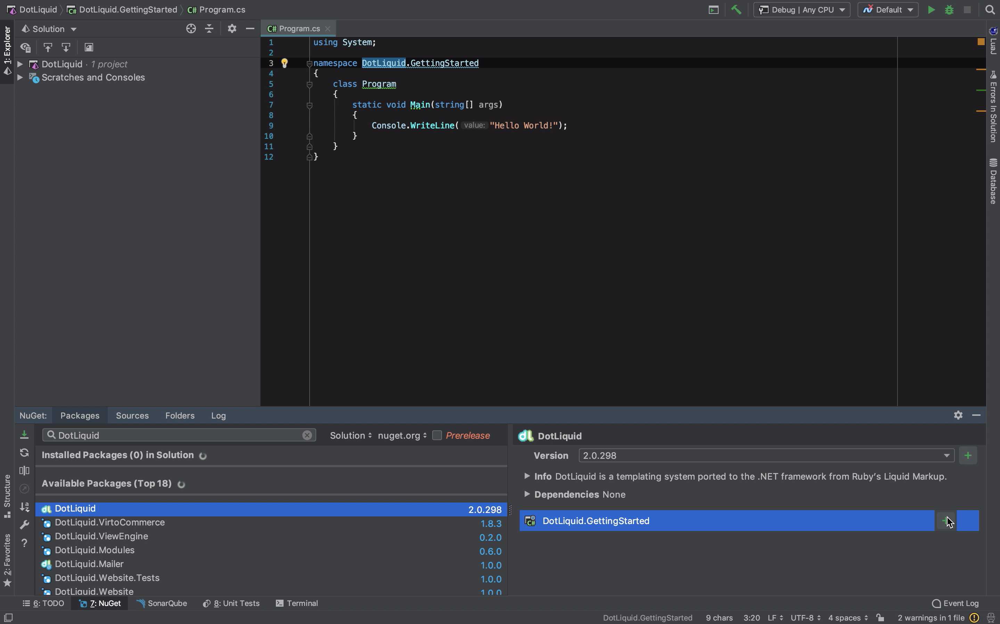
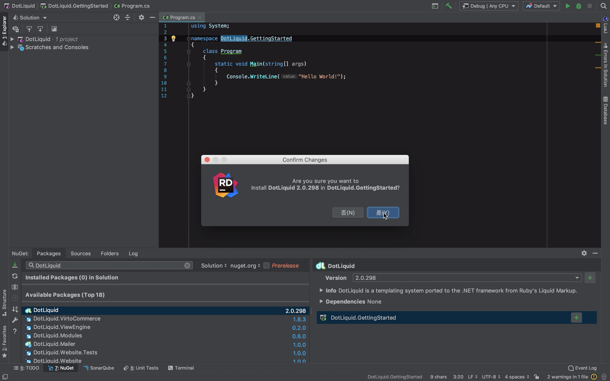
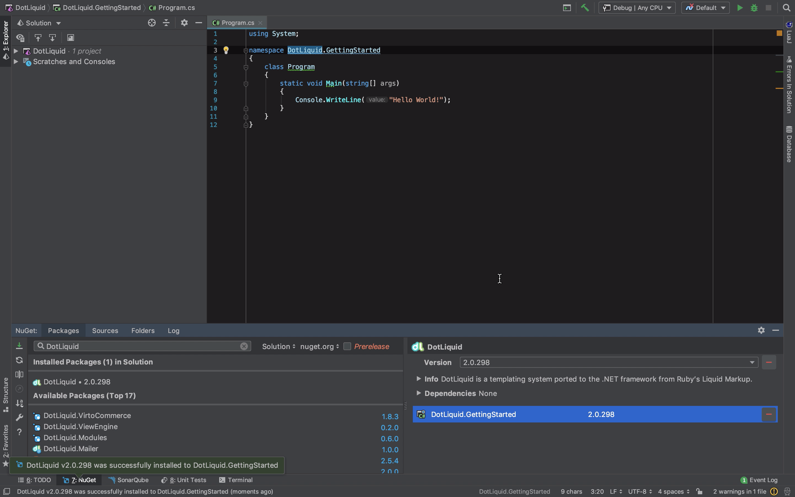
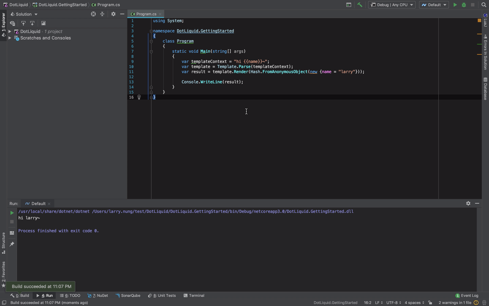
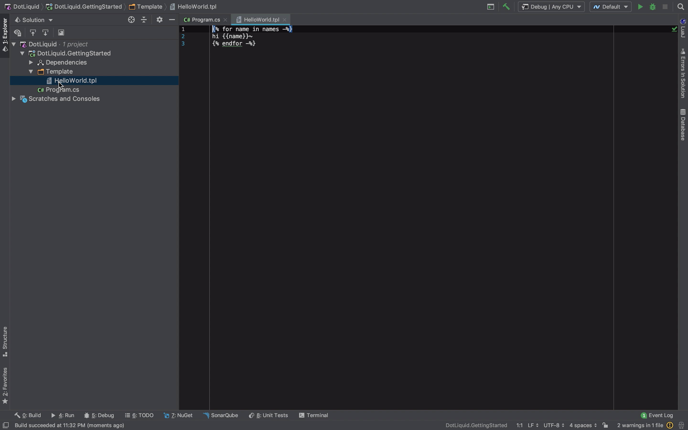
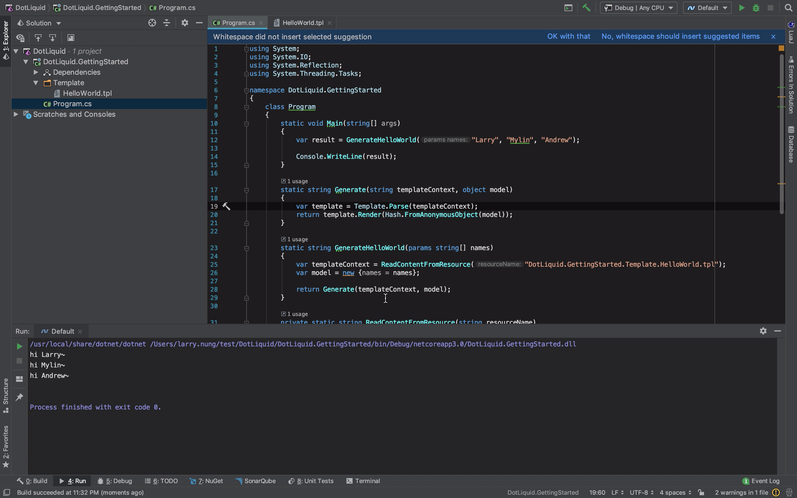

要在 DotNet 中使用 Liquid 範本，可先加入 DotLiquid 套件參考。  

<!-- More -->



<br/>




<br/>




<br/>


套件參考加入後，開始撰寫程式部分。  

<br/>


程式撰寫起來很簡單，只要解析範本，然後將範本需要的資料帶進去渲染即可。  

```C#
...
var template = Template.Parse("hi {{name}}");
var result = template.Render(Hash.FromAnonymousObject(new { name = "Larry" }));
...
```

<br/>


運行起來就會看到 DotLiquid 將資料帶進範本渲染出來的結果。    



<br/>


最後提供比較完整的使用範例，筆者將範本放在內嵌資源中，從內嵌資源讀出範本、透過 DotLiquid 將範本與資料帶入渲染。  

```C#
using System;
using System.IO;
using System.Reflection;
using System.Threading.Tasks;

namespace DotLiquid.GettingStarted
{
    class Program
    {
        static void Main(string[] args)
        {
            var result = GenerateHelloWorld("Larry", "Mylin", "Andrew");

            Console.WriteLine(result);
        }

        static string Generate(string templateContext, object model)
        {
            var template = Template.Parse(templateContext);
            return template.Render(Hash.FromAnonymousObject(model));
        }

        static string GenerateHelloWorld(params string[] names)
        {
            var templateContext = ReadContentFromResource("DotLiquid.GettingStarted.Template.HelloWorld.tpl");
            var model = new {names = names};

            return Generate(templateContext, model);
        }
        
        private static string ReadContentFromResource(string resourceName)
        {
            return ReadContentFromResourceAsync(resourceName).Result;
        }

        
        private static async Task<string> ReadContentFromResourceAsync(string resourceName)
        {
            var assembly = Assembly.GetExecutingAssembly();
            using (var stream = assembly.GetManifestResourceStream(resourceName))
            using (var reader = new StreamReader(stream))
            {
                return await reader.ReadToEndAsync();
            }
        }
    }
}
```

<br/>


範本部分也稍微複雜了些，帶入了迴圈的處理，允許帶入多個名字進入範本，該範本會依序對這些名字打招呼。  

```

hi {{name}}~

```



<br/>


運行起來會像下面這樣：  



<br/>


Link
----
* [Welcome to DotLiquid, a safe templating system for .net](http://dotliquidmarkup.org/)
