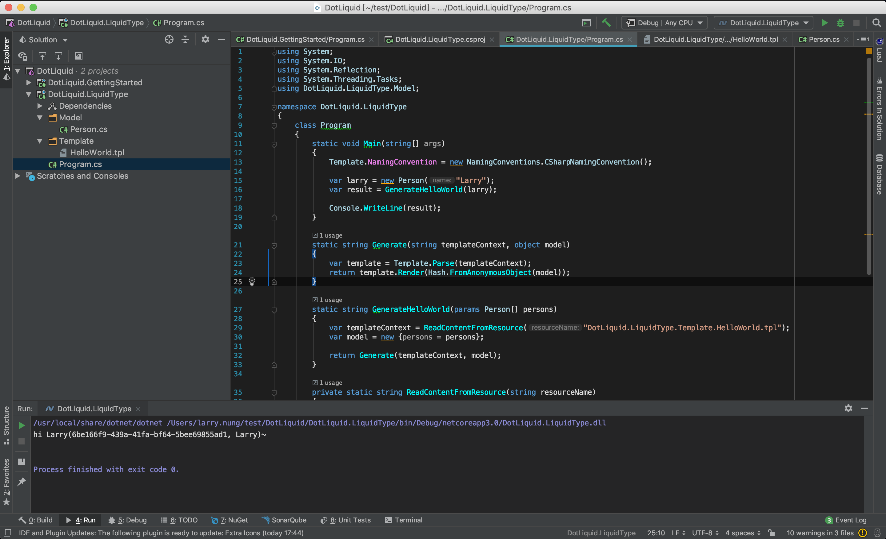

使用 DotLiquid 做範本渲染時，如果需要使用到自訂型別當作參數，自訂型別可加掛 LiquidTypeAttribute 指定範本會使用到的屬性。  

<!-- More -->

```C#
using System;

namespace DotLiquid.LiquidType.Model
{
    [LiquidType(nameof(Person.Id), nameof(Person.Name), nameof(Person.NickName))]
    public class Person
    {
        public string Id { get; set; }
        public string Name { get; set; }
        public string NickName { get; set; }

        public Person()
        {
            
        }
        
        public Person(string name)
        {
            this.Id = Guid.NewGuid().ToString();
            this.Name = name;
            this.NickName = name;
        }
    }
}
```

<br/>


加掛 Attribute 後範本就可以使用自訂型別來渲染。  

```C#

hi {{person.NickName}}({{person.Id}}, {{person.Name}})~

```

<br/>


渲染時注意要設定使用 CSharpNamingConvention，不然會使用到 Ruby 的命名規則，設定的屬性名稱會被轉為小寫且用底線隔開，會找不到對應的屬性。  

```C#
...
Template.NamingConvention = new NamingConventions.CSharpNamingConvention();
...
```

<br/>


整個程式寫起來會像下面這樣：

```C#
using System;
using System.IO;
using System.Reflection;
using System.Threading.Tasks;
using DotLiquid.LiquidType.Model;

namespace DotLiquid.LiquidType
{
    class Program
    {
        static void Main(string[] args)
        {
            Template.NamingConvention = new NamingConventions.CSharpNamingConvention();
            
            var larry = new Person("Larry");
            var result = GenerateHelloWorld(larry);

            Console.WriteLine(result);
        }

        static string Generate(string templateContext, object model)
        {
            var template = Template.Parse(templateContext);
            return template.Render(Hash.FromAnonymousObject(model));
        }

        static string GenerateHelloWorld(params Person[] persons)
        {
            var templateContext = ReadContentFromResource("DotLiquid.LiquidType.Template.HelloWorld.tpl");
            var model = new {persons = persons};

            return Generate(templateContext, model);
        }
        
        private static string ReadContentFromResource(string resourceName)
        {
            return ReadContentFromResourceAsync(resourceName).Result;
        }

        
        private static async Task<string> ReadContentFromResourceAsync(string resourceName)
        {
            var assembly = Assembly.GetExecutingAssembly();
            using (var stream = assembly.GetManifestResourceStream(resourceName))
            using (var reader = new StreamReader(stream))
            {
                return await reader.ReadToEndAsync();
            }
        }
    }
}
```

<br/>




<br/>

Link
