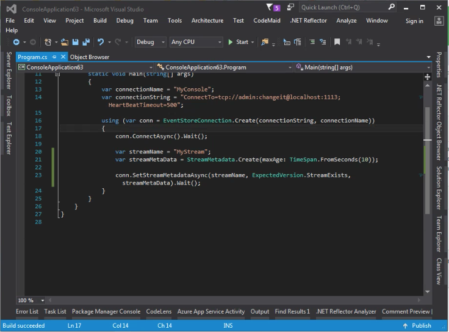
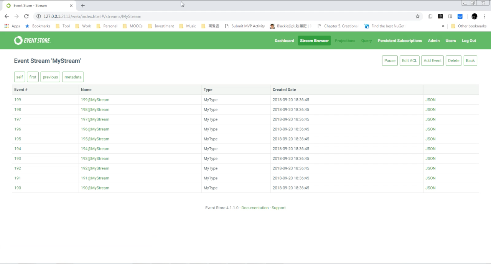
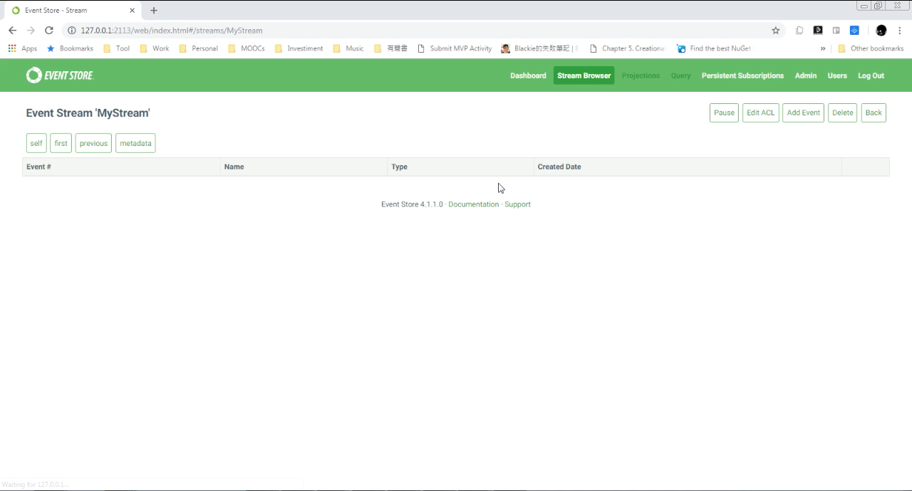

要設定 Event Store 的 Stream 內 Event 的存活時間，可以設定 Stream 的 Max age。  

<!-- More -->

<br/>


透過 StreamMetadata 的 maxAge 指定 Stream 內 Event 的存活時間，然後透過 Connection.SetStreamMetadataAsync，帶入 Stream 的名稱、ExpectedVersion、以及剛設定好的 StreamMetadata。  

```C#
...
var streamMetaData = StreamMetadata.Create(maxAge: TimeSpan.FromSeconds(maxAge));

conn.SetStreamMetadataAsync(streamName, ExpectedVersion.StreamExists, streamMetaData).Wait();
```

<br/>


像是筆者這邊設定了 Stream 內 Event 的存活時間。   

```C#
using EventStore.ClientAPI;
...
using (var conn = EventStoreConnection.Create(connectionString, connectionName))
{
    conn.ConnectAsync().Wait();

    var streamName = "MyStream";
    var streamMetaData = StreamMetadata.Create(maxAge: TimeSpan.FromSeconds(10));

    conn.SetStreamMetadataAsync(streamName, ExpectedVersion.StreamExists, streamMetaData).Wait();
}
```


 
<br/>


Stream 內的 Event 在指定的存活時間過後就會自動被清除。  


 
<br/>



 
<br/>


Link
----
* [Deleting streams and events | Event Store](https://eventstore.org/docs/server/deleting-streams-and-events/index.html)
