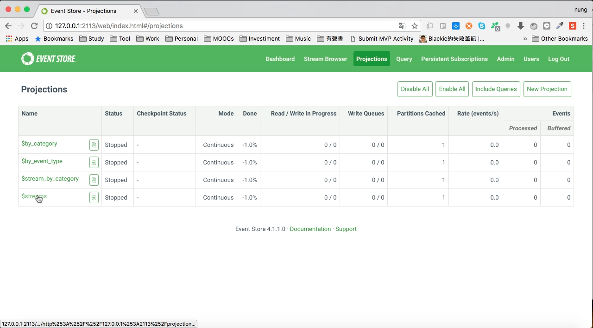
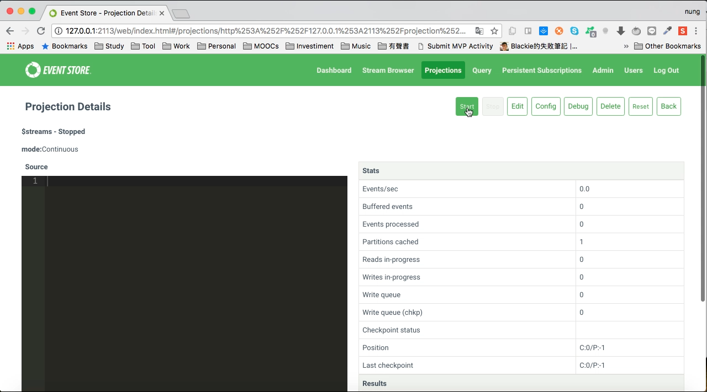
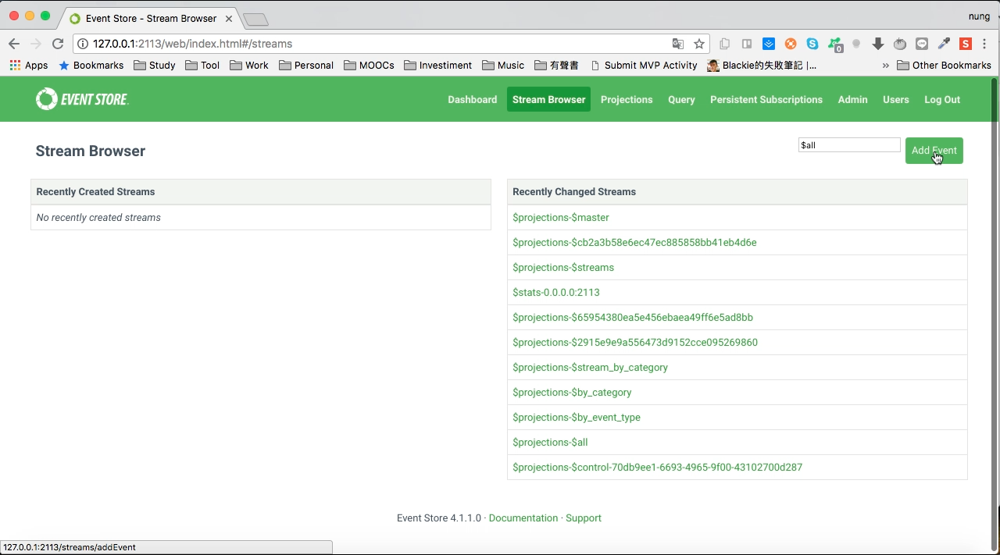
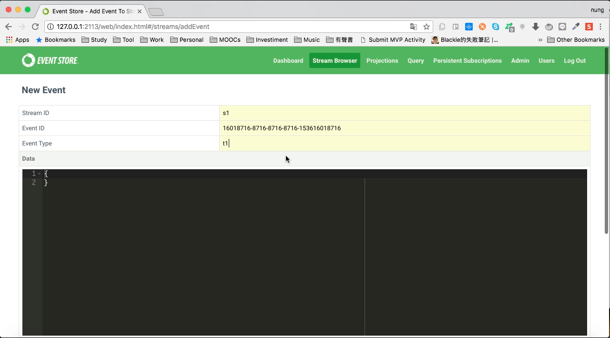
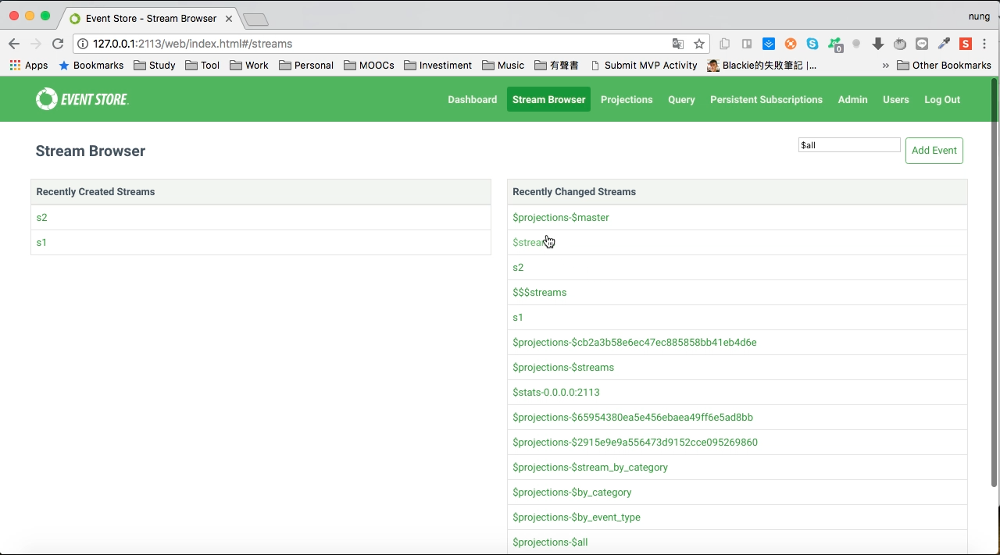
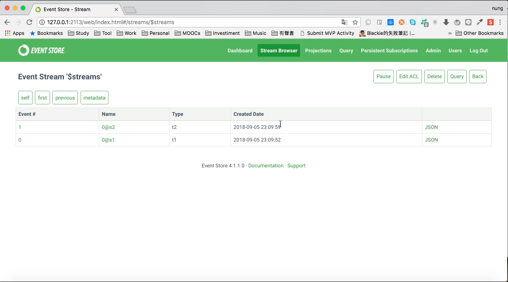

$streams 是 Event Store 預設提供的 Projection，可以將 Event Link 到一個集中的 Stream。  

<!-- More -->

 

使用前需先將 $streams projection 開啟。

 
 

 
 

開啟後切到 Stream Browser 頁面，點選 Add Event 按鈕發送 Event。  

 
 

 
 

這邊可一次發送了多個 Event 做個測試。  

 
 

發送完切回 Stream Browser 頁面，會看到 $streams projection 會幫我們產生 $streams 這樣的 Stream。  

 
 

點進去會看到剛所發送的 Event 都被 Link 在這個 Stream 內。  

 
 

Link
----
* [System Projections | Event Store](https://eventstore.org/docs/projections/system-projections/index.html)
