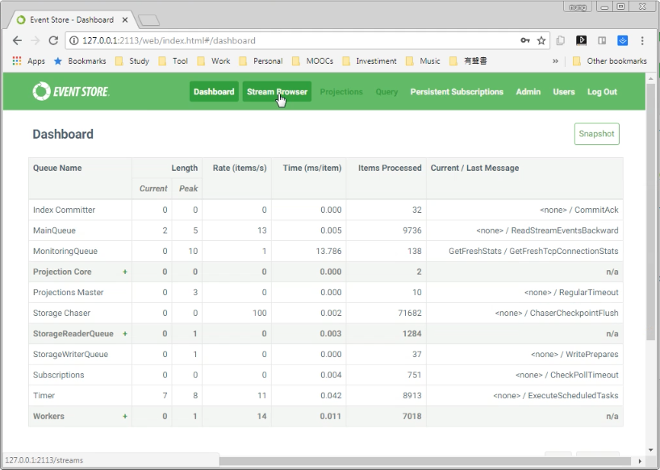
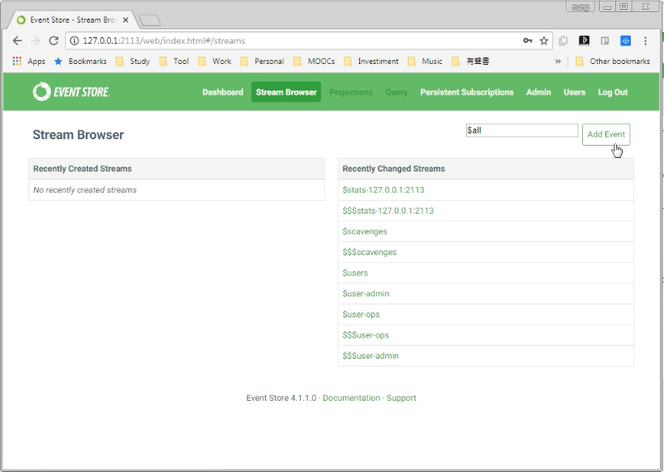
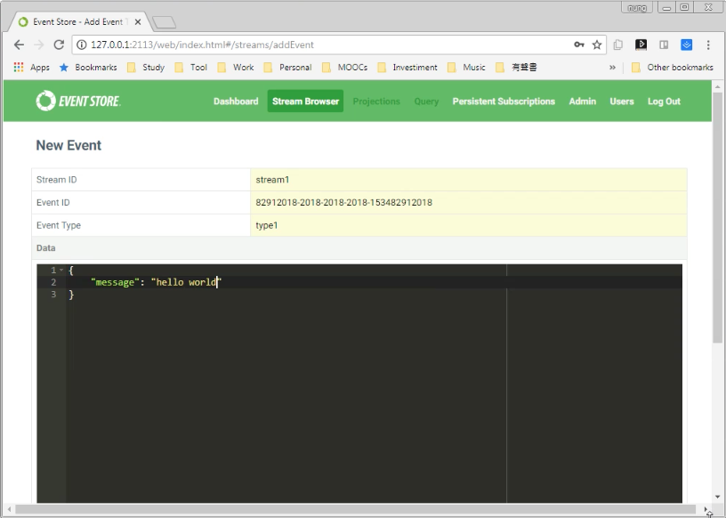
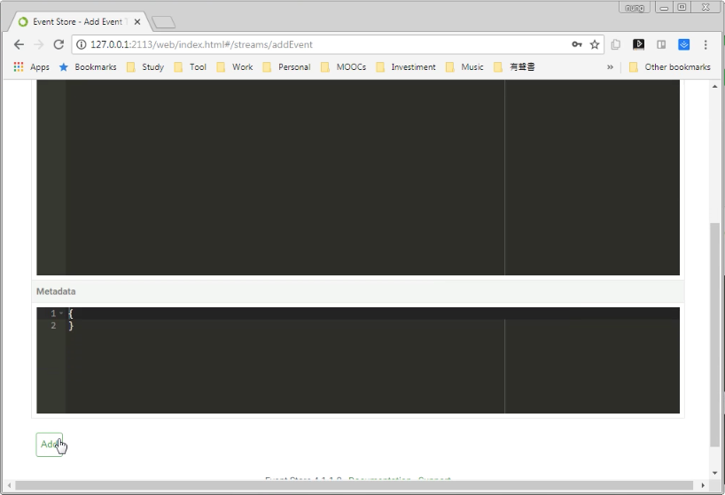
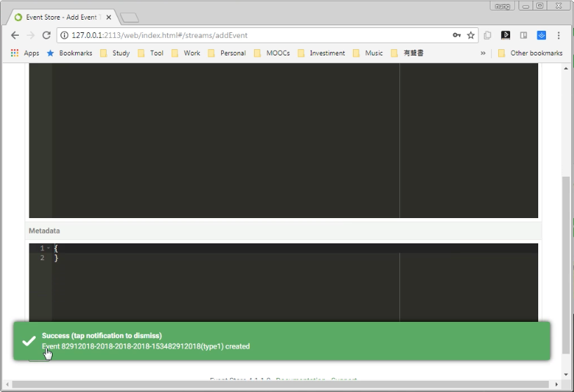
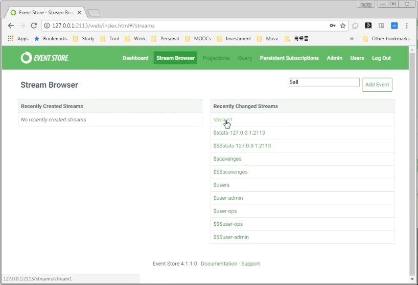
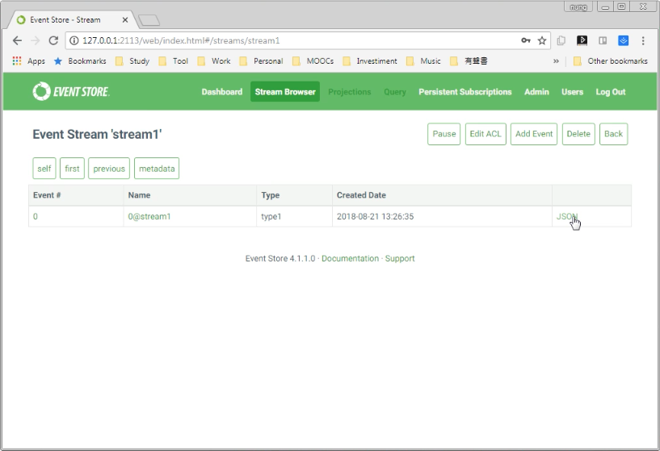
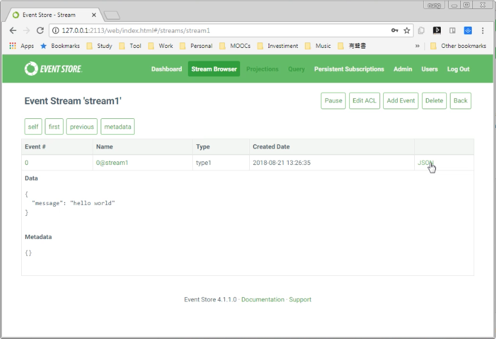
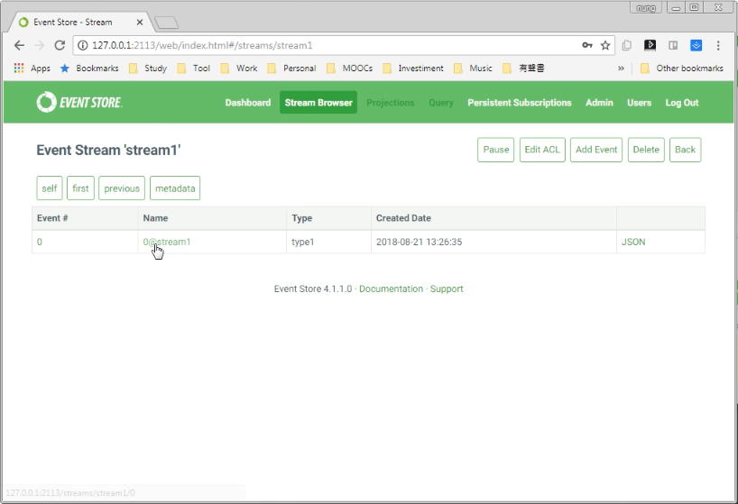
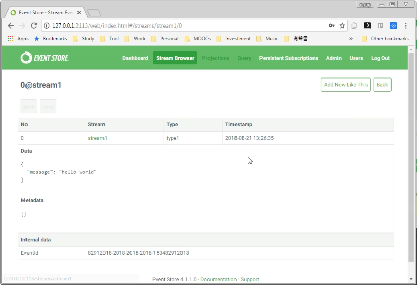

要透過 Web interface 去發送 event，可以將 Web interface 切換至 Stream Browser 頁面。  

<!-- More -->

 
 

點擊 Add Event 按鈕。  

 
 

填入要發送的 Event 資訊。  

 
 

按下 Add 按鈕發送設定的 Event。

 
 

 
 

發送完回到 Stream Broser 頁面，可以看到剛剛所發送的 Event，點選即可查閱。  

 
 

要查閱更為細部的資訊可點選 Event 後方的 JSON 字樣。  

 
 
 

即可看到更為細部的資訊。  

 
 

也可以透過點選 Event name 字樣。  

 
 

一樣可看到更為細部的資訊。  

 
 
