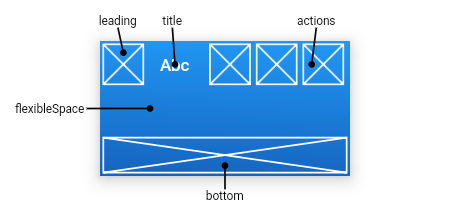
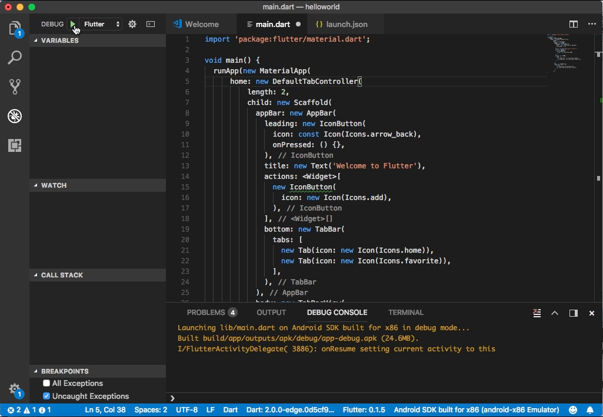
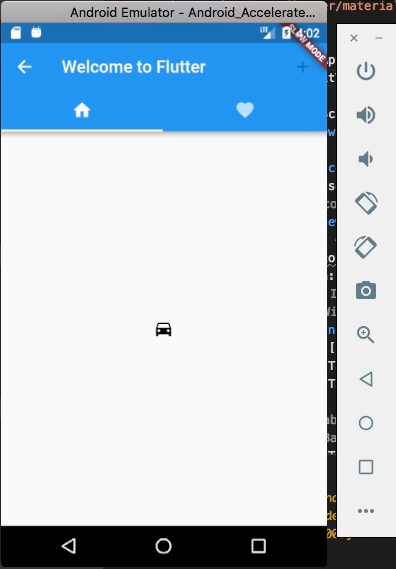

Flutter 的 AppBar widget 需搭配 Scaffold 使用。 

<!-- More -->

<br/>


其建構子如下：  

    AppBar({Key key, Widget leading, bool automaticallyImplyLeading: true, Widget title, List<Widget> actions, Widget flexibleSpace, PreferredSizeWidget bottom, double elevation: 4.0, Color backgroundColor, Brightness brightness, IconThemeData iconTheme, TextTheme textTheme, bool primary: true, bool centerTitle, double titleSpacing: NavigationToolbar.kMiddleSpacing, double toolbarOpacity: 1.0, double bottomOpacity: 1.0 })

<br/>


屬性如下：  

| Name | Type | Description |
|:-------------:|:-------------:|:-----:|
| actions | List<Widget> | Widgets to display after the title widget. |
| automaticallyImplyLeading | bool | Controls whether we should try to imply the leading widget if null. |
| backgroundColor | Color | The color to use for the app bar's material. Typically this should be set along with brightness, iconTheme, textTheme. |
| bottom | PreferredSizeWidget | This widget appears across the bottom of the app bar. |
| bottomOpacity | double | How opaque the bottom part of the app bar is. |
| brightness | Brightness | The brightness of the app bar's material. Typically this is set along with backgroundColor, iconTheme, textTheme. |
| centerTitle | bool | Whether the title should be centered. |
| elevation | double | The z-coordinate at which to place this app bar. This controls the size of the shadow below the app bar. |
| flexibleSpace | Widget | This widget is stacked behind the toolbar and the tabbar. It's height will be the same as the app bar's overall height. |
| iconTheme | IconThemeData | The color, opacity, and size to use for app bar icons. Typically this is set along with backgroundColor, brightness, textTheme. |
| leading | Widget | A widget to display before the title. |
| preferredSize | Size | A size whose height is the sum of kToolbarHeight and the bottom widget's preferred height. |
| primary | bool | Whether this app bar is being displayed at the top of the screen. |
| textTheme | TextTheme | The typographic styles to use for text in the app bar. Typically this is set along with brightness backgroundColor, iconTheme. |
| title | Widget | The primary widget displayed in the appbar. |
| titleSpacing | double | The spacing around title content on the horizontal axis. This spacing is applied even if there is no leading content or actions. If you want title to take all the space available, set this value to 0.0. |
| toolbarOpacity | double | How opaque the toolbar part of the app bar is. |
| hashCode | int | The hash code for this object. |
| key | Key | Controls how one widget replaces another widget in the tree. |
| runtimeType | Type | A representation of the runtime type of the object. |

<br/>


方法如下：

| Name | Return Type | Description |
|:-------------:|:-------------:|:-----:|
| createState() | _AppBarState | Creates the mutable state for this widget at a given location in the tree. |
| createElement() | StatefulElement | Creates a StatefulElement to manage this widget's location in the tree. |
| debugDescribeChildren() | List<DiagnosticsNode> | Returns a list of DiagnosticsNode objects describing this node's children. |
| debugFillProperties(DiagnosticPropertiesBuilder properties) | void | Add additional properties associated with the node. |
| noSuchMethod(Invocation invocation) | dynamic | Invoked when a non-existent method or property is accessed. |
| toDiagnosticsNode({String name, DiagnosticsTreeStyle style }) | DiagnosticsNode | Returns a debug representation of the object that is used by debugging tools and by toStringDeep. |
| toString({DiagnosticLevel minLevel: DiagnosticLevel.debug }) | String | Returns a string representation of this object. |
| toStringDeep({String prefixLineOne: '', String prefixOtherLines, DiagnosticLevel minLevel: DiagnosticLevel.debug }) | String | Returns a string representation of this node and its descendants. |
| toStringShallow({String joiner: ', ', DiagnosticLevel minLevel: DiagnosticLevel.debug }) | String | Returns a one-line detailed description of the object. |
| toStringShort() | String | A short, textual description of this widget. |

<br/>


主要有 leading/title/actions/bottom 這幾個區塊可供設定。  


 
<br/>


```dart
import 'package:flutter/material.dart';

void main() {
  runApp(new MaterialApp(
      home: new DefaultTabController(
          length: 2,
          child: new Scaffold(
            appBar: new AppBar(
              leading: new IconButton(
                icon: const Icon(Icons.arrow_back),
                onPressed: () {},
              ),
              title: new Text('Welcome to Flutter'),
              actions: <Widget>[
                new IconButton(
                  icon: new Icon(Icons.add),
                ),
              ],
              bottom: new TabBar(
                tabs: [
                  new Tab(icon: new Icon(Icons.home)),
                  new Tab(icon: new Icon(Icons.favorite)),
                ],
              ),
            ),
            body: new TabBarView(
              children: [
                new Icon(Icons.directions_car),
                new Icon(Icons.directions_transit)
              ],
            ),
          ))));
} 
```


 
<br/>


 
<br/>


Link
----
* [AppBar class - material library - Dart API](https://docs.flutter.io/flutter/material/AppBar-class.html)
