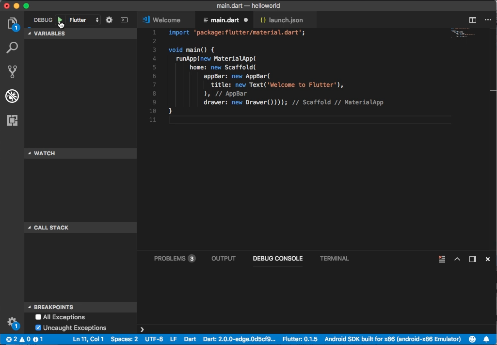
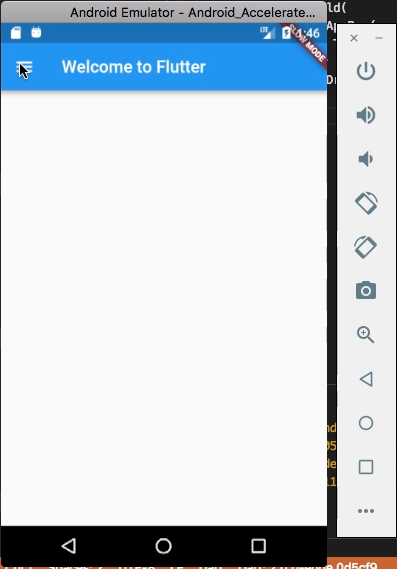
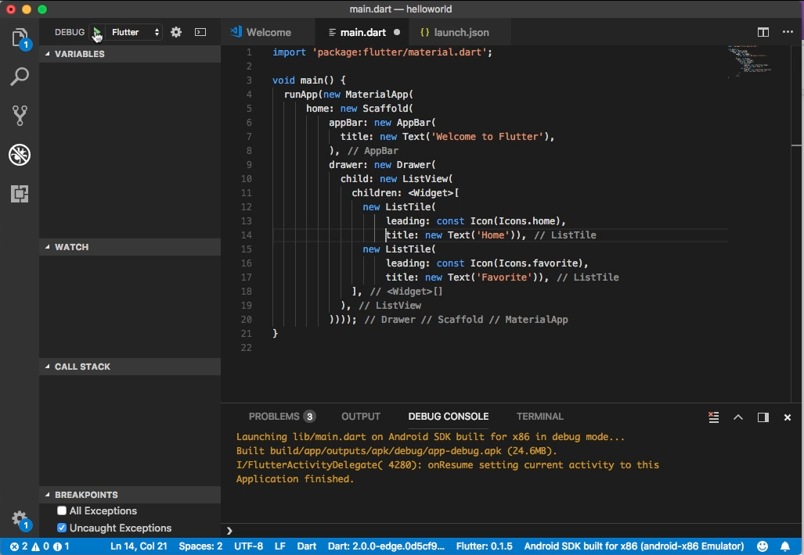
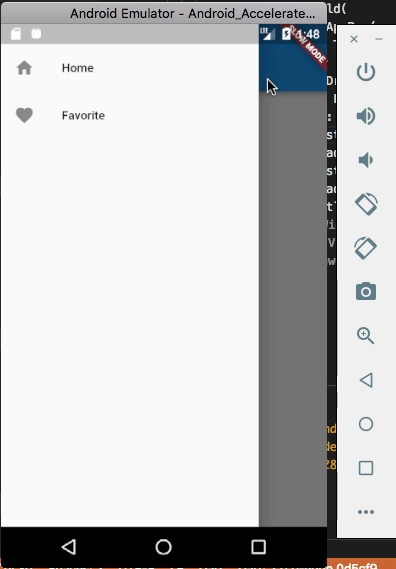
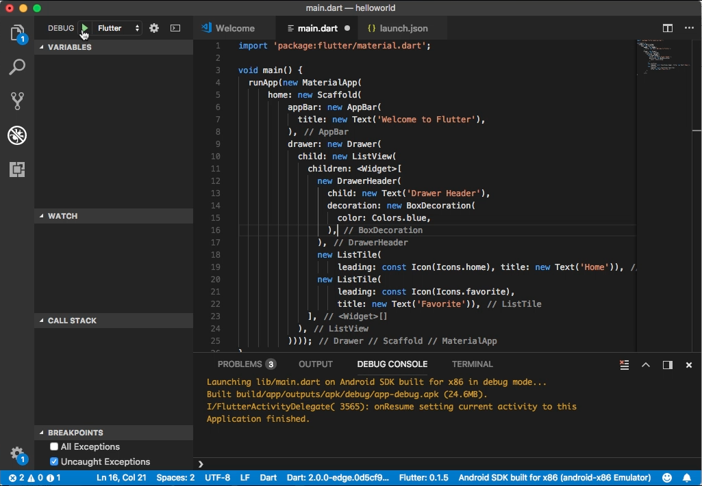
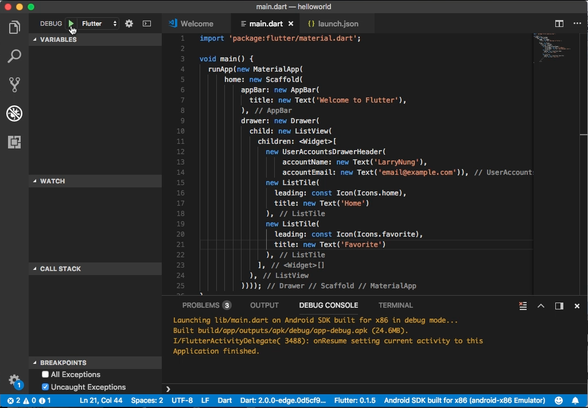
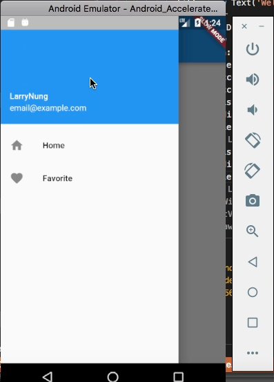

Flutter 的 Drawer widget 需搭配 Scaffold 使用，可用以設定 Scaffold 左側的選單。  

<!-- More -->

<br/>


其建構子如下：  

    Drawer({Key key, double elevation: 16.0, Widget child, String semanticLabel })

<br/>


屬性如下：  

| Name | Type | Description |
|:-------------:|:-------------:|:-----:|
| child | Widget | The widget below this widget in the tree. |
| elevation | double | The z-coordinate at which to place this drawer. This controls the size of the shadow below the drawer. |
| semanticLabel | String | The semantic label of the dialog used by accessibility frameworks to announce screen transitions when the drawer is opened and closed. |
| hashCode | int | The hash code for this object. |
| key | Key | Controls how one widget replaces another widget in the tree. |
| runtimeType | Type | A representation of the runtime type of the object. |

<br/>


方法如下：

| Name | Return Type | Description |
|:-------------:|:-------------:|:-----:|
| build(BuildContext context) | Widget | Describes the part of the user interface represented by this widget. |
| createElement() | StatelessElement | Creates a StatelessElement to manage this widget's location in the tree. |
| debugDescribeChildren() | List<DiagnosticsNode> | Returns a list of DiagnosticsNode objects describing this node's children. |
| debugFillProperties(DiagnosticPropertiesBuilder properties) | void | Add additional properties associated with the node. |
| noSuchMethod(Invocation invocation) | dynamic | Invoked when a non-existent method or property is accessed. |
| toDiagnosticsNode({String name, DiagnosticsTreeStyle style }) | DiagnosticsNode | Returns a debug representation of the object that is used by debugging tools and by toStringDeep. |
| toString({DiagnosticLevel minLevel: DiagnosticLevel.debug }) | String | Returns a string representation of this object. |
| toStringDeep({String prefixLineOne: '', String prefixOtherLines, DiagnosticLevel minLevel: DiagnosticLevel.debug }) | String | Returns a string representation of this node and its descendants. |
| toStringShallow({String joiner: ', ', DiagnosticLevel minLevel: DiagnosticLevel.debug }) | String | Returns a one-line detailed description of the object. |
| toStringShort() | String | A short, textual description of this widget. |

<br/>


使用時只要建立出 Drawer 實體，並指給 Scoffold 的 drawer 屬性即可。  

```dart
import 'package:flutter/material.dart';

void main() {
  runApp(new MaterialApp(
      home: new Scaffold(
          appBar: new AppBar(
            title: new Text('Welcome to Flutter'),
          ),
          drawer: new Drawer())));
}
```


 
<br/>


 
<br/>


 
<br/>


可搭配 ListTile 設定 Drawer 選單的選項。  

```dart
import 'package:flutter/material.dart';

void main() {
  runApp(new MaterialApp(
      home: new Scaffold(
          appBar: new AppBar(
            title: new Text('Welcome to Flutter'),
          ),
          drawer: new Drawer(
            child: new ListView(
              children: <Widget>[
                new ListTile(
                    leading: const Icon(Icons.home), 
                    title: new Text('Home')),
                new ListTile(
                    leading: const Icon(Icons.favorite),
                    title: new Text('Favorite')),
              ],
            ),
          ))));
}
```


 
<br/>



 
<br/>


搭配 DrawerHeader 設定 Drawer 的標頭。  

```dart
import 'package:flutter/material.dart';

void main() {
  runApp(new MaterialApp(
      home: new Scaffold(
          appBar: new AppBar(
            title: new Text('Welcome to Flutter'),
          ),
          drawer: new Drawer(
            child: new ListView(
              children: <Widget>[
                new DrawerHeader(
                  child: new Text('Drawer Header'),
                  decoration: new BoxDecoration(
                    color: Colors.blue,
                  ),
                ),
                new ListTile(
                  leading: const Icon(Icons.home),
                  title: new Text('Home')
                ),
                new ListTile(
                  leading: const Icon(Icons.favorite),
                  title: new Text('Favorite')
                ),
              ],
            ),
          ))));
}
```




<br/>


 
<br/>


搭配 UserAccountsDrawerHeader 設定顯示有使用者資訊的 Drawer 標頭。  

```dart
import 'package:flutter/material.dart';

void main() {
  runApp(new MaterialApp(
      home: new Scaffold(
          appBar: new AppBar(
            title: new Text('Welcome to Flutter'),
          ),
          drawer: new Drawer(
            child: new ListView(
              children: <Widget>[
                new UserAccountsDrawerHeader(
                    accountName: new Text('LarryNung'),
                    accountEmail: new Text('email@example.com')),
                new ListTile(
                  leading: const Icon(Icons.home),
                  title: new Text('Home')
                ),
                new ListTile(
                  leading: const Icon(Icons.favorite),
                  title: new Text('Favorite')
                ),
              ],
            ),
          ))));
}
```


 
<br/>



 
<br/>


Link
----
* [Drawer class - material library - Dart API](https://docs.flutter.io/flutter/material/Drawer-class.html)
