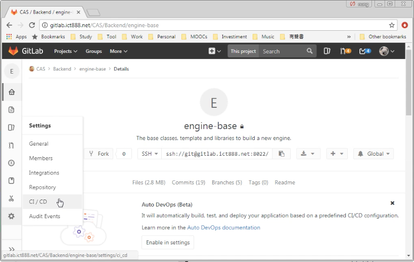
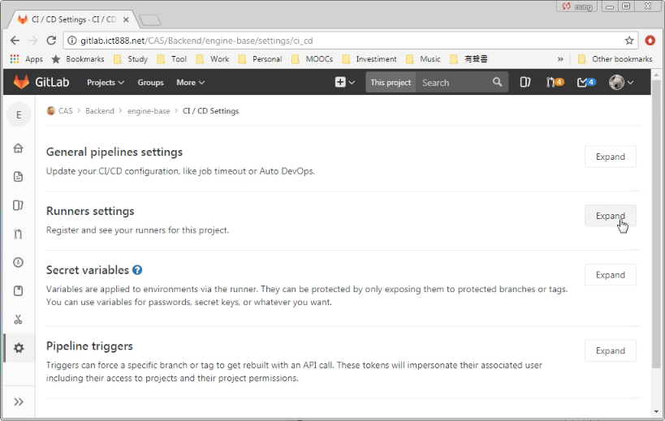
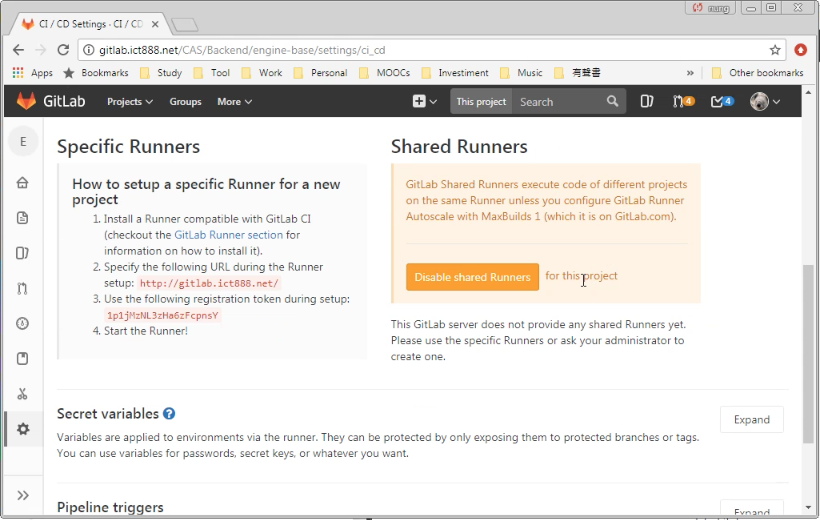
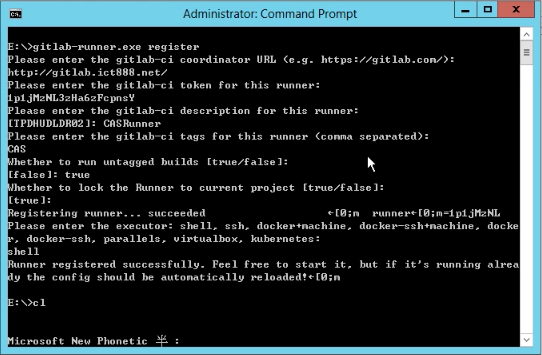
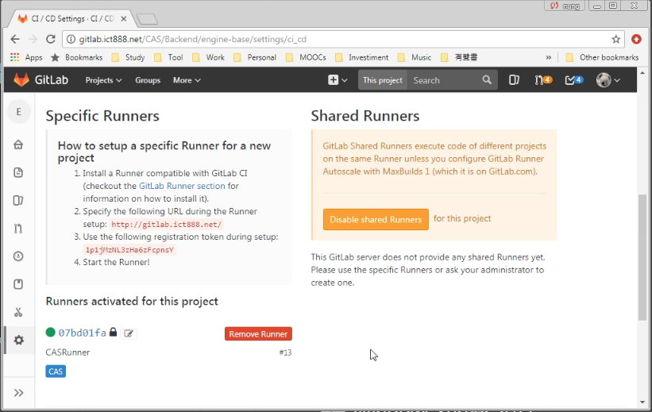

要設定 Specific GitLab Runner，需先至 GitLab 的 CI/CD 設定頁面。  

<!-- More -->

 
 

找到 Runner settings。  

 
 

這邊會顯示 GitLab Runner 註冊時需要的 URL 與 Token。  

 
 

接著回到命令列調用 GitLab Runner 的 register，設定剛剛拿到的 URL 位置、Token、Runner 描述...等資訊。  

 
 

Specific GitLab Runner 就設定完成了。  

 
 
