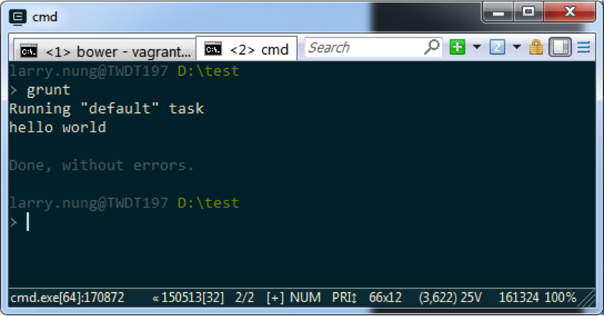
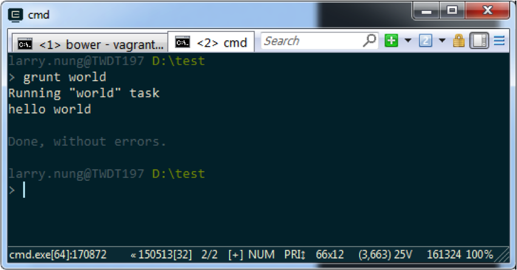
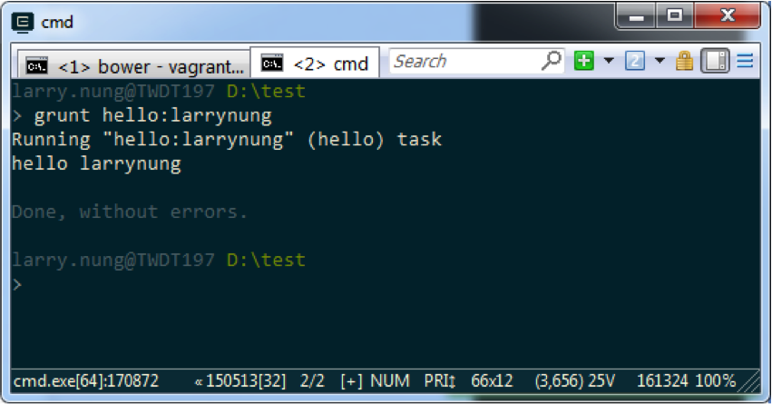
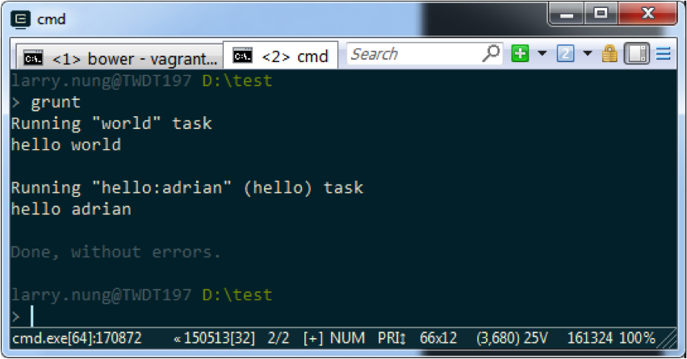

接著實際來用用看 Grunt，首先 gruntfile 先用 require 載入 grunt，然後用 registerTask 註冊一個任務，這邊帶入任務名為 default，並將任務的動作用 function 指定，這邊這個任務就只是簡單的顯示 hello world 訊息而已。

<!-- More -->

```js
var grunt = require('grunt'); 

grunt.registerTask('default', '',function(){ 
  console.log('hello world'); 
});
```

<br/>


實際透過命令呼叫 grunt，可以看到 default 任務被 grunt 調用了，因此會在螢幕上顯示 hello world。  



<br/>


接著可以試著撰寫難一點的來看看，註冊一個 world 任務，執行時會顯示 hello world，接著註冊一個 hello 任務，需帶入名字執行，執行會顯示 hello 以及帶入的名字，最後註冊 default 任務，執行時會調用 world 任務以及用 adrian 當參數去調用 hello 任務。  

```js
var grunt = require('grunt'); 

grunt.registerTask('world', '', function(){ 
  console.log('hello world'); 
});
grunt.registerTask('hello', '', function(name){ 
  if(!name || !name.length) 
    grunt.warn('you need to provide a name.'); 
  console.log('hello ' + name); 
}); 
grunt.registerTask('default', ['world', 'hello:adrian']);
```

<br/>


因為這次有多個任務，所以運行時我們可以在 grunt 後面帶上欲執行的任務名稱，像是調用 grunt world，grunt 就會開始執行 world 任務。  



<br/>


調用 grunt hello:larrynung，grunt 就會用 larrynung 當參數帶入去運行 hello 任務。  



<br/>


如果只調用 grunt，則一樣是運行 default 任務。  


