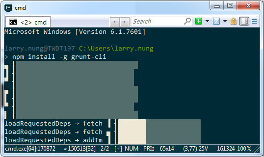
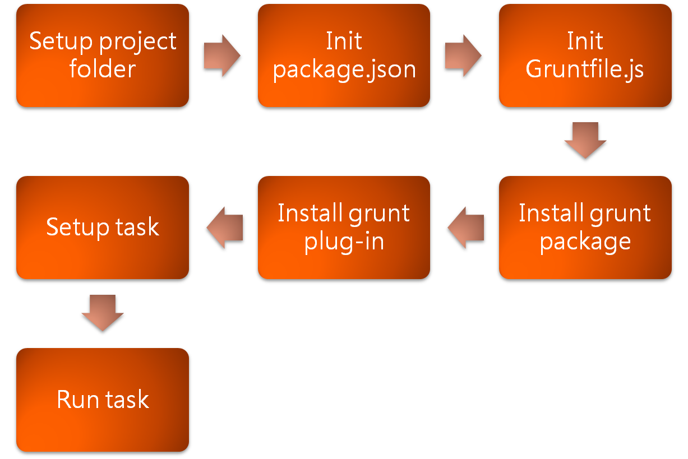

使用 Grunt 前需先確定環境是否已經安裝了 Node.js 與 grunt-cli。  

<!-- More -->

    npm install grunt-cli -g

 

環境安裝無誤就可以開始使用 Grunt，使用上大致分為下列幾個步驟：  

 

以 Windows 的操作為例，首先需要有專案目錄。  

    md <folder>
  
 

  
接著需要建立 npm 套件的設定檔。  

    npm init

 	
	
	
再來要建立 Grunt 設定檔。  

    type NUL > Gruntfile.js

 	

	
加入 Grunt 套件。  	
	
    npm install grunt --save-dev
	
 	

加入 Grunt plug-in。  

    npm install <plug-in> --save-dev
	
 	

開啟 Grunt 設定檔設定 Grunt task。  

    notepad gruntfile.js

 

	
運行 Grunt task。  

    grunt
