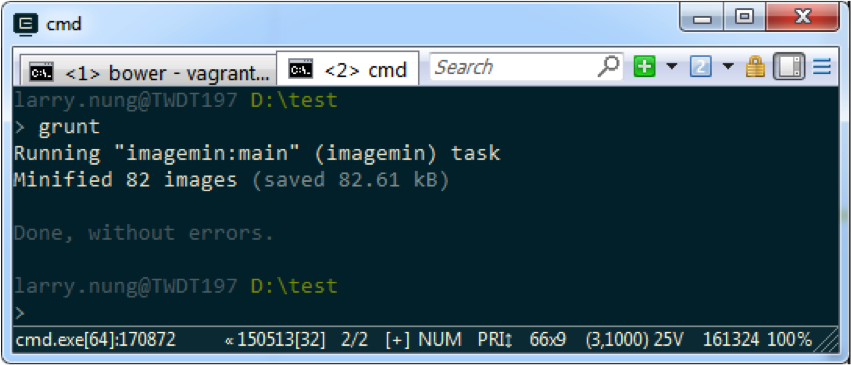

grunt-contrib-imagemin 套件可以用 Grunt 來將進行檔的壓縮。  

<!-- More -->

<br/>


使用時先用 npm 安裝 grunt-contrib-imagemin 套件。  

    npm install grunt-contrib-imagemin --save-dev

<br/>


接著開啟 gruntfile 設定 task，這邊有些參數可供設定，可參考 [gruntjs/grunt-contrib-imagemin: Minify PNG and JPEG images.](https://github.com/gruntjs/grunt-contrib-imagemin)。  

<br/>


再來將 plugin 載入。  

    grunt.loadNpmTasks('grunt-contrib-imagemin');

<br/>


最後再將 task 註冊即可。  

<br/>


像是下面這邊設定了一個 imagemin 的 task，會將 images 目錄下副檔名為 png/jpg/gif 的圖片進行壓縮，壓縮後會放回到 images 目錄。   

```js
var grunt = require('grunt'); 
grunt.initConfig({ 
  imagemin: { 
    main:{
      options: { 
        optimizationLevel: 3, 
        svgoPlugins: [{ removeViewBox: false }] 
      }, 
      files: [{ 
        expand: true, 
        cwd: 'Images/', 
        src: ['**/*.{png,jpg,gif}'], 
        dest: 'Images/’
      }] 
    } 
  } 
}); 

grunt.loadNpmTasks('grunt-contrib-imagemin'); 
grunt.registerTask('default', ['imagemin']);
```

<br/>




<br/>


Link
----
* [gruntjs/grunt-contrib-imagemin: Minify PNG and JPEG images.](https://github.com/gruntjs/grunt-contrib-imagemin)
