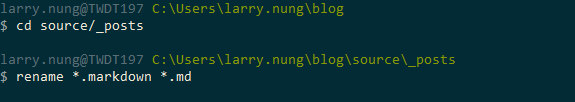
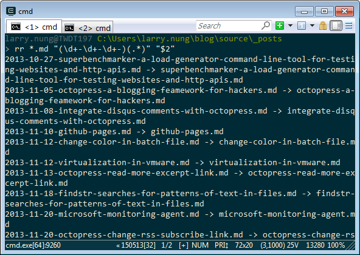
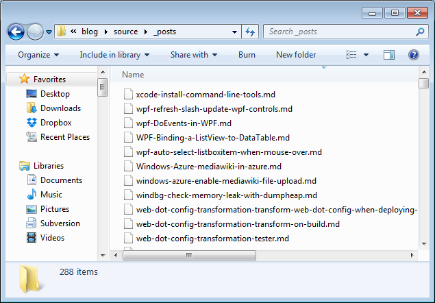

要將 Octopress 部落格移至 Hexo 部落格，首先要將 Octopress source/_posts 下的文章移至 Hexo source/_posts 下。若有圖檔也依樣移過去，像是如果 Octopress 的圖檔放置在 source/images 目錄下，這邊就將它移至 source/images 下。  

<!-- More -->

 

再來因為 Octopress 的文章的副檔名是 markdown，所以要將它取代為 md 副檔名。   

 

然後使用 [RenameRegex](http://nicj.net/windows-command-line-regular-expression-renaming-tool-renameregex/) 將檔名前面的日期部分拔除。  

    rr *.md "(\d+-\d+-\d+-)(.*)" "$2"

 

 

最後因為 Octopress 文章內的時間資料只顯示到分，所以要用 [Regular Expression Search and Replace Command Line Tool](https://sites.google.com/site/regexreplace/) 將日期部分修正到秒。  

    rxrepl -D "C:\Users\larry.nunglog\source\_posts" -I *.md -a --no-backup --no-bom -e utf8 --output-encoding utf8 -s "(\d+-\d+-\d+\s+\d+:\d+)" -r "\1:00"

 

將服務跑起來看看，如果 Octopress 文章內沒用太特別的符號，這時應該已經可以看到文章了。  

 

如果有 Error 發生，那就是要自己想辦法把出問題的文章抓出來了。   

 

Link
