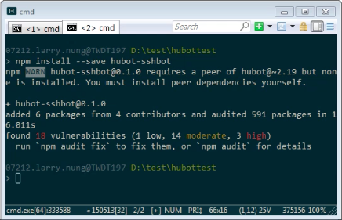
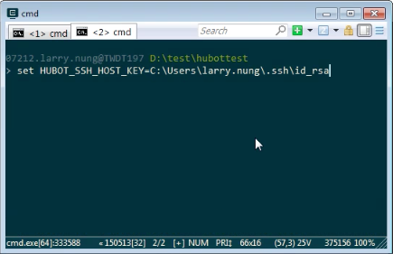
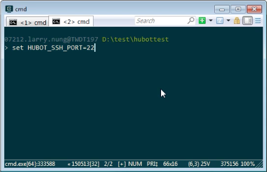
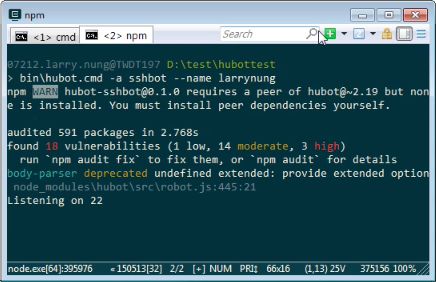
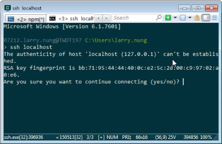
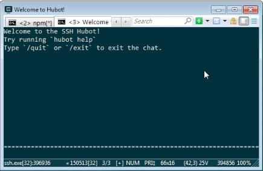
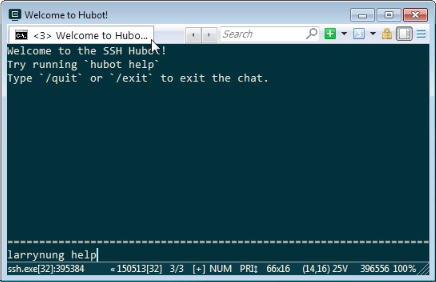
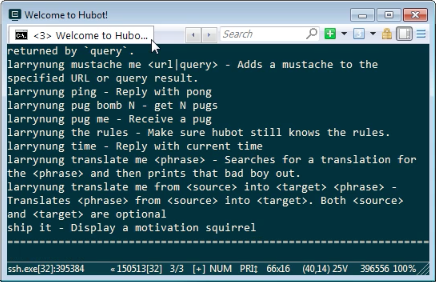

要將 Hubot 整合 SSH，可以安裝 hubot-sshbot。  

<!-- More -->

    npm install --save hubot-sshbot

 

安裝完後透過 HUBOT_SSH_HOST_KEY 環境變數指定 SSH key。  

    set HUBOT_SSH_HOST_KEY=<SSHKey>

 

透過 HUBOT_SSH_POST 環境變數指定要使用的 Port (預設是使用 3050)。  

    set HUBOT_SSH_PORT=<Port>

 

透過 HUBOT_SSH_HOST 環境變數指定 Host 的位置 (預設是 0.0.0.0)。

 

將 Hubot 運行起來並指定使用 SSH adapter。  

    hubot -a sshbot

 

接著透過 SSH 連進去。  

 

就可以看到 SSH Hubot 的畫面。  

 

可以透過 SSH Hubot 調用 Hubot 命令。  

 

 

Link
----
* [kylemacey/hubot-sshbot: An SSH based Hubot adapter to allow Hubot to be accessed from an SSH client.](https://github.com/kylemacey/hubot-sshbot)
