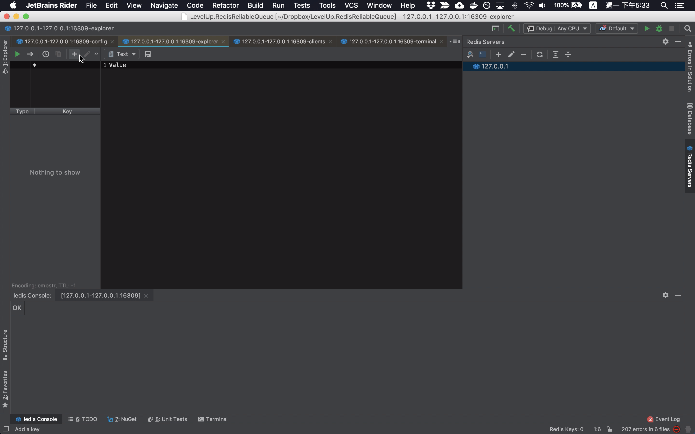
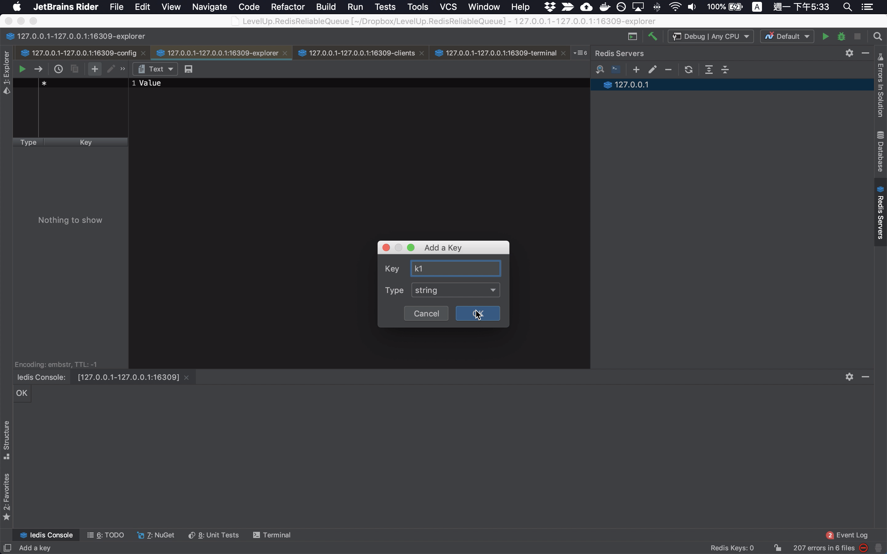
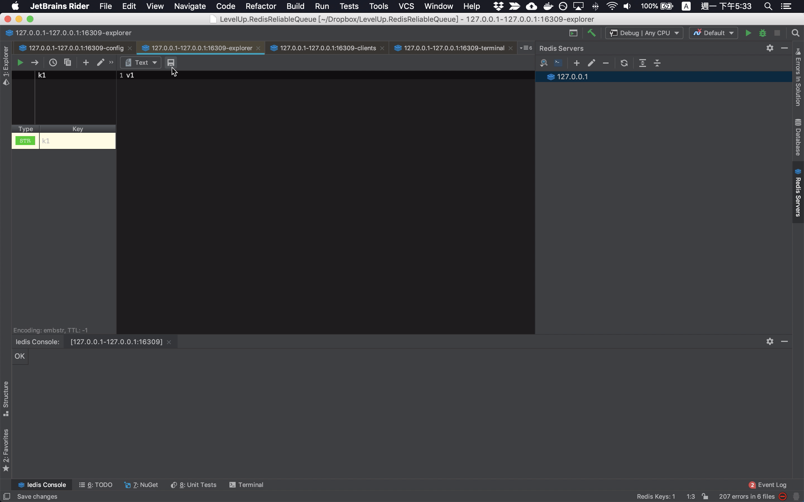
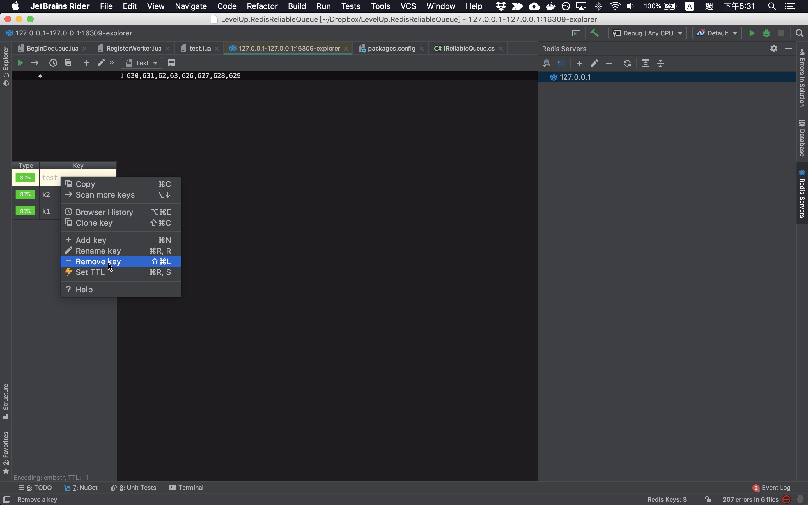

透過 Redis Servers Tool Window 加完 Redis 連線後，在連線上連點即可連到對應的 Redis。  

<!-- More -->

 

連線後可看到 Redis 內含的 Key，左上方的區塊可以做 Key 的過濾，上方的工具列可以做 DataBase 的切換、Key 的新增、TTL 的設定等。  

 

如果要新增 Key，可直接透過點擊上方工具列的 + 按鈕。  

 

設定 Key 的名稱及型態，按下 OK 按鈕繼續。  

 

接著設定 Key 的值，按下存擋即可。    

 

在左邊顯示 Key 的列表這邊，按下滑鼠右鍵，透過滑鼠右鍵快顯選單也可以做很多 Key 的操作，像是新增 Key、Key 更名、刪除 Key、設定 TTL 等。  

 

Link
----
* [Iedis: Key Operations](https://www.codesmagic.com/iedis/userguide/key-operations)
