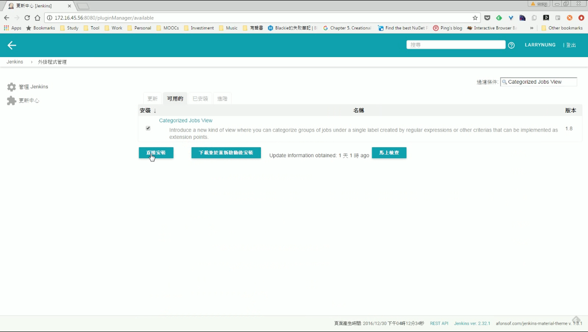
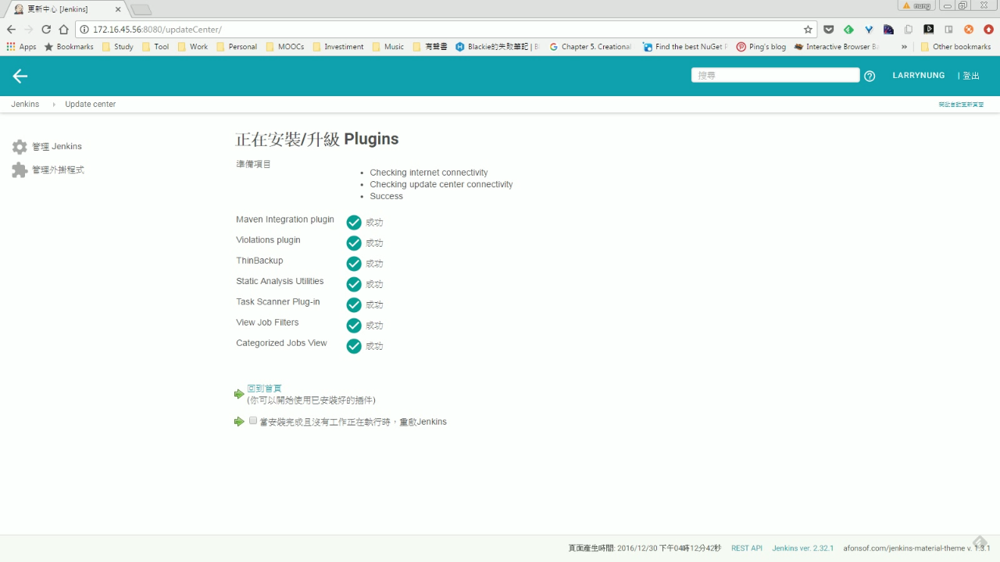
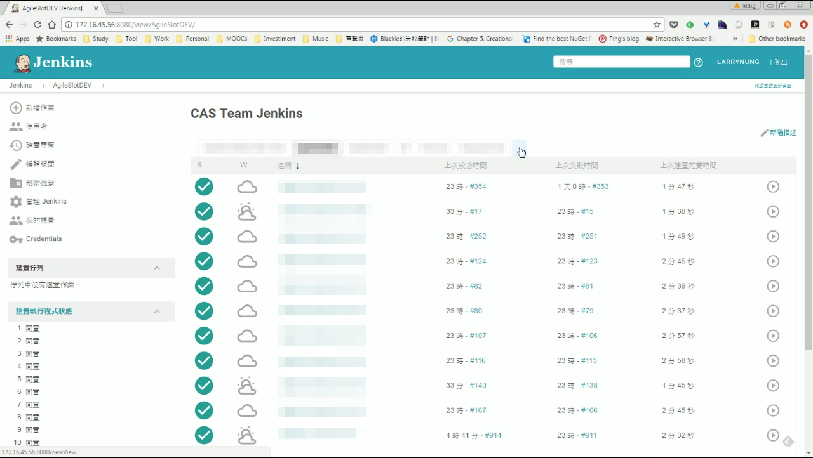
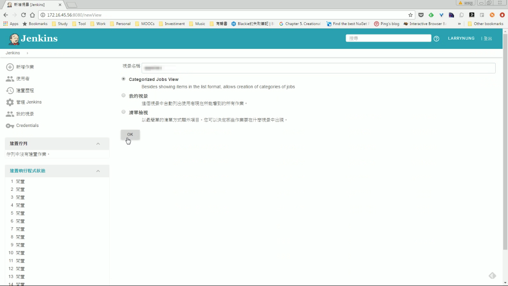
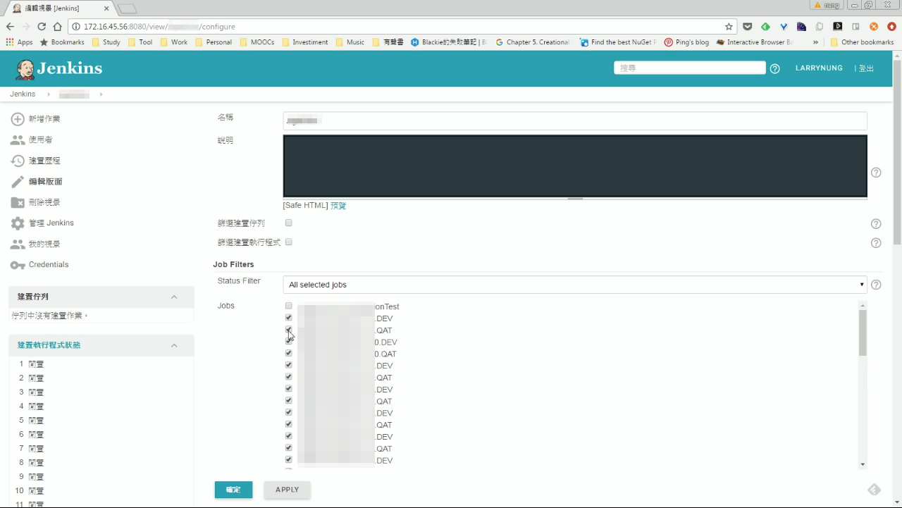
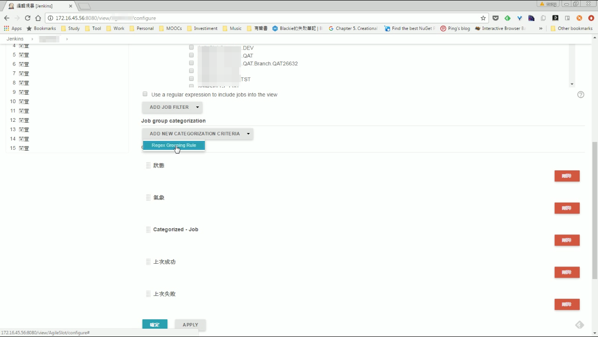
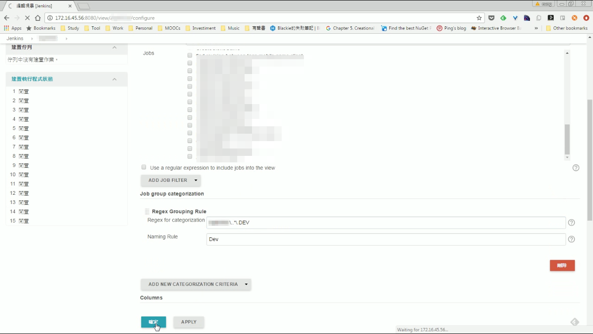
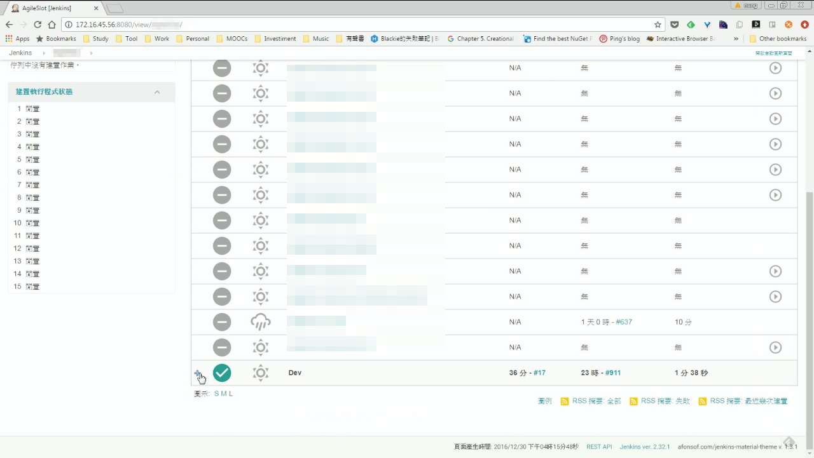
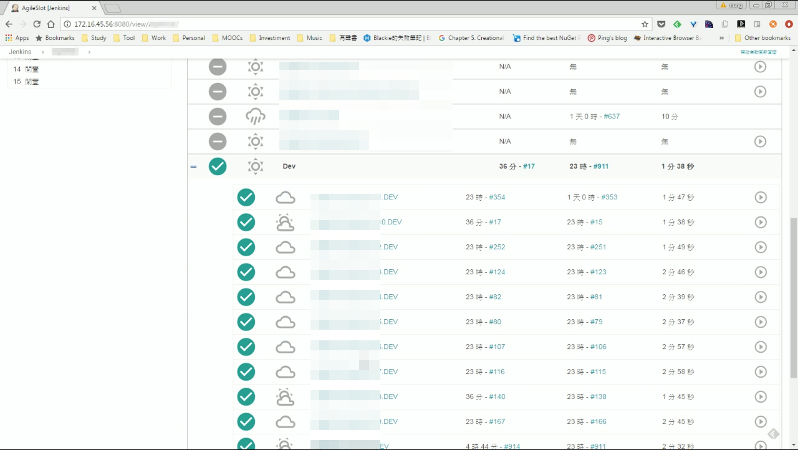

Jenkins 的 Categorized Jobs View 套件可用來分類整理 Jenkins job，允許指定多個不同的分類 Rule，View 內的 Job 會依照指定的 Rule 進行分類。  

<!-- More -->

要使用 Categorized Job View，可先到外掛程式管理這邊搜尋 Categorized Jobs View 套件，下載並安裝。  

 
 

 
 

安裝完建立一個新的 View。  

 
 

選取剛安裝的 Categorized Jobs View。  

 
 

勾選加入要在這 View 看到的 Job。

 
 

並設定 Grouping rule 。  

 
 

 
 

 
 

回到剛新加的 View，即會看到 Job 依照 Grouping rule 進行了分類。  

 
 
