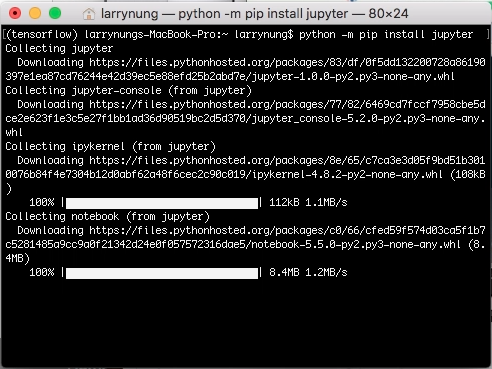
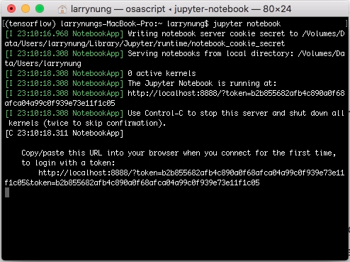
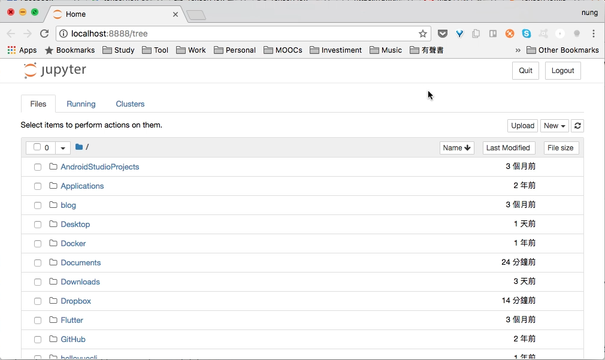

要使用 pip 安裝 Jupyter，可調用下列命令。  

<!-- More -->

    python -m pip install --upgrade pip
    python -m pip install jupyter

 

 
 

安裝完調用下列命令運行 Jupyter。  

    jupyter notebook

 
 

沒意外的話會看到 Jupyter 被正常帶出。  

 
 

Link
----
* [Project Jupyter | Install](http://jupyter.org/install.html)
