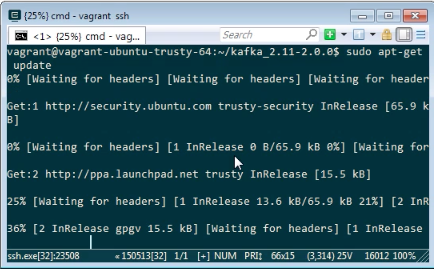
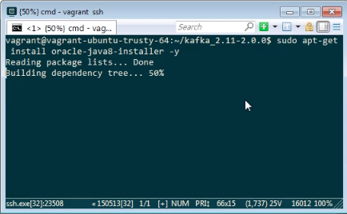
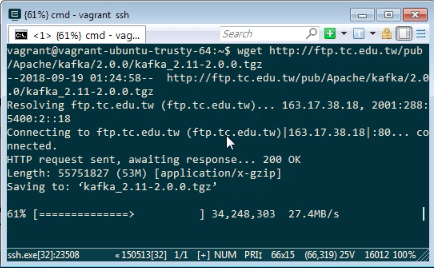
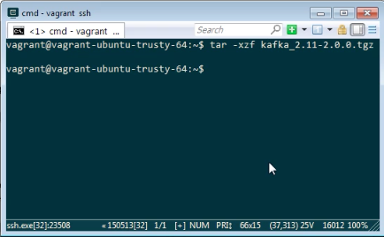
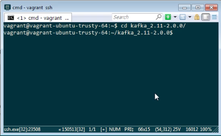
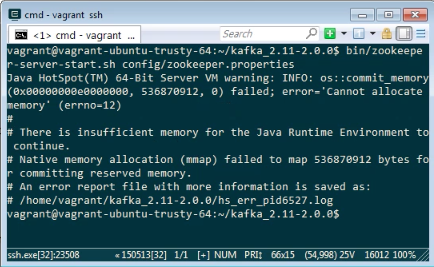
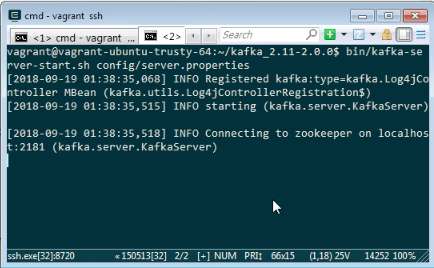

要使用 Kafka  首先須確定環境中有安裝 Java。   

<!-- More -->

 

若沒有的話需先進行安裝。  

 
 

 
 

接著下載 Kafka 程式。  

    wget http://ftp.mirror.tw/pub/apache/kafka/2.0.0/kafka_2.11-2.0.0.tgz 

 
 

將下載下來的 Kafka 程式解壓縮。  

    tar -xzf kafka_2.11-2.0.0.tgz

 
 

進入解壓縮後的 Kafka 目錄。  

    cd kafka_2.11-2.0.0

 
 

啟動 ZooKeeper。  

    bin/zookeeper-server-start.sh config/zookeeper.properties

 
 

啟動 Kafka。  

    bin/kafka-server-start.sh config/server.properties

 
 

Link
----
* [Apache Kafka](https://kafka.apache.org/quickstart)
