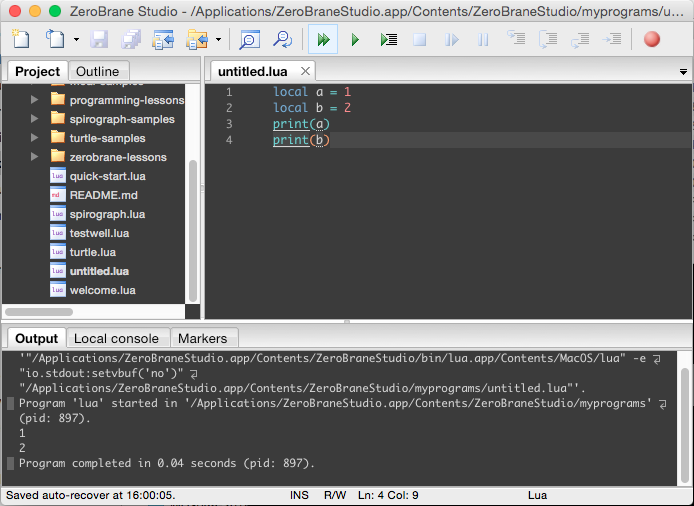
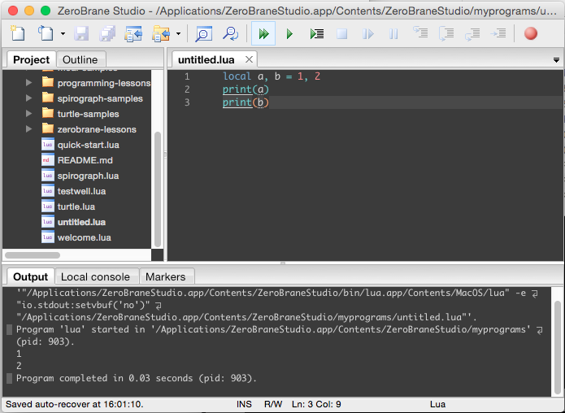
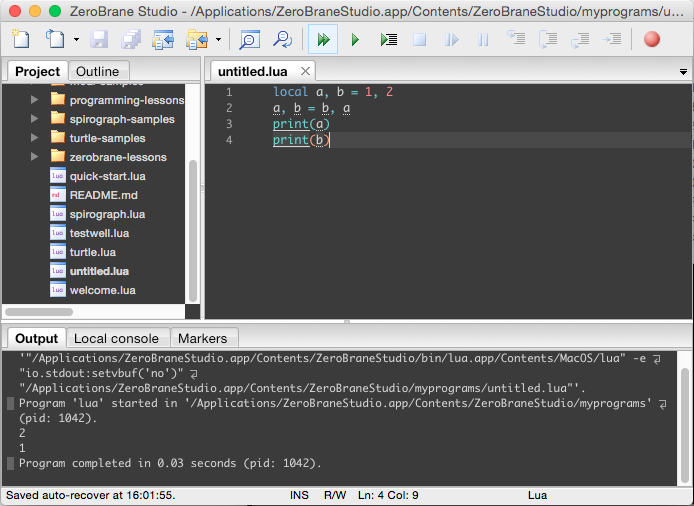

Lua 的賦值語法如下：  

<!-- More -->

```Lua
variable1[, variable2 ...] = value1[, value2 ...]
```

<br/>


簡單說就是先寫要被賦值的變數，接著帶上賦值運算子 =，然後再帶入要賦予的值即可。像是下面這樣：

```Lua
local a = 1
local b = 2
print(a)
print(b)
```

<br/>




<br/>


若要一次賦予多個變數，可用逗號隔開帶上數個要被賦值的變數與要賦予的值。要賦予的值會依序賦予給要被賦予的變數，如果賦予的值少於要被賦予的變數，那多餘的變數不會做賦值的動作，其值為 nil。如果賦予的值多餘要被賦予的變數，那多餘的賦予值會被忽略不處理。    

```Lua
local a, b = 1, 2
print(a)
print(b)
```

<br/>




<br/>


賦值語法也可以拿來做數值的交換。  

```Lua
variable1, variable2 = value2, value1
```

<br/>


像是下面這樣：  

```Lua
local a, b = 1, 2
a, b = b, a
print(a)
print(b)
```

<br/>




<br/>


Link
----
* [Programming in Lua : 4.1](https://www.lua.org/pil/4.1.html)
