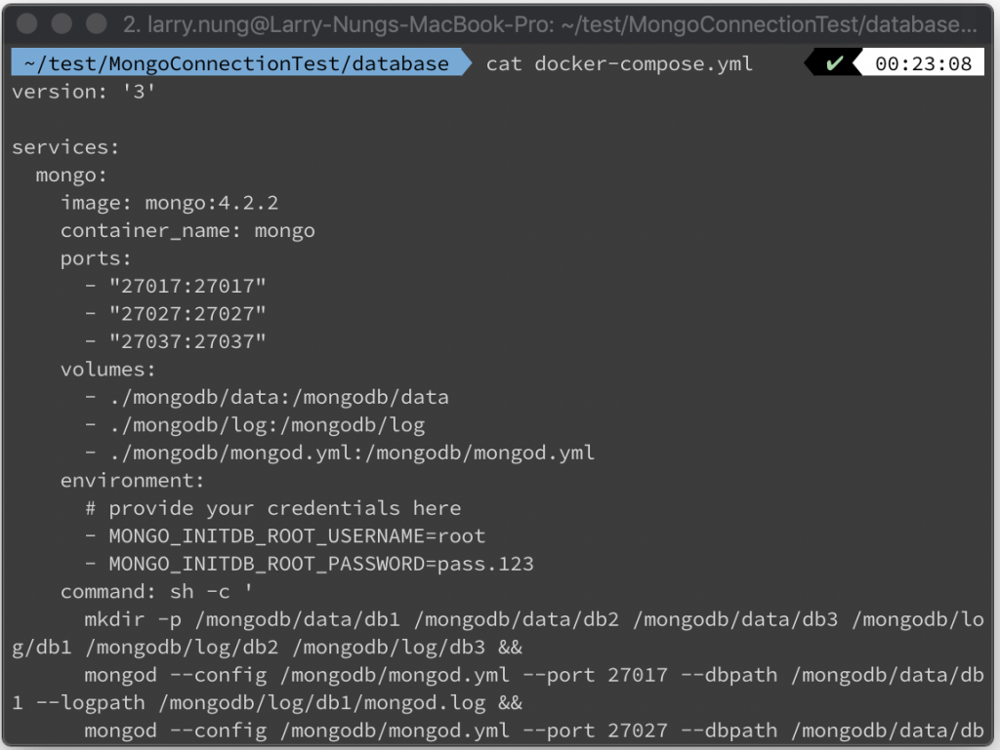
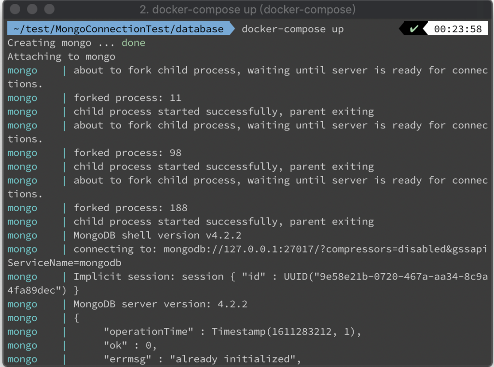
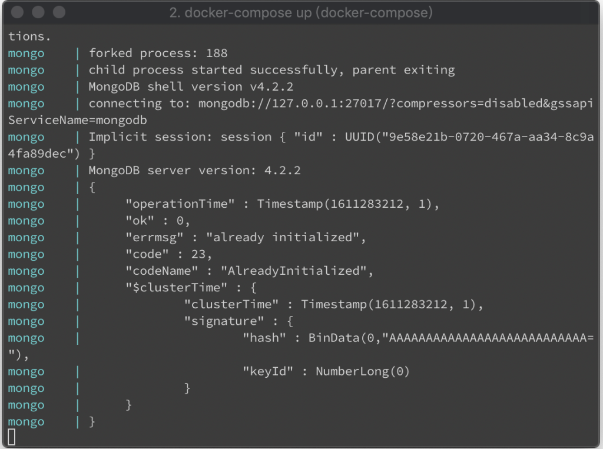
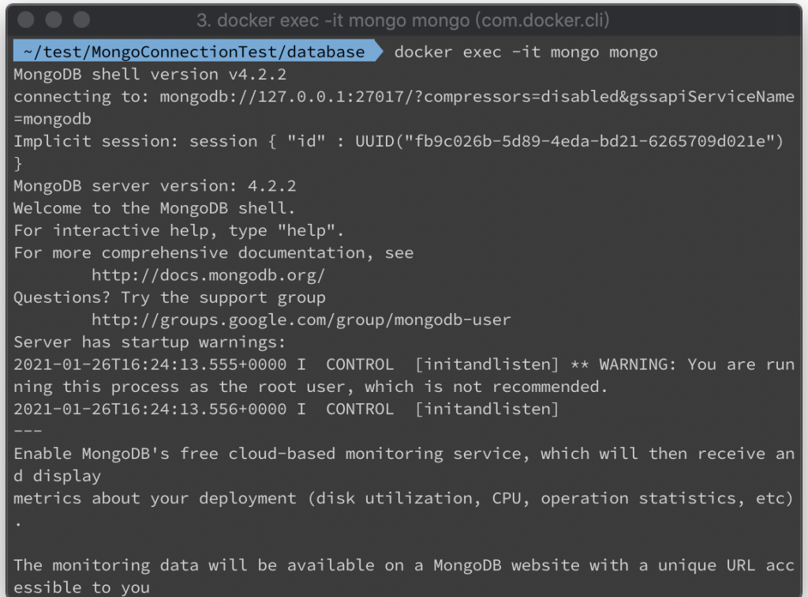
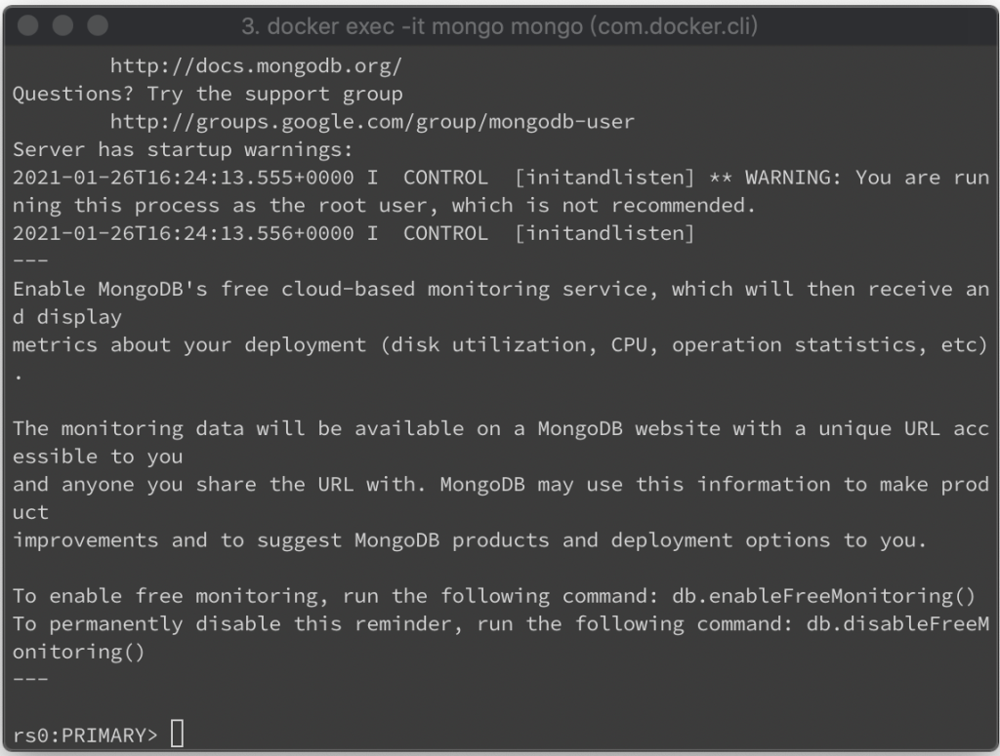
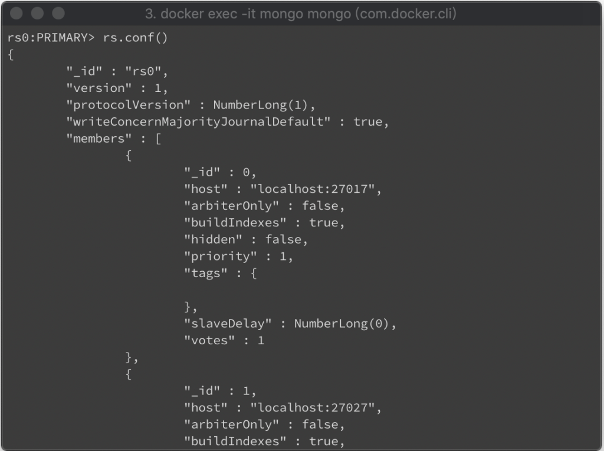
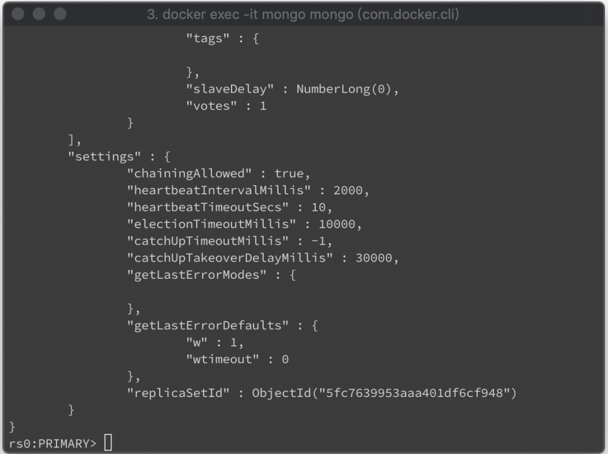
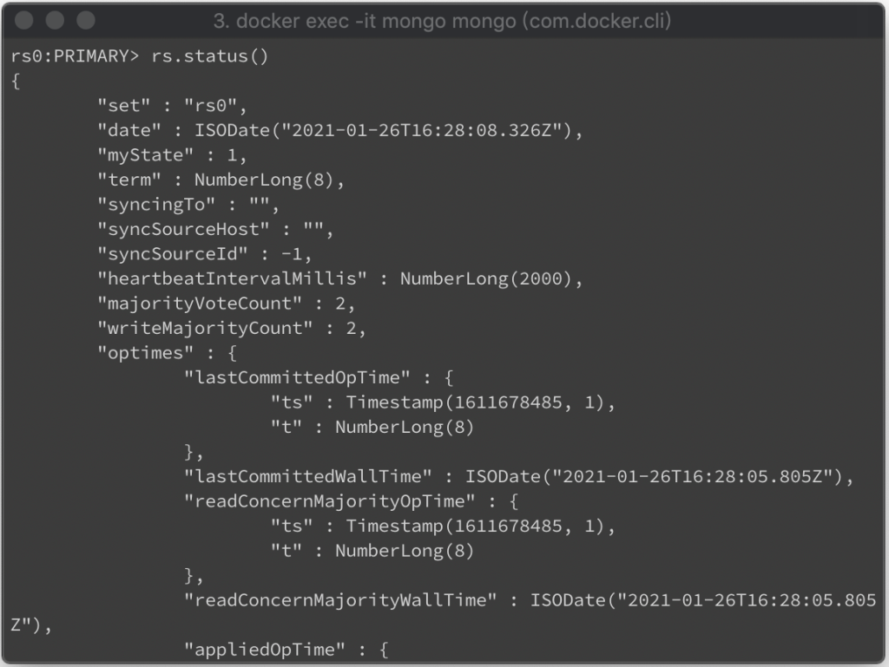
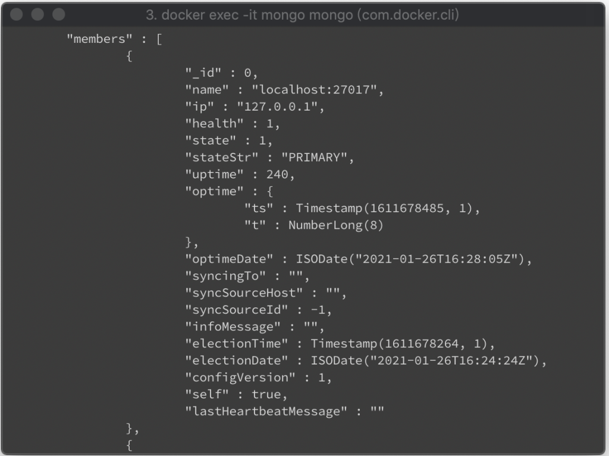
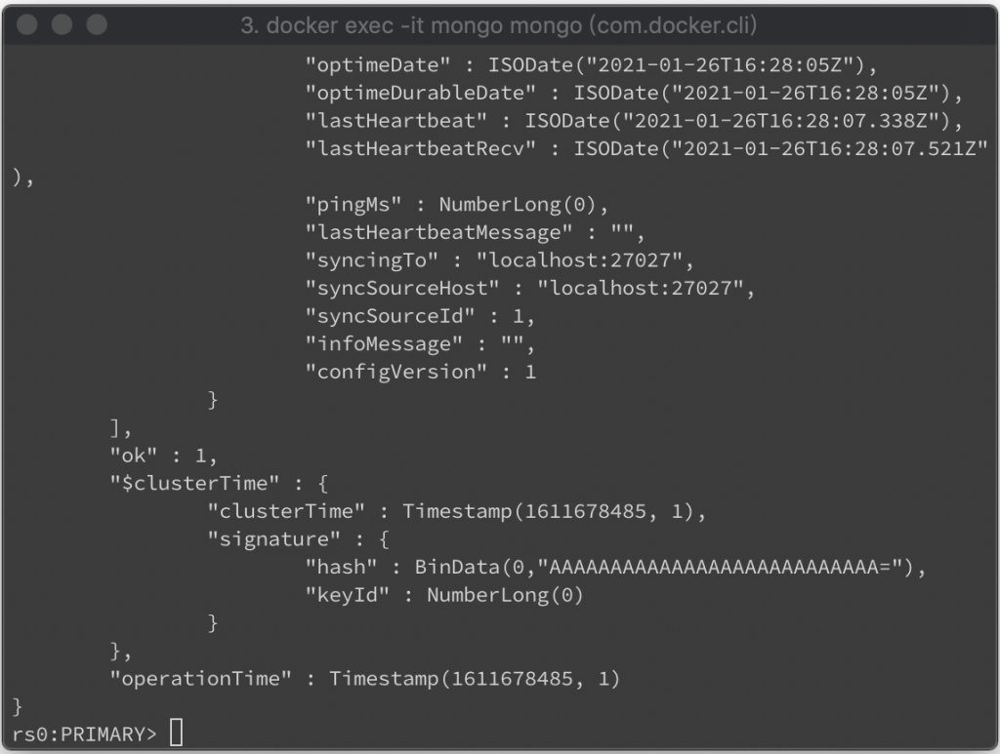

透過 Docker 去起 MongoDB replica set，多半網路上的做法都是用多個容器去做，這邊筆者考量測試與開發上的便利性，試著用一個容器去起 MongoDB replica set。  

<!-- More -->

<br>


Docker compose 檔如下:  

```yaml
version: '3'


services:
  mongo:
    image: mongo:4.2.2
    container_name: mongo
    ports:
      - "27017:27017"
      - "27027:27027"
      - "27037:27037"
    volumes:
      - ./mongodb/data:/mongodb/data
      - ./mongodb/log:/mongodb/log
      - ./mongodb/mongod.yml:/mongodb/mongod.yml
    environment:
      # provide your credentials here
      - MONGO_INITDB_ROOT_USERNAME=root
      - MONGO_INITDB_ROOT_PASSWORD=pass.123
    command: sh -c '
      mkdir -p /mongodb/data/db1 /mongodb/data/db2 /mongodb/data/db3 /mongodb/log/db1 /mongodb/log/db2 /mongodb/log/db3 &&
      mongod --config /mongodb/mongod.yml --port 27017 --dbpath /mongodb/data/db1 --logpath /mongodb/log/db1/mongod.log &&
      mongod --config /mongodb/mongod.yml --port 27027 --dbpath /mongodb/data/db2 --logpath /mongodb/log/db2/mongod.log &&
      mongod --config /mongodb/mongod.yml --port 27037 --dbpath /mongodb/data/db3 --logpath /mongodb/log/db3/mongod.log &&
      mongo --eval '"'"'rs.initiate({_id:"rs0",members:[{_id:0,host:"localhost:27017"},{_id:1,host:"localhost:27027"},{_id:2,host:"localhost:27037"}]})'"'"' &&
      tail -f /dev/null
      '
```



<br>


將容器啟動，MongoDB replica set 沒意外的話會正常運作。



<br>



<br>


通常從最後的 initiate 訊息即可判斷是否正常，若是擔心也可連進容器再做些確認。  

    docker exec -it mongo mongo



<br>


像是連進去的資訊，看看是否有提示 PRIMARY/SECONDARY。  



<br>


調用 rs.conf 命令確認設定。

    rs.conf()



<br>




<br>


或是調用 rs.status 命令確認 replica set 的 primary/secondary 的切換、抄寫、狀態、設定都是正常的。  

    rs.status()



<br>




<br>



