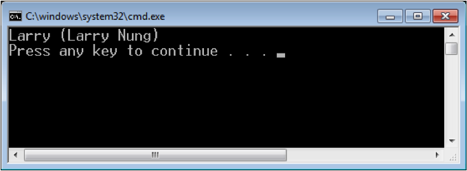

MsgPack.Cli 是 MessagePack 在 CLI 下的實作，如果要在 .NET 程式裡面使用 MessagePack，可以直接透過 NuGet 安裝使用。  

<!-- More -->

    Install-Package MsgPack.Cli

<br/>


使用時先引用 MsgPack.Serialization 命名空間，然後透過 SerializationContext.Default.GetSerializer 取得 Serializer，用取得的 Serializer 帶入 stream 與要序列化的物件去調用 Pack 方法即可將物件序列化。  

```
using MsgPack.Serialization;
... 
public static byte[] Serialize<T>(T thisObj) {
  var serializer = SerializationContext.Default.GetSerializer<T>();
  using (var ms = new MemoryStream()) {
    serializer.Pack(ms, thisObj); 
    return ms.ToArray(); 
  } 
} 
...
```

<br/>


要解序列化則是透過取得的 Serializer 將 Stream 帶入調用 Unpack 方法。  

```
... 
public static T Deserialize<T>(byte[] bytes) { 
  var serializer = SerializationContext.Default.GetSerializer<T>(); 
  using (var byteStream = new MemoryStream(bytes)) { 
    return serializer.Unpack(byteStream); 
  } 
}
...
```

<br/>


MsgPack.Cli 也提供了一些 Attribute 讓我們設定要序列化的物件，像是 MessagePackIgnoreAttribute 可以指定屬性不做序列化的動作，MessagePackMember 可以指定屬性的 ID，物件屬性隨著開發增減時，能識別屬性值是要怎樣對應處理。  

```c#
public class OldPerson { 
  [MessagePackMember(0)] 
  public String Name { get; set; } 
  [MessagePackMember(1)] 
  public String NickName { get; set; } 
  [MessagePackIgnore] 
  public Object Tag { get; set; } 
} 

public class NewPerson { 
  [MessagePackMember(2)] 
  public String ID { get; set; } 
  [MessagePackMember(0)] 
  public String Name { get; set; } 
  [MessagePackMember(1)] 
  public String NickName { get; set; } 
}
```

<br/>


像是假設本來的物件只有 Name 與 NickName 兩個屬性，後來增加了 ID 的屬性，經由 MessagePackMember 設定 ID 後，也能正常的將資料解序列化。  

```c#
…
var larry = new OldPerson { 
  Name = "Larry Nung", 
  NickName = "Larry" 
}; 
var bytes = Serialize(larry); 
var person = Deserialize<NewPerson>(bytes); 
Console.WriteLine("{0} ({1})", person.NickName, person.Name);
…
```

<br/>




<br/>
