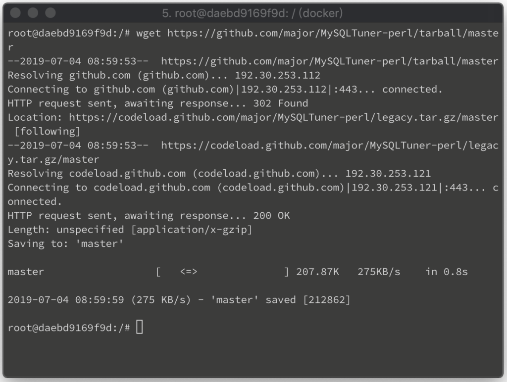
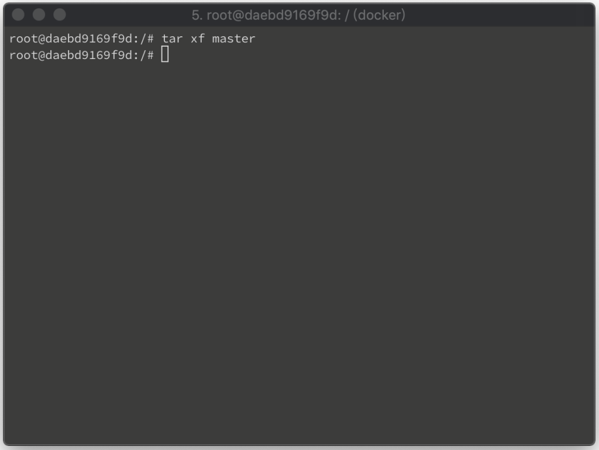
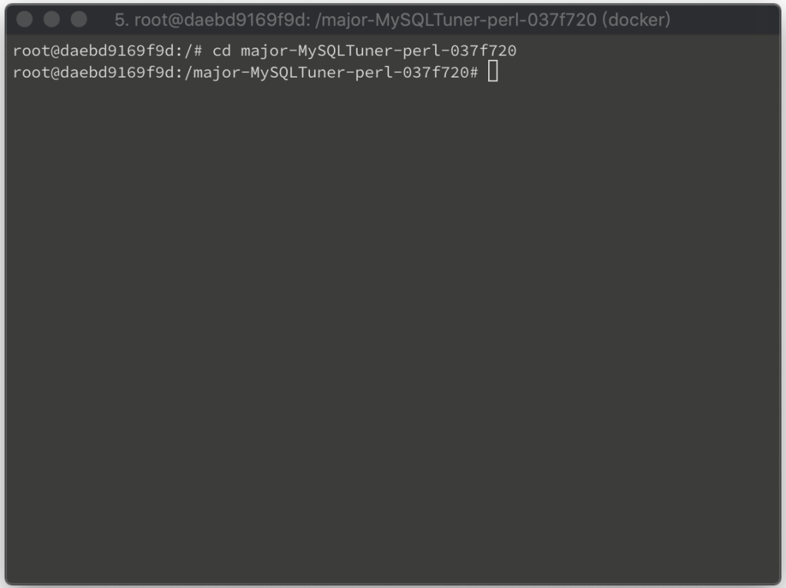
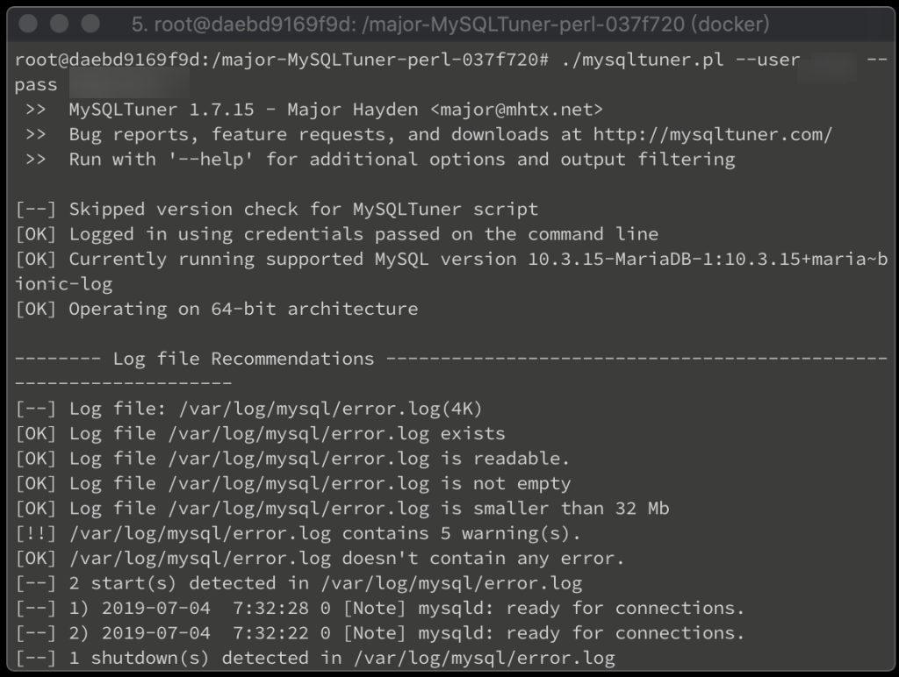

MySQLTuner 是用 Perl 撰寫的腳本，可用來分析 MySQL 或是 MariaDB 的設定，給予效能上的建議。  

<!-- More -->

 

將 MySQLTuner 下載下來。  

    wget https://github.com/major/MySQLTuner-perl/tarball/master

 

解壓縮。  

    tar xf master

 

進到解完壓縮的目錄。  

    cd major-MySQLTuner-perl-037f720

 

輸入命令可分析資料庫的設定並給予建議，只要針對最下方的建議或是前面是 !! 的下去處理即可。  

    ./mysqltuner.pl 
    ./mysqltuner.pl --user $user --pass $password

