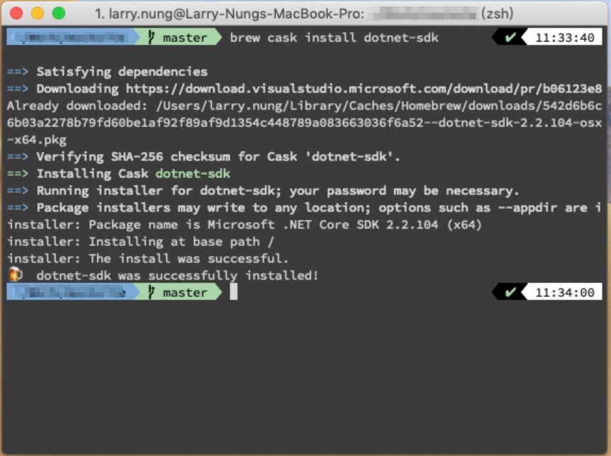
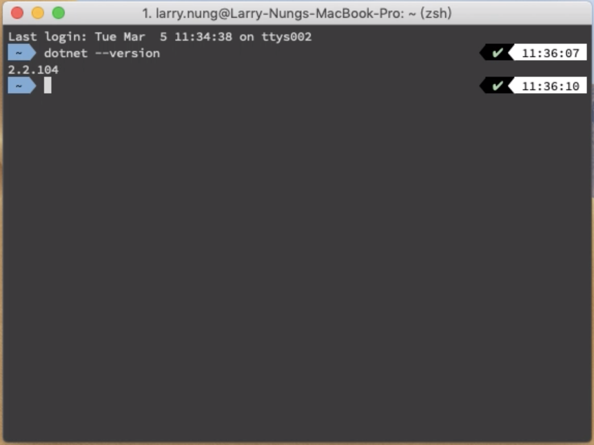

要使用 HomeBrew 安裝 .NET SDK，可以使用 brew cask 安裝 dotnet-sdk 套件。  

<!-- More -->

    brew cask install dotnet-sdk

 

安裝完後可開新的 Terminal 調用命令查詢 .NET Core SDK 版本試試，安裝成功的話應可正常看到 .NET Core SDK 的版本。  

    dotnet --version

