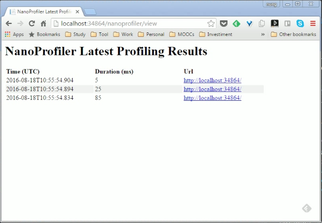

NanoProfiler 有許多的套件。  

<!-- More -->

<br/>


如果是 Web 專案，安裝 NanoProfiler.Web 即可 (會連帶安裝 NanoProfiler)。  

<br/>


套件安裝完後要設定 CircularBuffer，可透過程式設定...   

```c#
protected void Application_Start(object sender, EventArgs e)
{
    ...
    ProfilingSession.CircularBuffer = new CircularBuffer<ITimingSession>(200, session => false);
    ...
}
```

<br/>


也可以透過設定檔設定...  

```xml
<configuration>
  <configSections>
    <section name="slf4net" type="slf4net.Configuration.SlfConfigurationSection, slf4net" />
    <section name="nanoprofiler" type="EF.Diagnostics.Profiling.Configuration.NanoProfilerConfigurationSection, NanoProfiler" />
  </configSections>
  ...
  <nanoprofiler circularBufferSize="200" />
</configuration>
```

<br/>


CircularBuffer 設定完後，就可以設定要 Profile 的部分，像是每個 Request 的進出。    
```c#
        protected void Application_BeginRequest(object sender, EventArgs e)
        {
            ProfilingSession.Start("root");
        }

        protected void Application_EndRequest(object sender, EventArgs e)
        {
            ProfilingSession.Stop();
        }
```

<br/>


以及 Request 中想要監測的部分。  

```c#
using (var step = ProfilingSession.Current.Step("[StepName]"))
{
    ...
}
```

<br/>


將程式運行起來，訪問 http://[Domain]/nanoprofiler/view 即可看到 profile 的結果。  


<br/>


這邊如果要將資料保存下來，可以加裝 NanoProfiler.Storages.Json，並修改設定去指定使用 Storage。  

```xml
<configuration>
  <configSections>
    <section name="slf4net" type="slf4net.Configuration.SlfConfigurationSection, slf4net" />
    <section name="nanoprofiler" type="EF.Diagnostics.Profiling.Configuration.NanoProfilerConfigurationSection, NanoProfiler" />
    ...
  </configSections>
  ...
  <nanoprofiler circularBufferSize="200" storage="EF.Diagnostics.Profiling.Storages.Json.JsonProfilingStorage, NanoProfiler.Storages.Json"/>
</configuration>
```

<br/>


如果 Profile 要過濾掉一些位置，可以透過程式設定 filter。  

```c#
        protected void Application_Start()
        {
            ...
            // register profiling filters to exclude some URLs from profiling
            ProfilingSession.ProfilingFilters.Add(new NameContainsProfilingFilter("_tools/"));
            ProfilingSession.ProfilingFilters.Add(new FileExtensionProfilingFilter("jpg", "js", "css"));
            ...
        }
```

<br/>


或是透過設定檔設定也可以。  

```xml
<configuration>
  <configSections>
    <section name="slf4net" type="slf4net.Configuration.SlfConfigurationSection, slf4net" />
    <section name="nanoprofiler" type="EF.Diagnostics.Profiling.Configuration.NanoProfilerConfigurationSection, NanoProfiler" />
    ...
  </configSections>
  ...
  <nanoprofiler circularBufferSize="200" storage="EF.Diagnostics.Profiling.Storages.Json.JsonProfilingStorage, NanoProfiler.Storages.Json">
    <filters>
        <add key="_tools" value="_tools/" type="Contain" />
        <add key="exts" value="ico,jpg,js,css" type="EF.Diagnostics.Profiling.Web.ProfilingFilters.FileExtensionProfilingFilter, NanoProfiler.Web" />
        <add key="ViewProfilingLogsHandler" value="ViewProfilingLogsHandler.*" type="regex" />
    </filters>
  </nanoprofiler>
</configuration>
```

<br/>


Link
----
* [ef-labs/nanoprofiler: NanoProfiler - a light weight .NET profiling library](https://github.com/ef-labs/nanoprofiler)
* [Home · ef-labs/nanoprofiler Wiki](https://github.com/ef-labs/nanoprofiler/wiki)
* [使用 NanoProfiler 對 ASP.NET Web API 進行性能監控 | mrkt的程式學習筆記 - 點部落](https://dotblogs.com.tw/mrkt/2016/06/05/142546)
