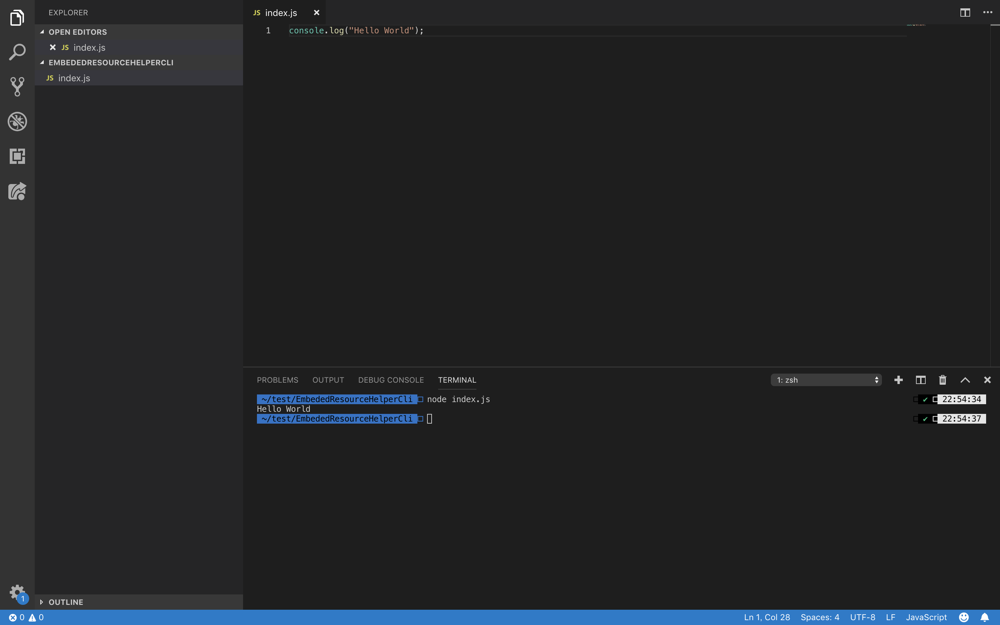
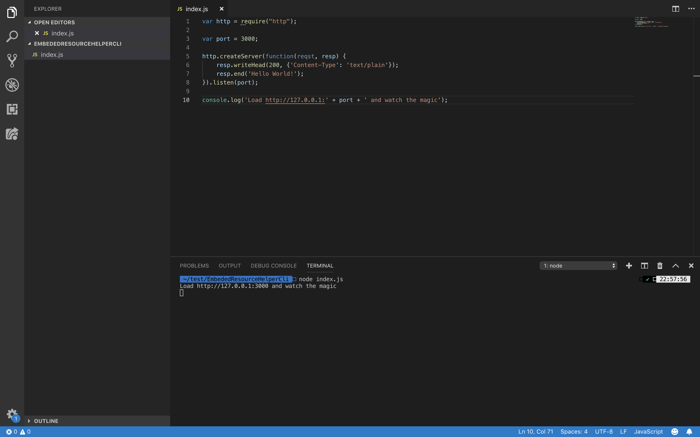
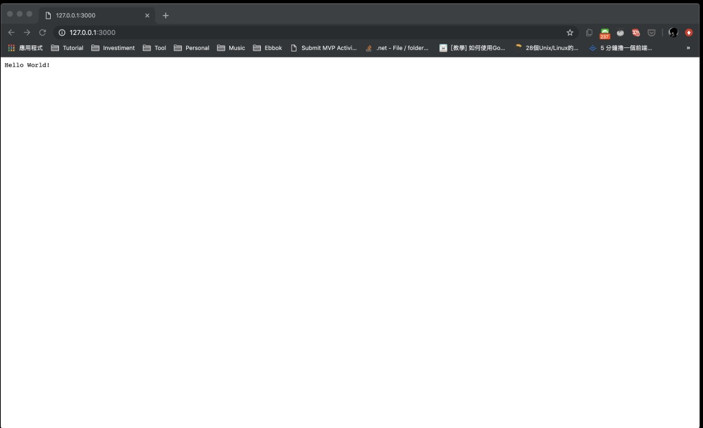

Node.Js 安裝完後，開個 Js 檔來撰寫簡單的 Hello World 程式。  

<!-- More -->

```
console.log("Hello World");
```

</br>


然後調用 node 命令並帶入程式位置。  

    node ${file}

</br>


即可運行程式，顯示程式運行後的結果。   



</br>


再來看一下稍微複雜點的 Hello World。  

```
var http = require("http");

var port = 3000;

http.createServer(function(reqst, resp) {
    resp.writeHead(200, {'Content-Type': 'text/plain'});
    resp.end('Hello World!');
}).listen(port);

console.log('Load http://127.0.0.1:' + port + ' and watch the magic');
```

</br>

會在特定 Port 號起一個 http 服務，該服務會回應 "Hello World!" 字樣。  

</br>


將服務啟動。  



</br>


用瀏覽器訪問服務的位置，即可看到服務回應我們預期的結果。  


