要將 Evernote 的資料搬移至 OneNote，可以使用 OneNote Importer。  

<!-- More -->

 

先下載 OneNote Importer。  

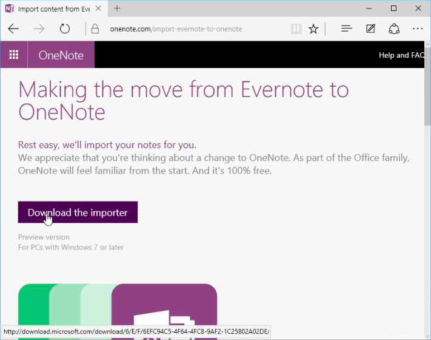

 

開啟 OneNote Importer，勾選 `I accept the terms of this aggreement` 後點選 `Get started` 按鈕。  

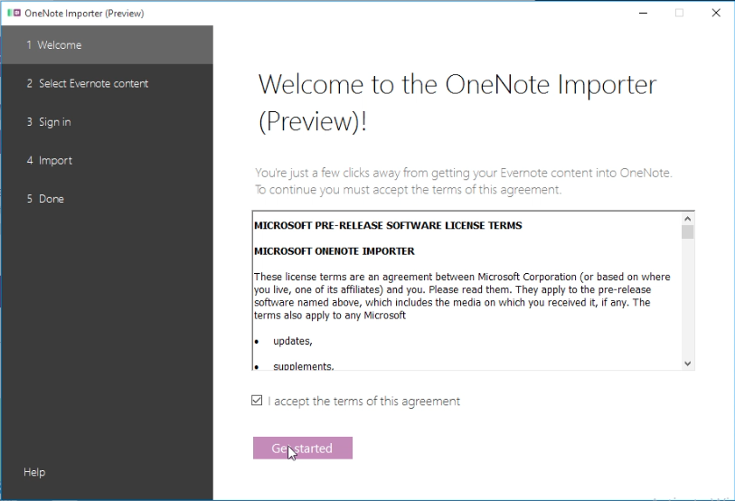

 

接著要選取要匯入 OneNote 的內容，如果機器有安裝 Evernote，這邊可以直接點選到 Evernote 的 Notebook。

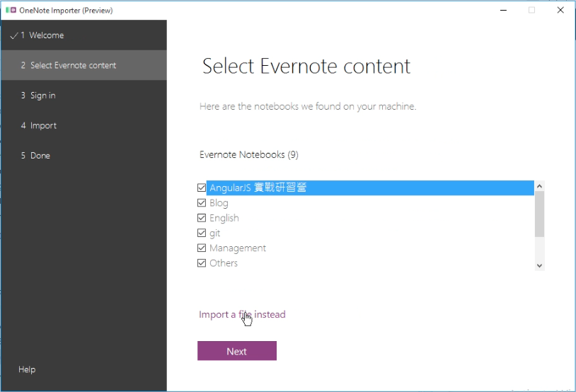

 

如果本機沒安裝 Evernote，或是要匯入的單位不是 Notebook 的話。這邊可先開啟 Evernote，將想匯入至 OneNote 的內容先行匯出。  

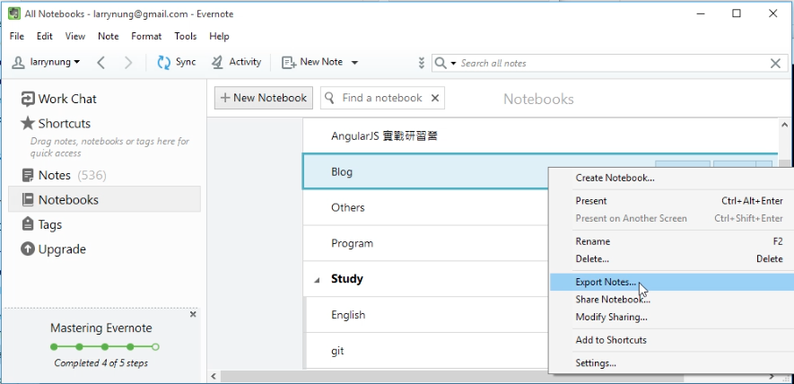

 

匯出的格式選曲 ENEX 即可。  

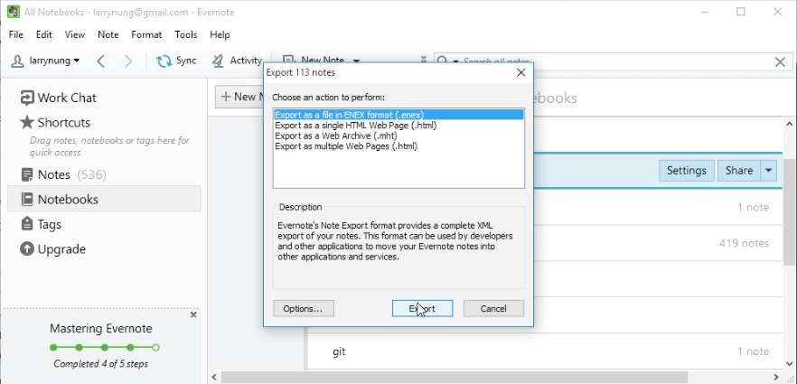

 

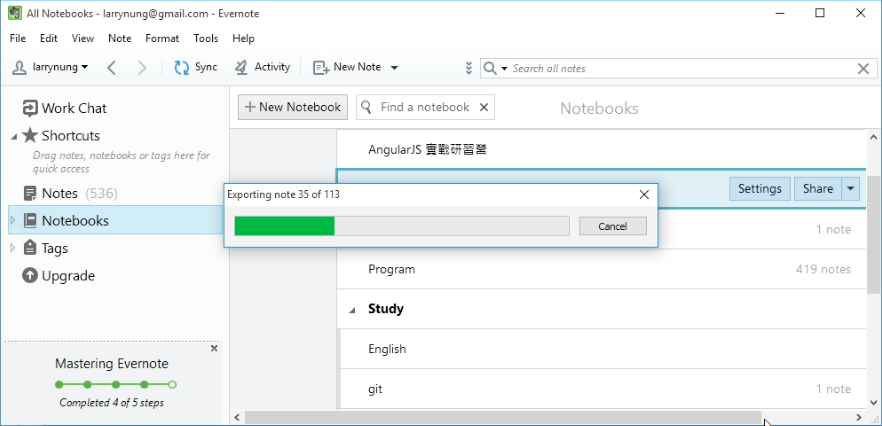

 

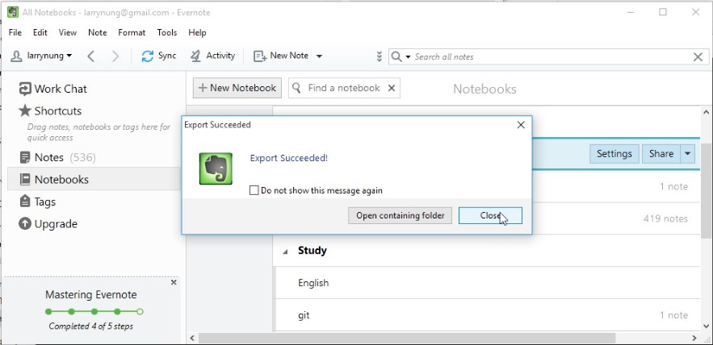

 

匯出完成，在 OneNote Importer 這邊指定剛匯出的檔案，點選 `Next` 按鈕。  

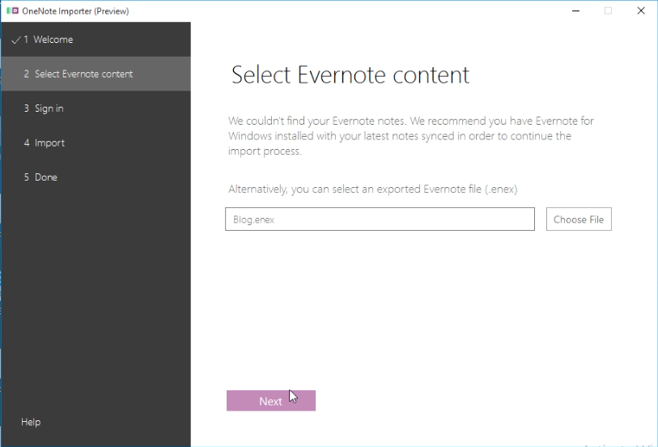

 

接著輸入帳密登入 OneNote。  

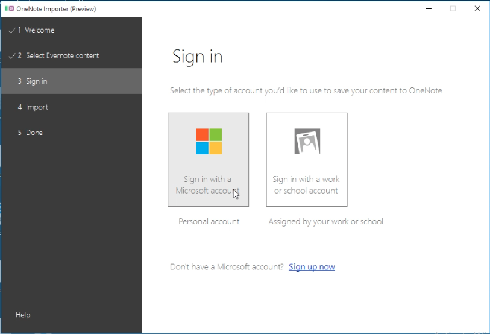

 

再來調整匯入時的設定，看是否要將 Evernote 的 Tag 帶到 OneNote。設定完點選 `Import` 按鈕開始匯入。  

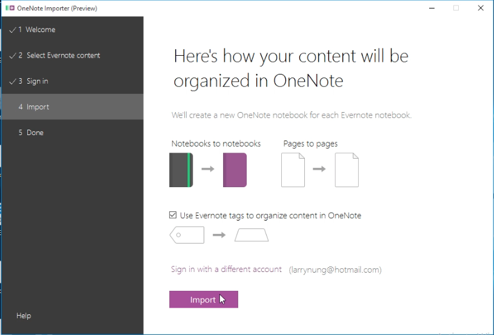

 

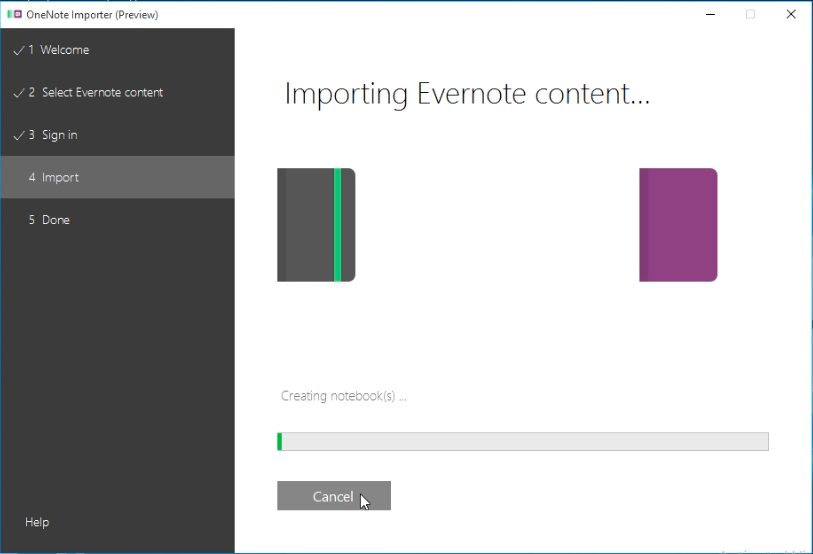

 

匯入完成可點選 `View notes in OneNote` 按鈕開啟 OneNote 進行確認。  

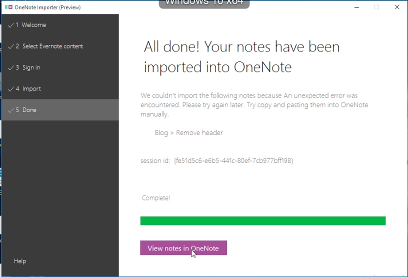

 

沒意外的話應該會看到匯入的內容。  

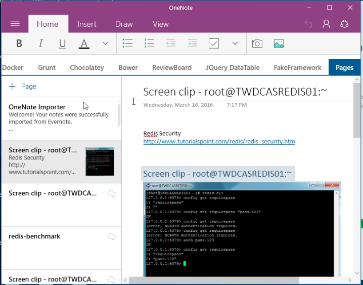

 

Link
----
* [將 Evernote 中的內容匯入 OneNote](https://www.onenote.com/import-evernote-to-onenote)
