Oracle SQL Developer 要使用 Subversion 進行程式碼的版本控制，首先要建立連線。  

<!-- More -->

 

可以透過 [Team | Subversion | Create Connection...] 選單選項進行連線的建立。  

 

選取 Manually Create a Subversion Connection 後按下 OK 按鈕。  

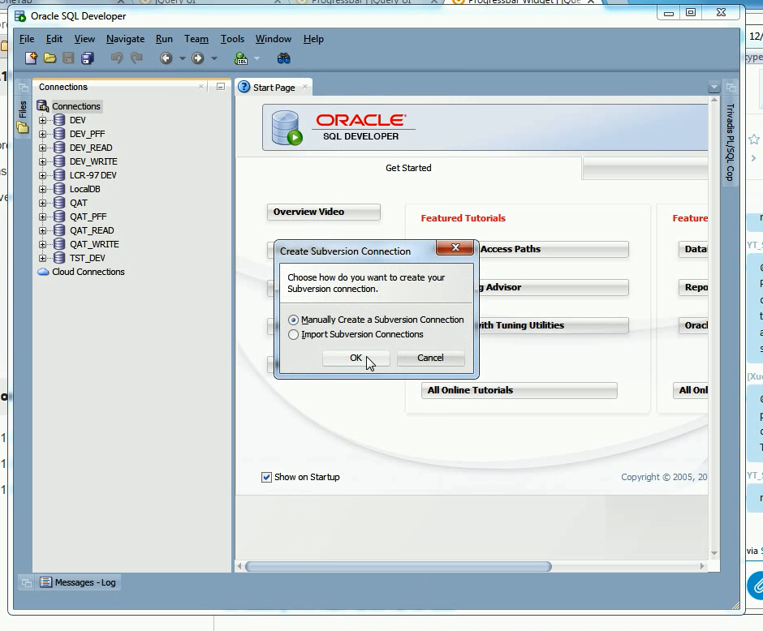

 

輸入 Subversion Repository 位置、連線名稱、帳號、密碼建立連線。  

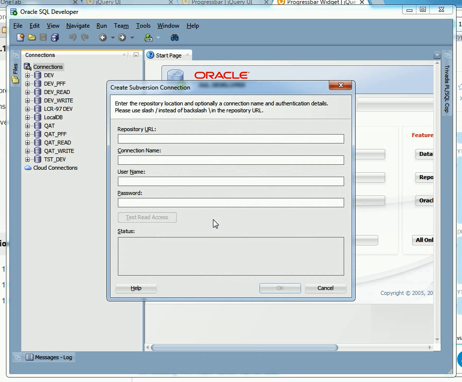

 

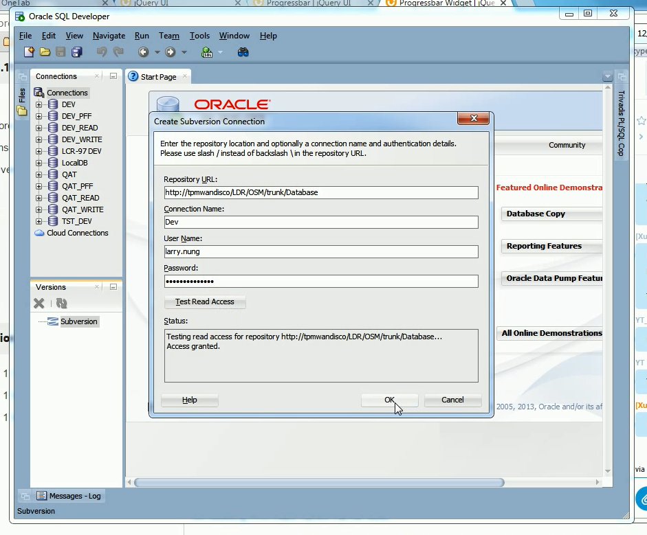

 

連線建立完成即可在 Versions 看到剛所建立的連線。  

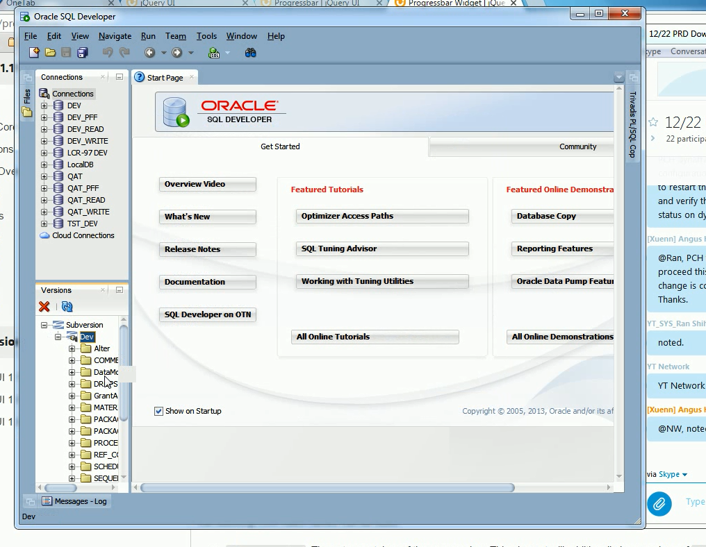

 

連線建立後要透過 Check Out... 滑鼠右鍵選單選項進行檔案的 Check Out。  

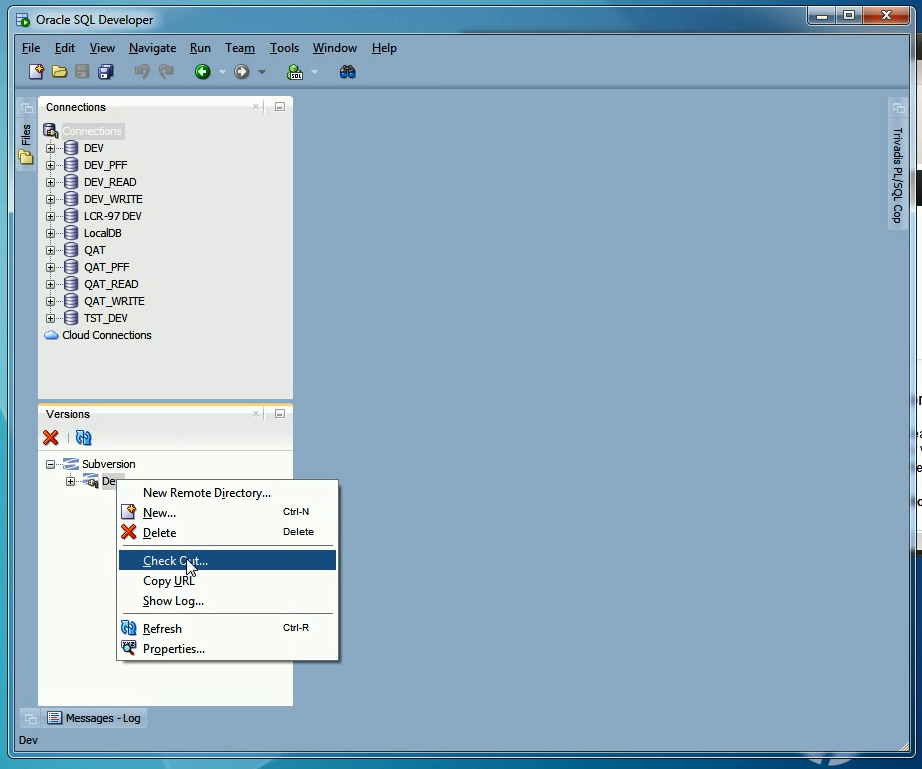

 

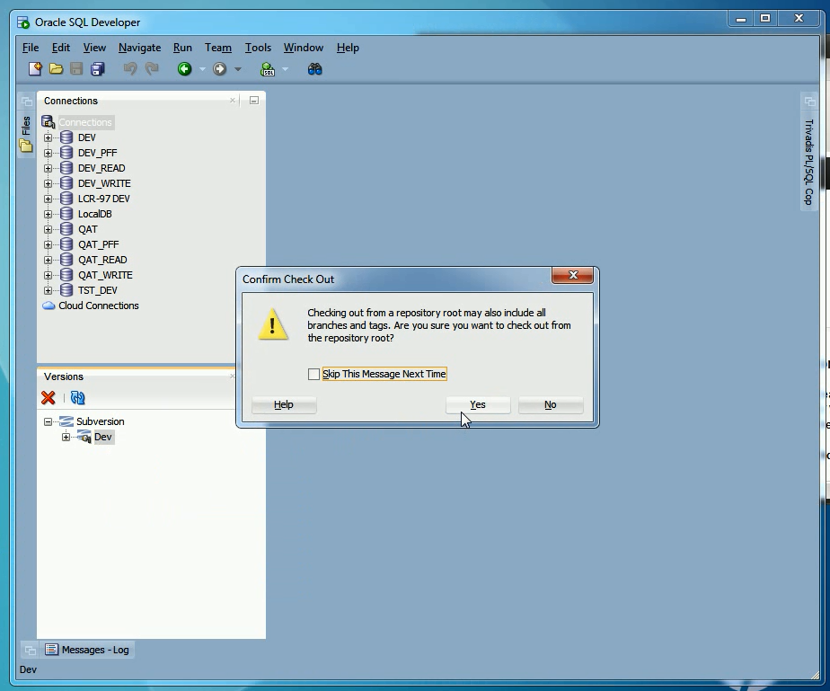

 

設定 Check Out 下來的位置。  

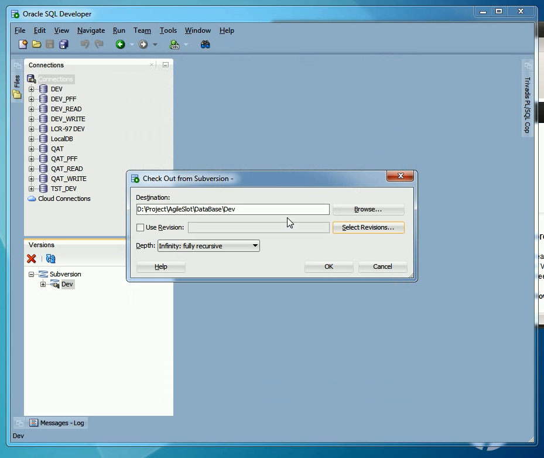

 

若有需要也可以指定 Check Out 的版本。  

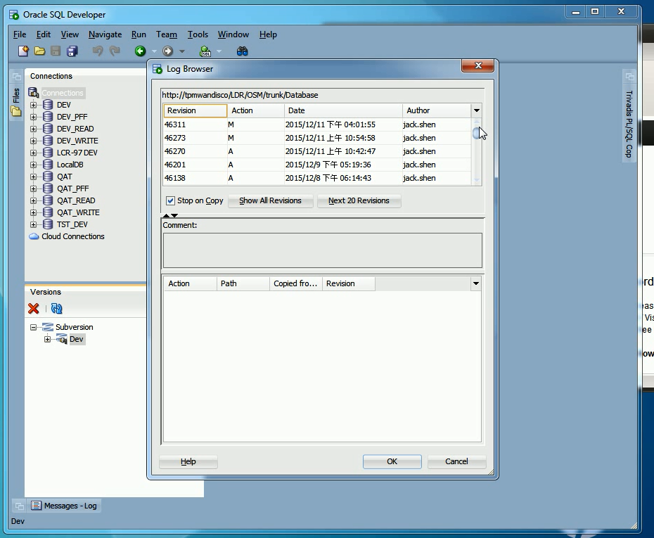

 

設定好按下 OK 按鈕繼續。  

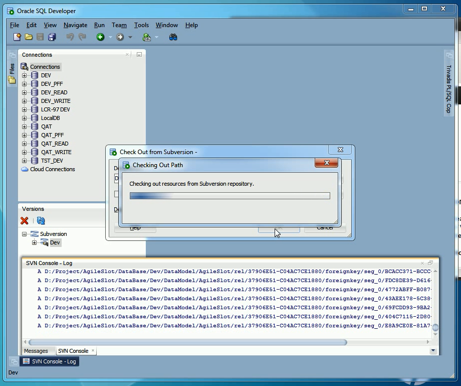

 

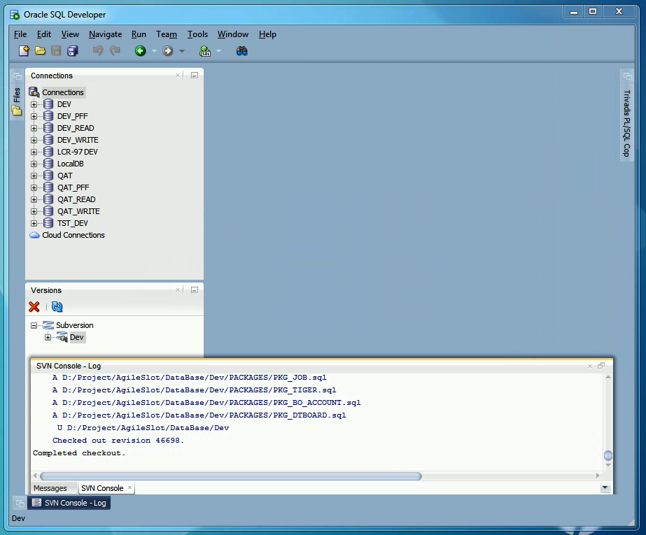

 

Check Out 下來後透過 Files 視窗瀏覽檔案可看到檔案的版控狀態。  

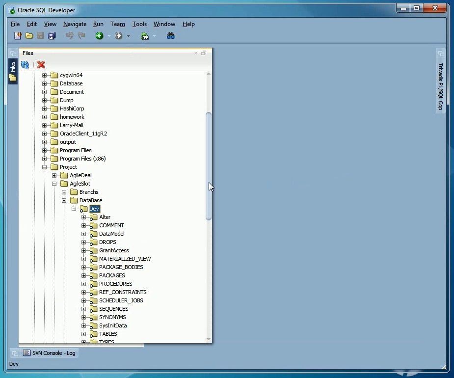

 

後續也可以直接透過 Oracle SQL Developer 進行 Commit 之類的版控動作。  

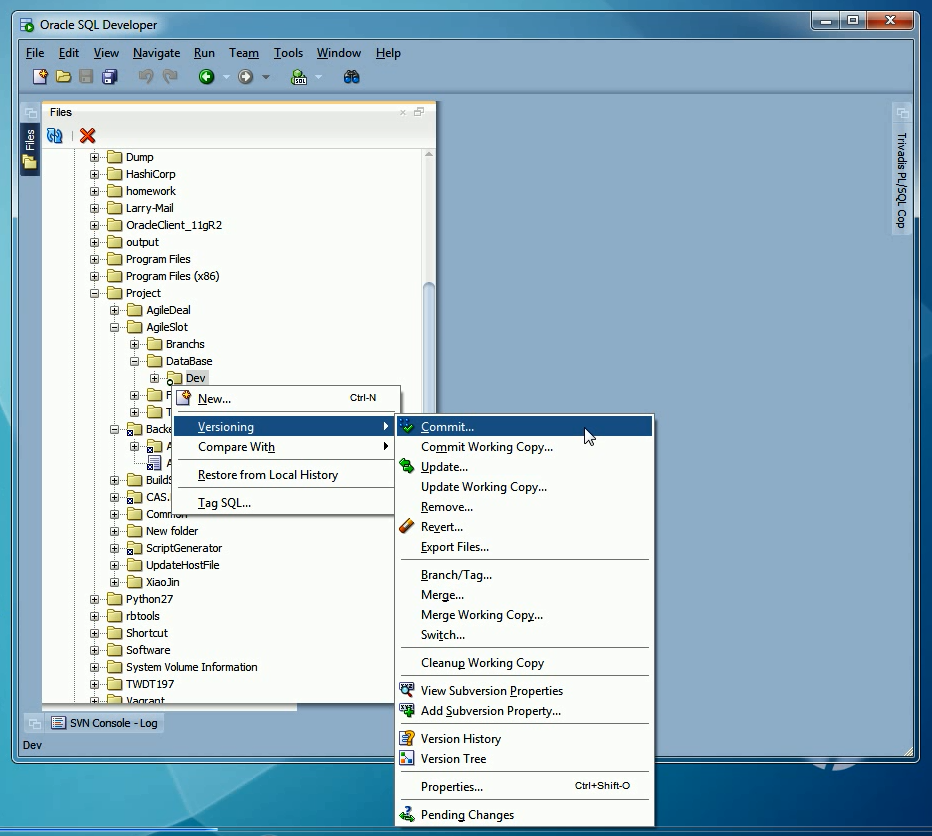

 

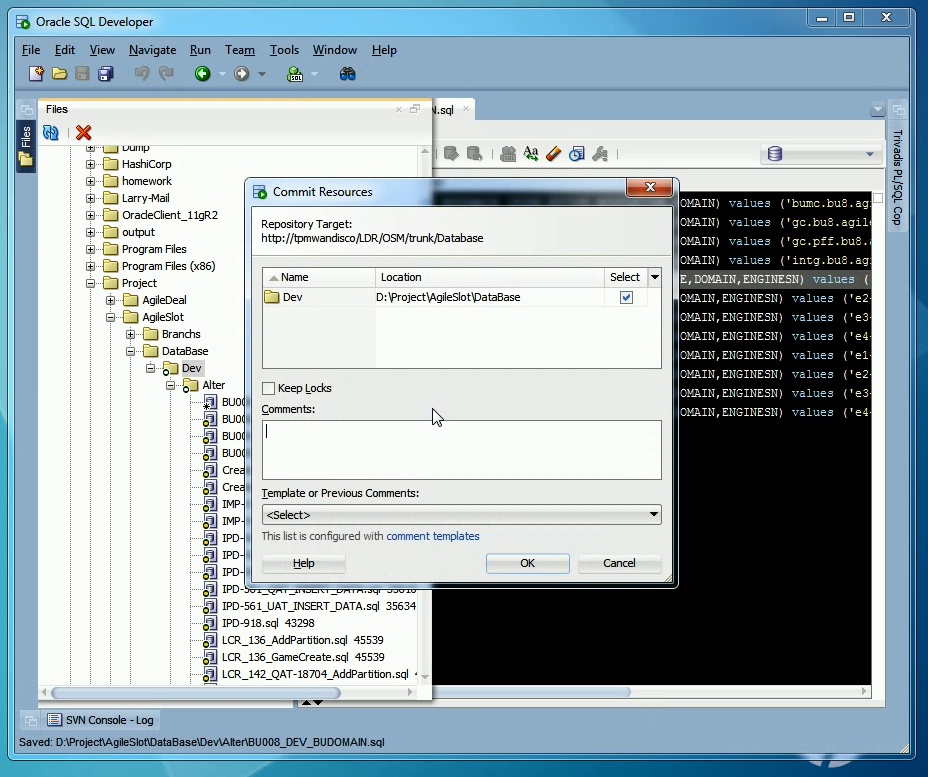

 
