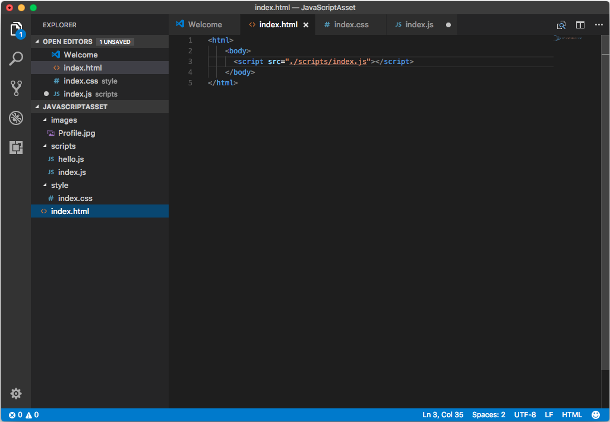
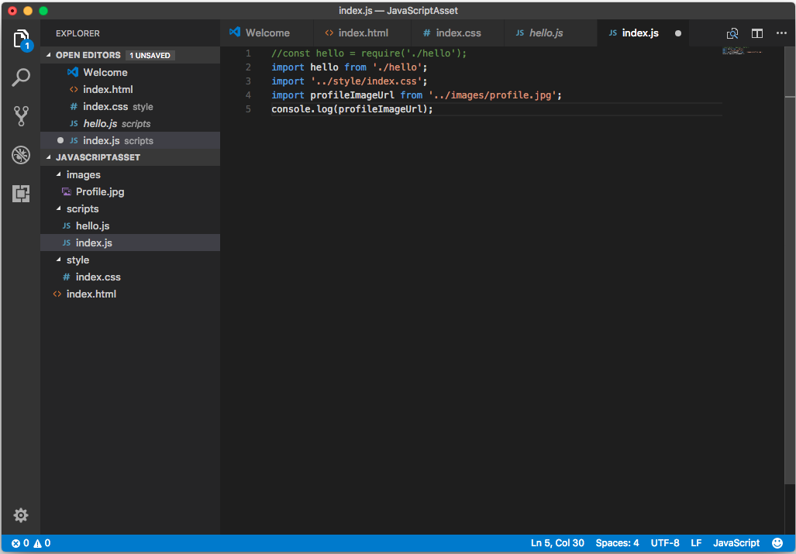
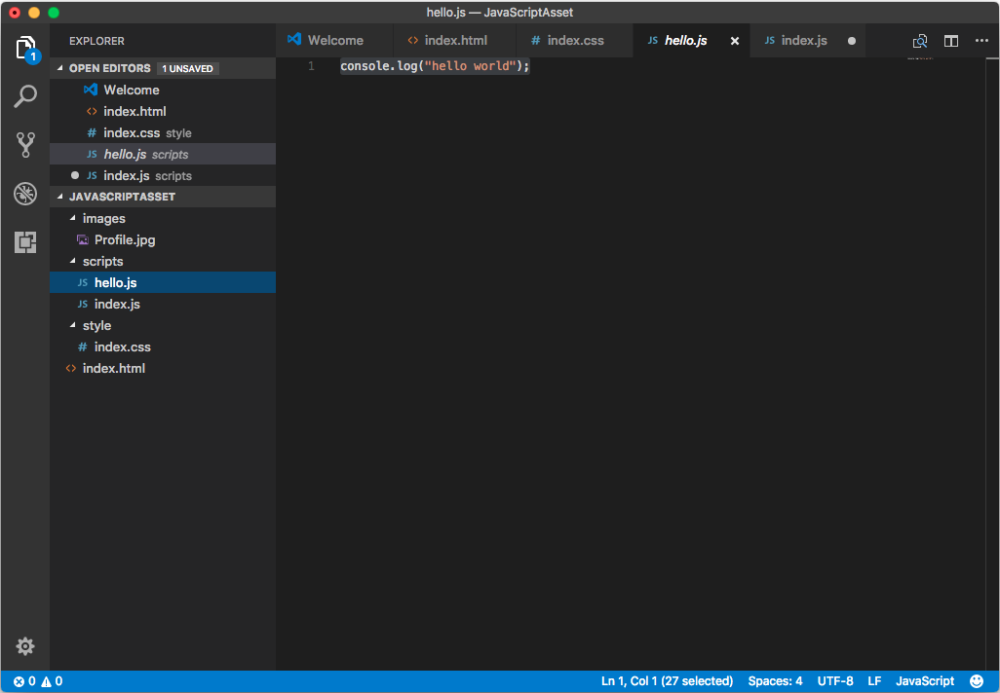
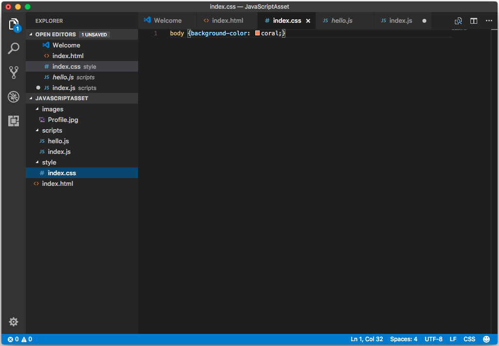
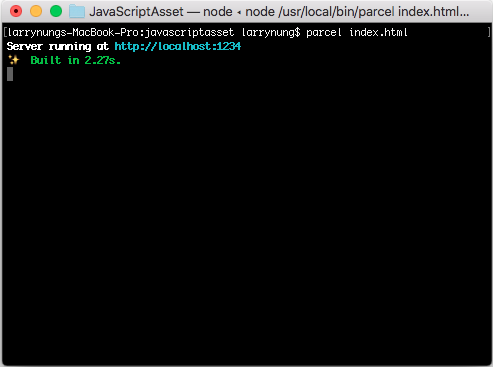
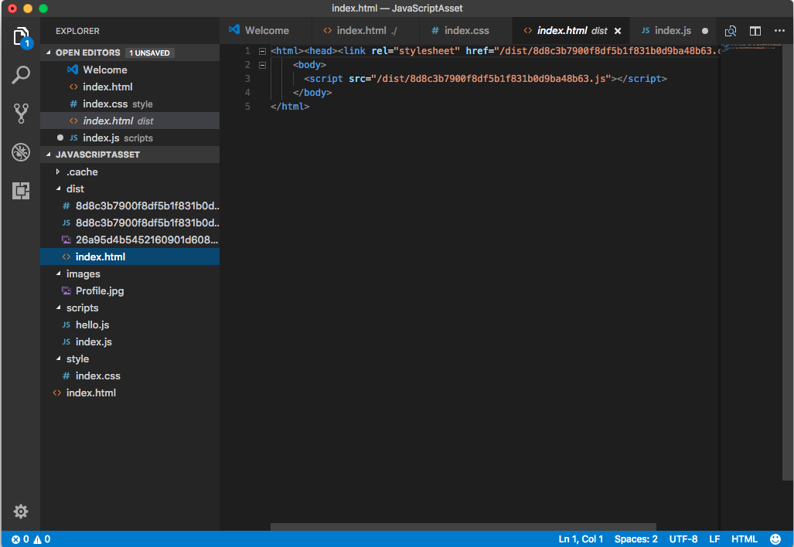
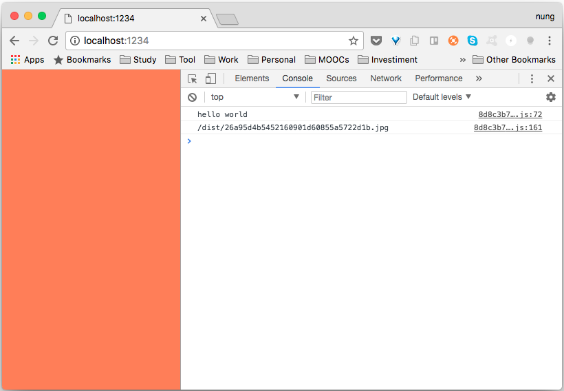

要使用 Parcel 在 JavaScript 中載入 JavaScript 模塊可用 CommonJS 的寫法。  

<!-- More -->

    const module = require(modulePath);

<br/>


或是 ES6 的寫法。  

    import module from modulePath;

<br/>


除了 JavaScript 的模塊外，也能引用 CSS 文件。  


    import cssPath;

<br/>


以及引用圖片。  

    import imageUrl from imagePath;

<br/>


像是下面這邊筆者創建了個簡單的範例，建立了個 index.html，裡面引用了 index.js。  

```html
<html>
    <body>
      <script src="./scripts/index.js"></script>
    </body>
</html>
```



<br/>


index.js 內引用了不同類型的檔案。  

```js
//const hello = require('./hello');
import hello from './hello';
import '../style/index.css';
import profileImageUrl from '../images/profile.jpg';
console.log(profileImageUrl);
```



<br/>


像是 js 檔(hello.js)。  

```js
console.log("hello world");
```



<br/>


CSS 檔(index.css)。

```css
body {background-color: coral;}
```  



<br/>


以及圖檔。  

<br/>


範例準備好後調用 Parcel 命令建置並啟用服務。  
 


<br/>


Parcel 解析網站後會將需要的檔案處理後移至輸出目錄。  



<br/>


連至啟動的服務網址，可看到網站正確的被運行。  



<br/>


Link
----
* [📦 资源(Assets)](https://parceljs.org/assets.html)
