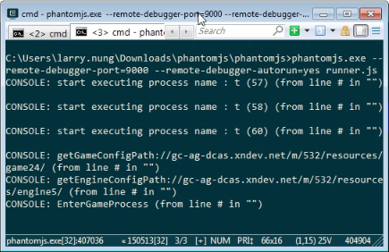
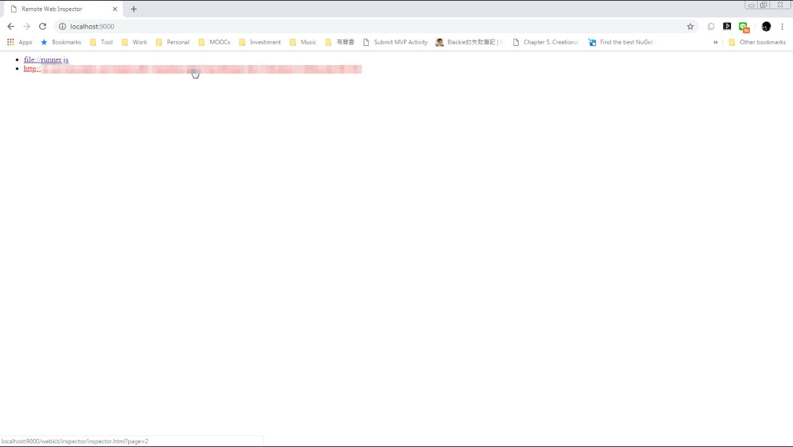
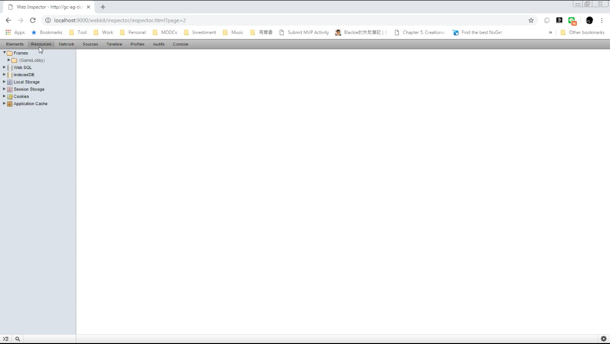

使用 PhantomJS 時，若是光靠訊息不好除錯，可進一步使用 PhantomJS 的遠端除錯。  

<!-- More -->

 

使用上只要調用 PhantomJS 時帶入參數 --remote-debugger-port 去指定連結埠。  

    phantomjs --remote-debugger-port=<Port> <Script>

 

但這樣啟動不會自動運行腳本，需在 Console 頁面調用 __run() 命令才會運行。  

 

可以在調用 PhantomJS 時加帶 --remote-debugger-autorun 參數指定自動運行腳本。  

    phantomjs --remote-debugger-port=<Port> --remote-debugger-autorun=yes <Script>

 

在調用上會像下面這樣：  

 

調用完用瀏覽器訪問 http://localhost:<Port>，點選連結... 

 

就會看到類似開發人員工具的介面，可透過該介面對腳本進行進一步的除錯。  

 

 

Link
----
* [Troubleshooting | PhantomJS](http://phantomjs.org/troubleshooting.html)
