ProGet Connector 允許 ProGet feed 取得其它來源的套件。  

<!-- More -->

 

可從 Feed 管理頁面建立加入 Connector。  

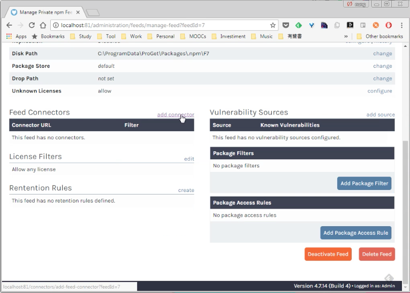

 

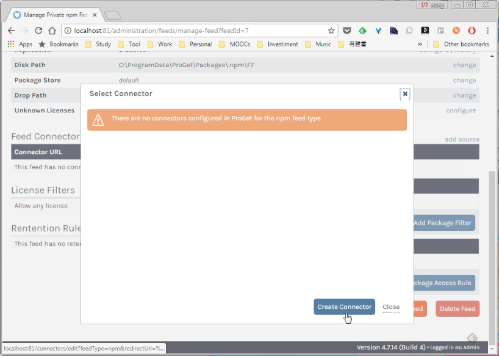

 

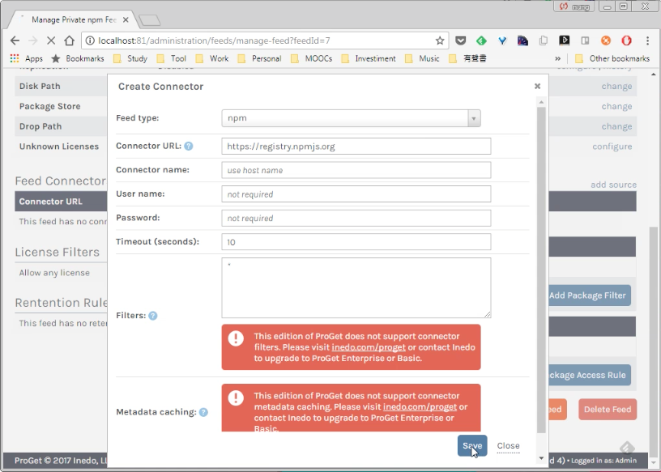

 

也可以在 Connectors 頁面建立 Connector。  

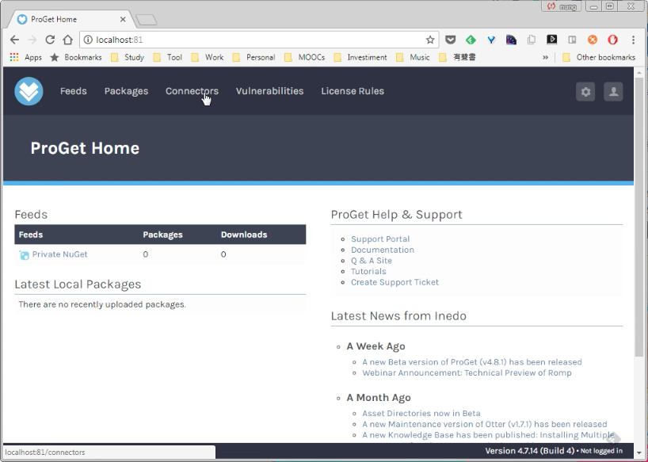

 

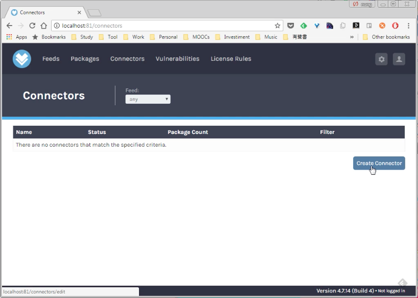

 

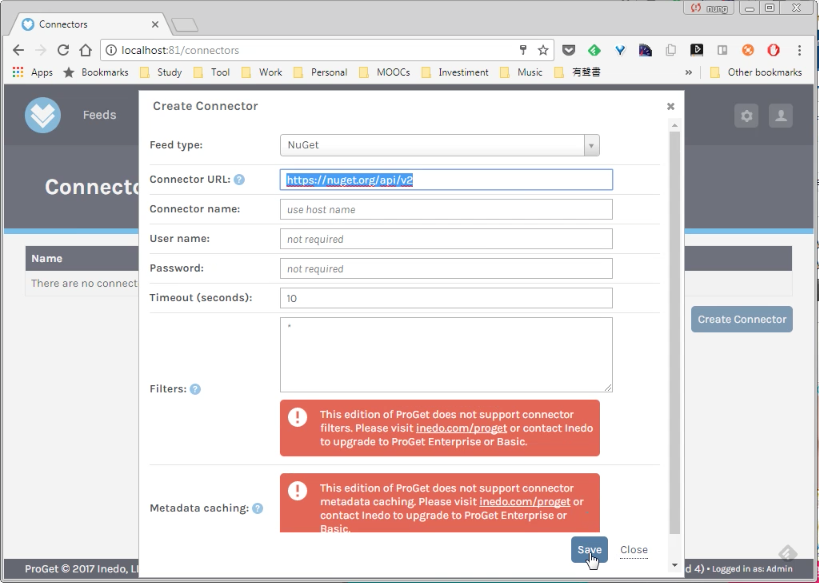

 

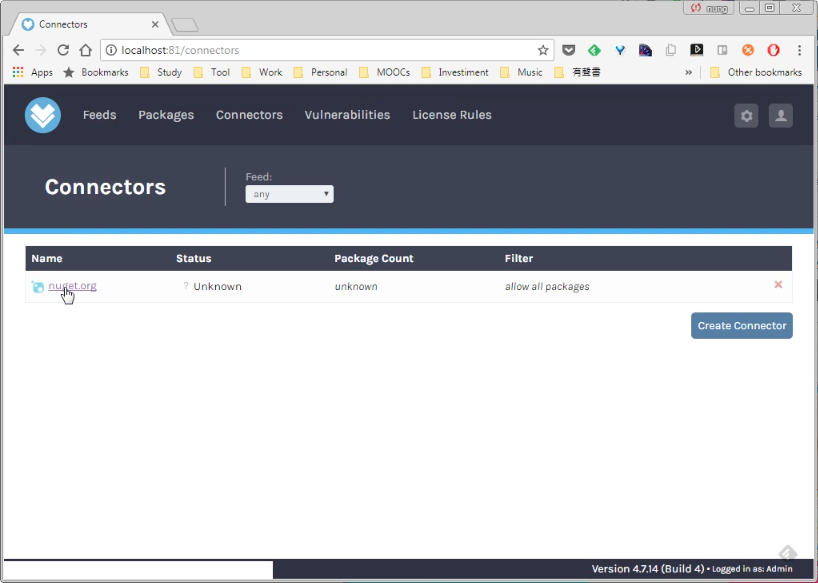

 

然後在 Feed 管理頁面加入 Connector。  

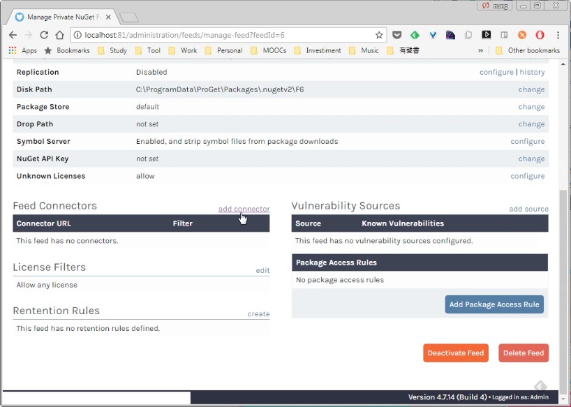

 

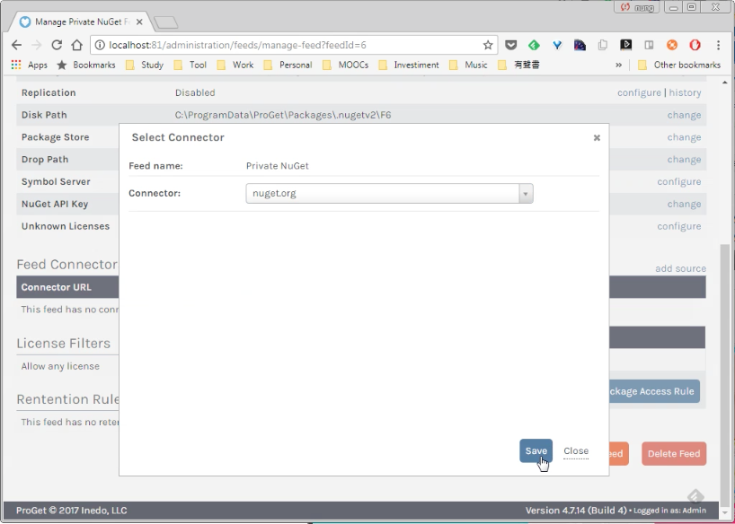

 

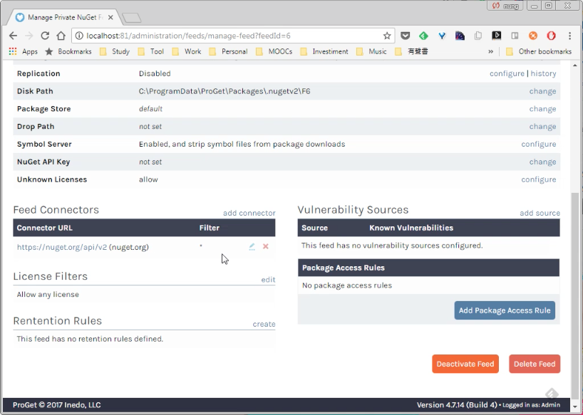

 

Feed 加入 Connector 後即可查閱到 Connector 來源內的套件。  

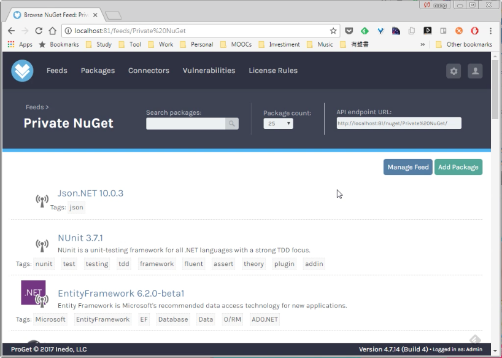

 

Link
----
* [Connectors - ProGet Documentation | Inedo](http://inedo.com/support/documentation/proget/core-concepts/connectors)
