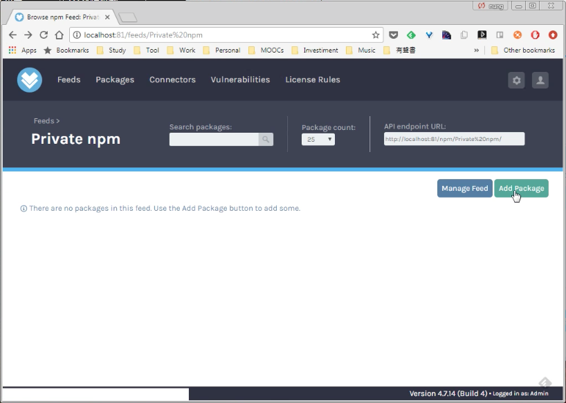
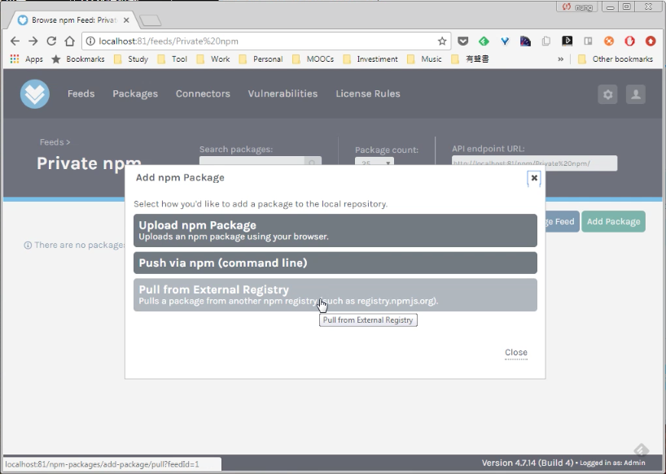
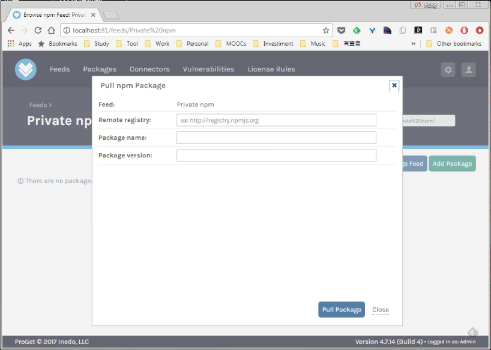
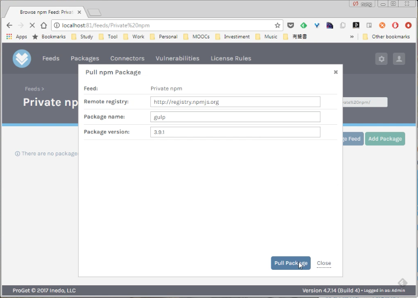
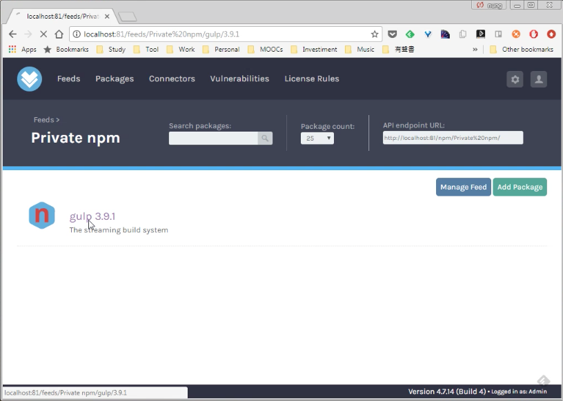
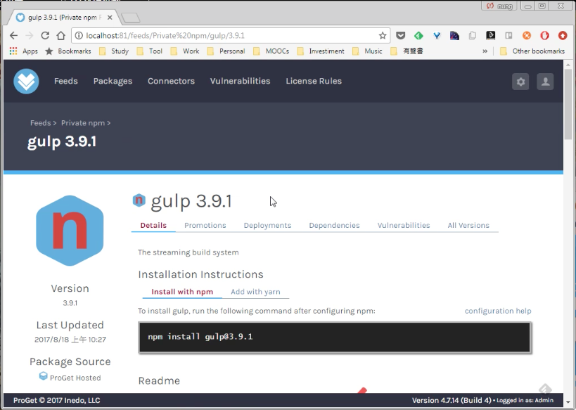

要拉外部 registry 的 npm 套件到 ProGet 的 npm feed，可在 ProGet 的 npm feed 頁面按下 Add Package 按鈕。   

<!-- More -->

 

點選 Pull from External Registry。   

 

 

填入 Registry 位置、套件名稱、套件版本，按下 Pull Package 按鈕。  

 

即會從指定的 Registry 位置拉指定版本的套件到 ProGet 的 npm feed。  

 

 
