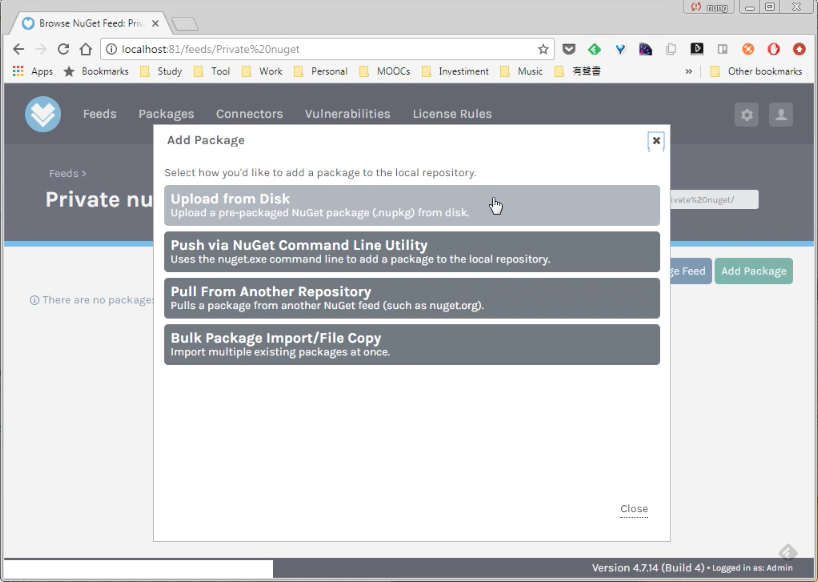
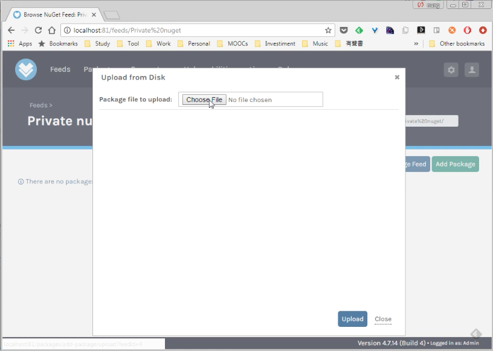
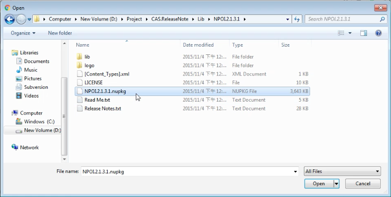
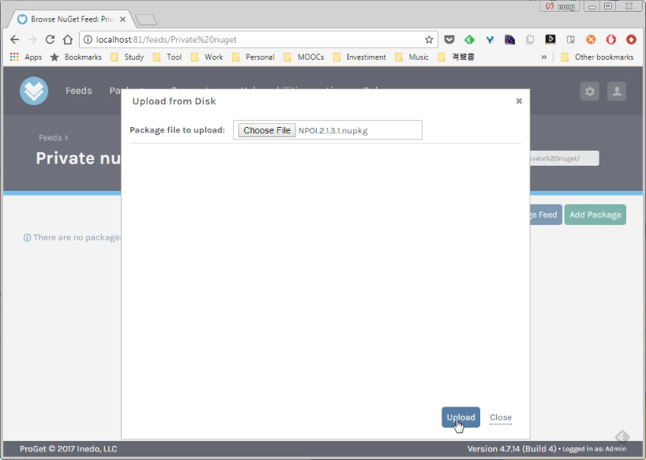
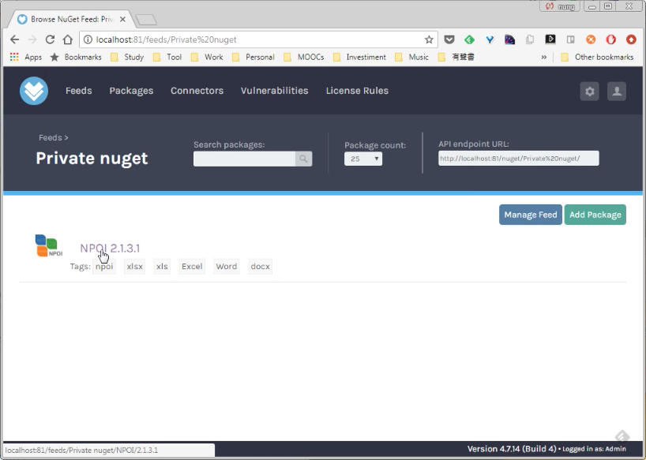
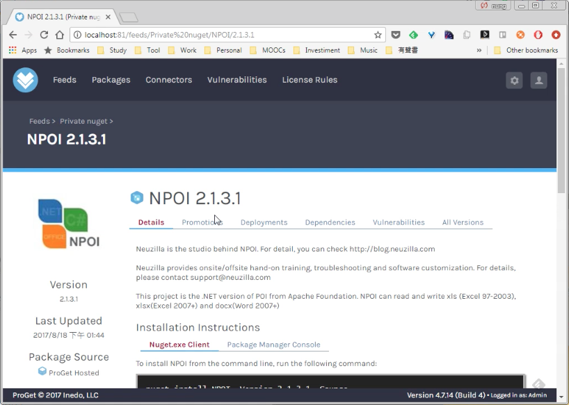

要從本地上傳 NuGet 套件到 ProGet 的 NuGet feed，可在 ProGet 的 NuGet feed 頁面按下 Add Package 按鈕。  

<!-- More -->

 

點選 Upload from Disk。  

 

按下 Choose File 按鈕。  

 

選取要上傳的 NuGet 套件。  

 

按下 Upload 按鈕。  

 

選取的套件即會上傳到 ProGet 的 NuGet feed。  

 

 
