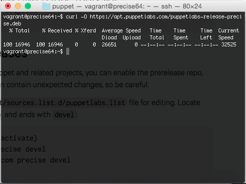
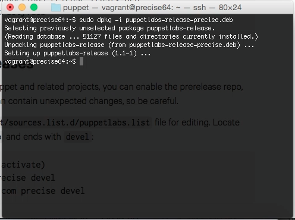
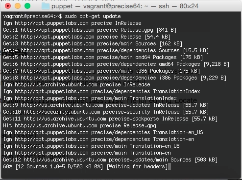
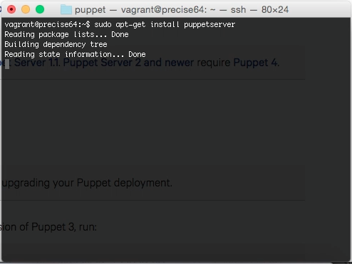

要透過 apt 安裝 Pupper server，需要開啟 package repository。  

<!-- More -->

 

首先要先依作業系統的版本下載 puppetlabs-release。  

 

Ubuntu 12.04  

    curl -O https://apt.puppetlabs.com/puppetlabs-release-precise.deb

 

Ubuntu 14.04  

    curl -O https://apt.puppetlabs.com/puppetlabs-release-trusty.deb

 

下載完用 dpkg 安裝下載的套件。  

    dpkg -i <PACKAGE NAME>

 

安裝完更新 apt 套件的清單。  

    sudo apt-get update

 

最後用 apt 安裝 puppetserver 即可。  

    sudo apt-get install puppetserver

 

Link
----
* [Installing Puppet: Debian and Ubuntu — Documentation — Puppet](https://docs.puppet.com/puppet/3.8/install_debian_ubuntu.html#step-2-install-puppet-on-the-puppet-master-server)
