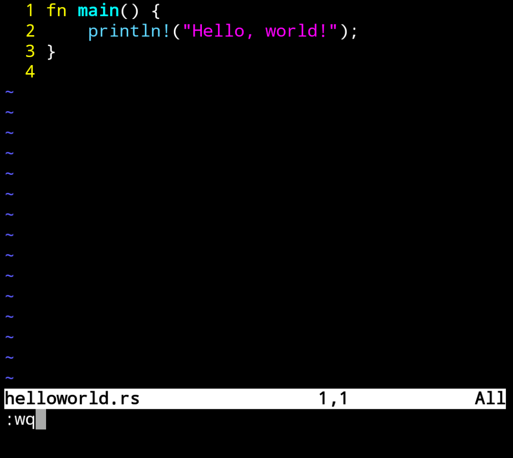
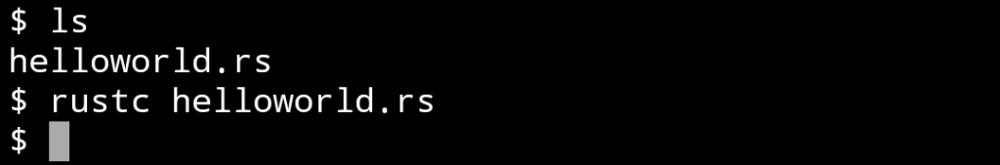
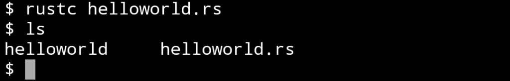
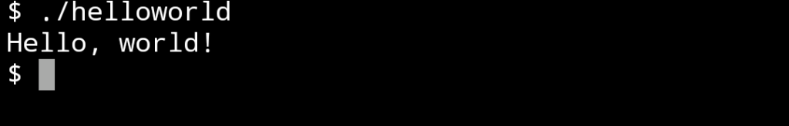

Rust 安裝後來撰寫個簡單的程式上手一下。  

<!-- More -->

</br>


開啟編輯器撰寫如下程式:  

```rust
fn main() {
  println!("Hello, world!");
}
```



</br>


程式只是很簡單的輸出 Hello, world!，程式記得存檔的副檔名為 rs。  

</br>


然後調用命令編譯程式。  

    rustc $file



</br>




</br>


調用編譯出來的檔案即可看到程式運行的結果。  


