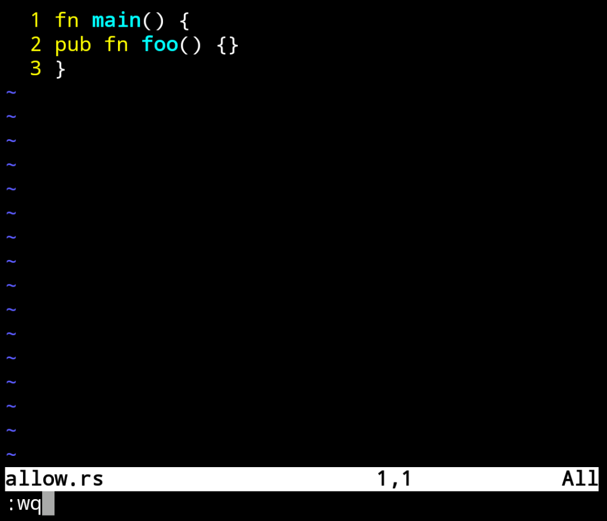
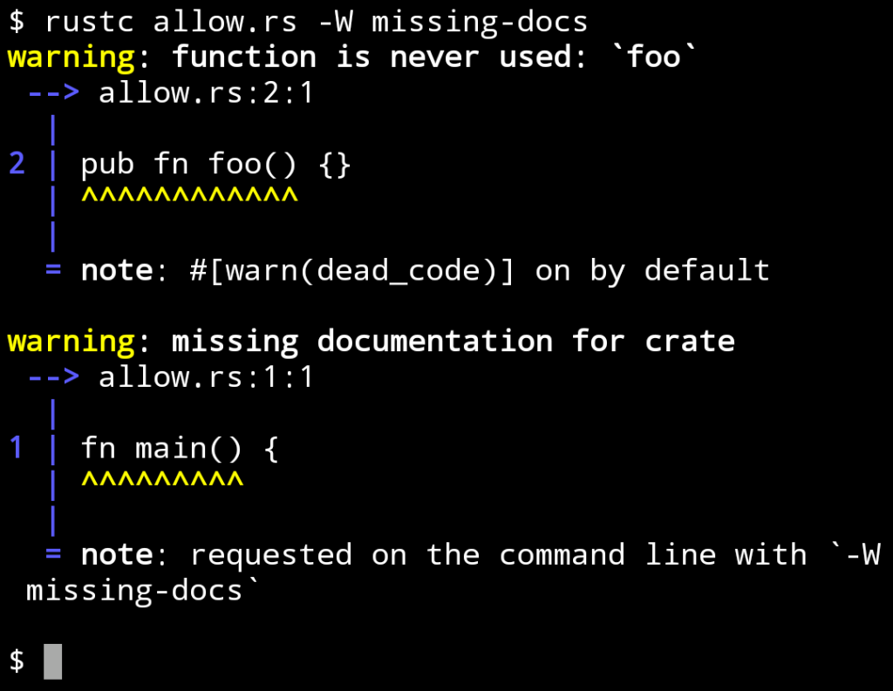
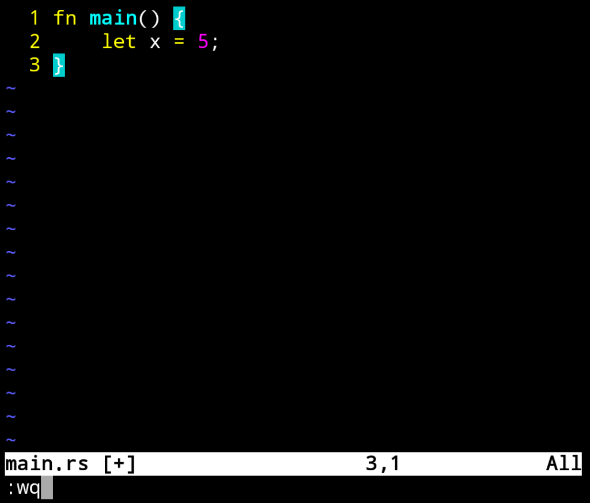
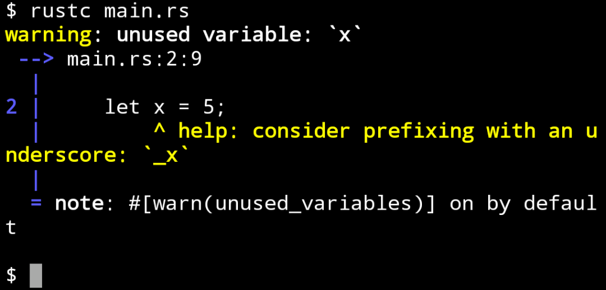
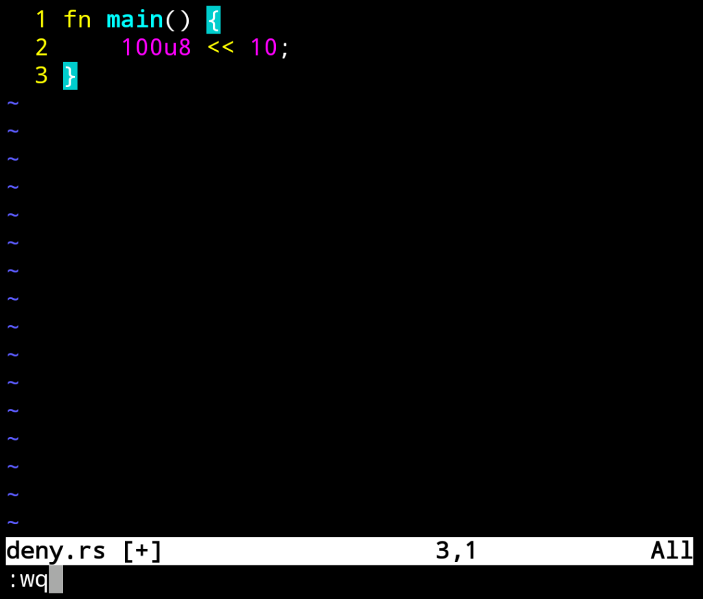
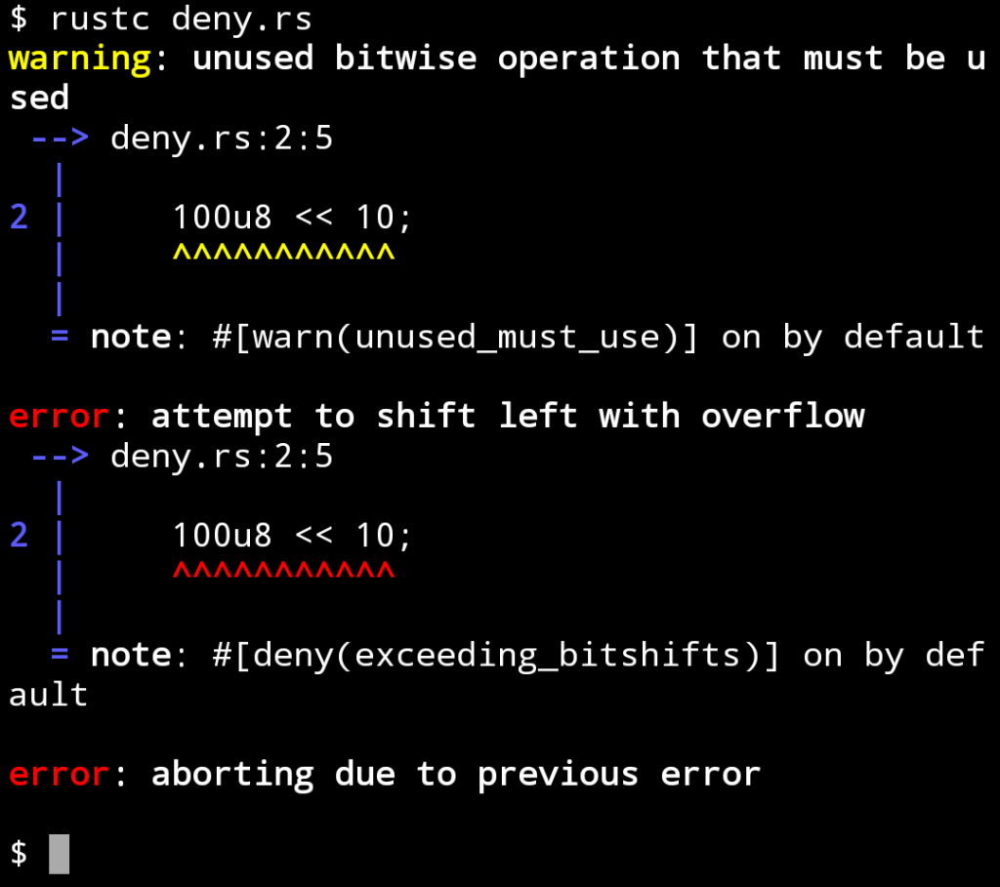
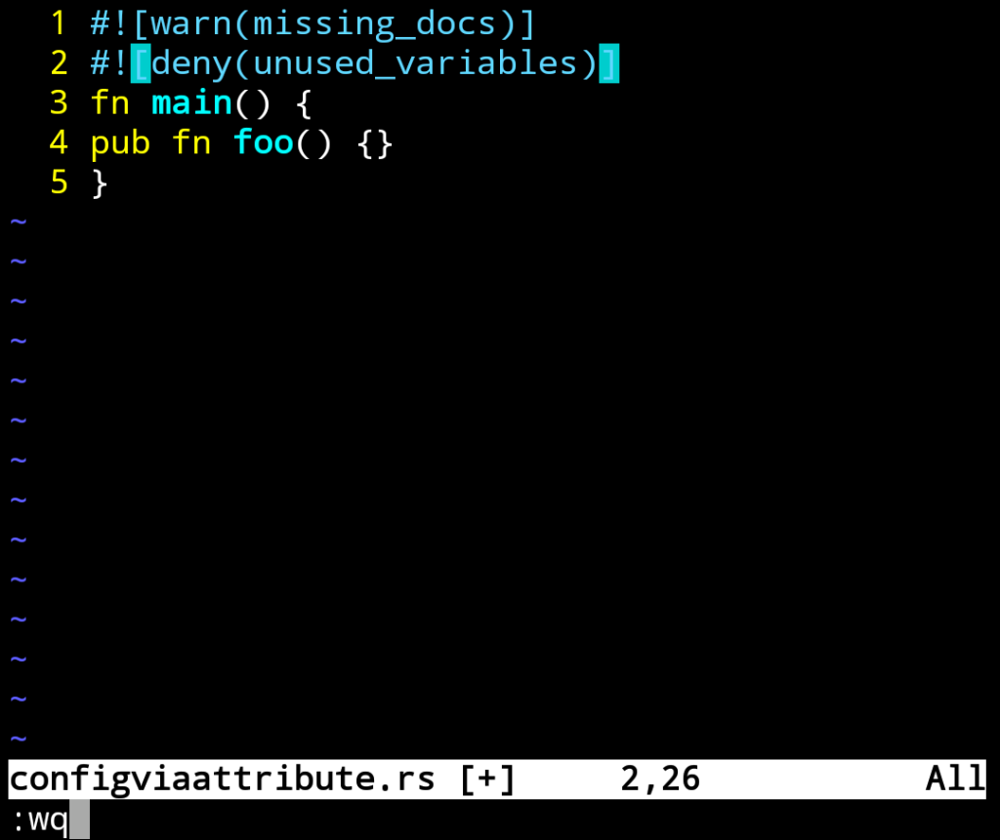
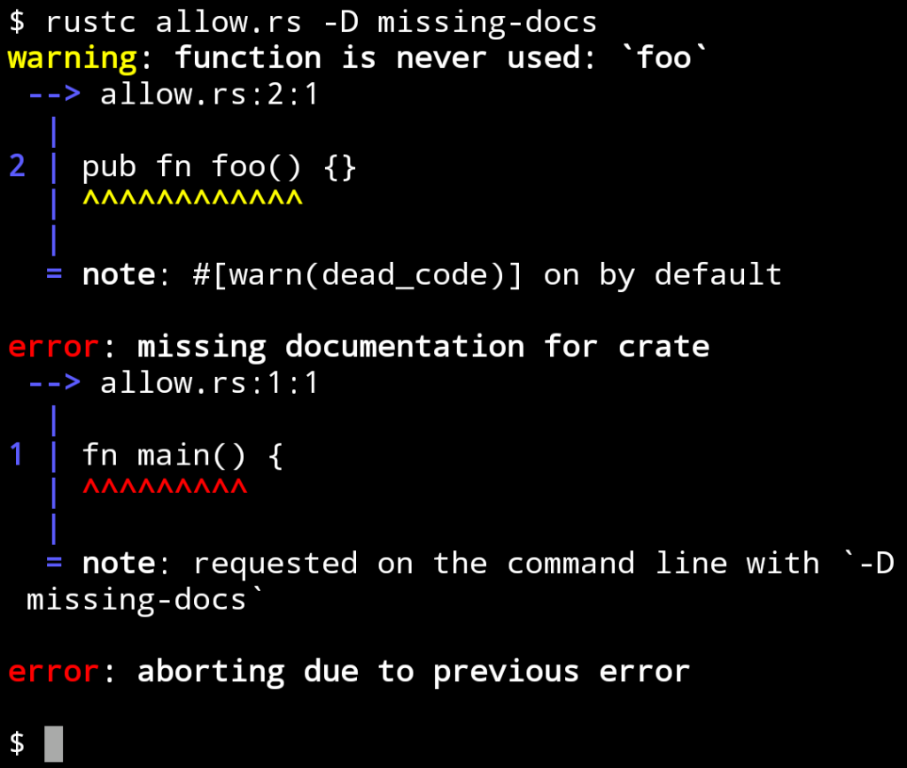
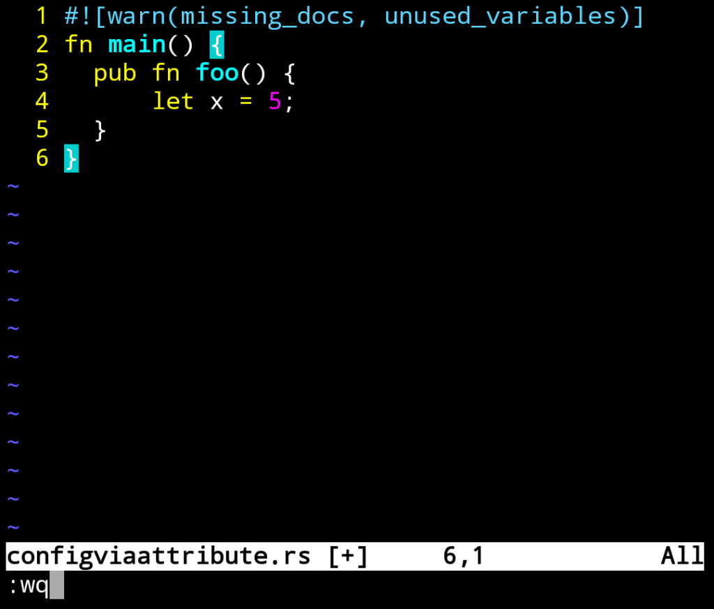
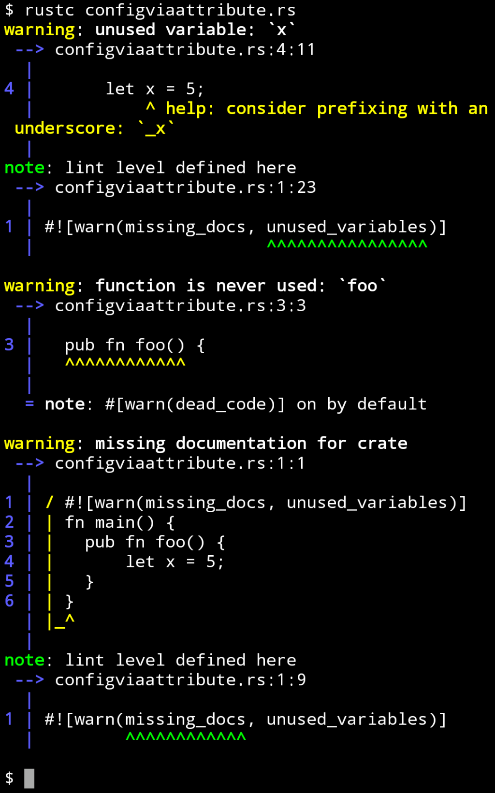

Rust 內建程式碼分析功能，在編譯時會針對程式碼進行分析。  

<!-- More -->

 

分析出來的問題分為 allow、warn、deny、forbid 這幾個等級。  

 

allow 是被允許的問題，預設是不會顯示的，若有需要可手動將它轉成其它等級。  

 

在編譯時可帶入 -W、-D、-F 將指定的 allow 等級問題轉為 warn、deny、forbid 等級，這樣就可以在編譯時看到問題。  

    rust -W $issue
    rust -D $issue
    rust -F $issue

 

 

如果是 allow 等級以外的問題，直接編譯就可以偵測到。  

 

像是 warn。  

 

 

deny...

 

 

或是 forbid。

 

如要轉換問題等級，除了用上面提到的命令參數外，也可以透過 attribute 的方式指定。  

 

 

 

 

Link
====
* [Lint levels - The rustc book](https://doc.rust-lang.org/rustc/lints/levels.html)
