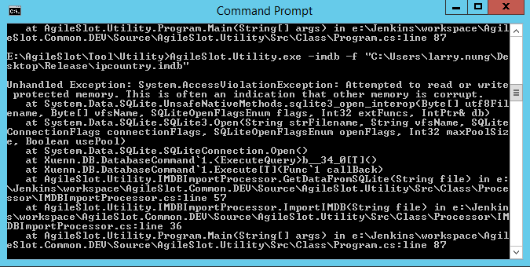
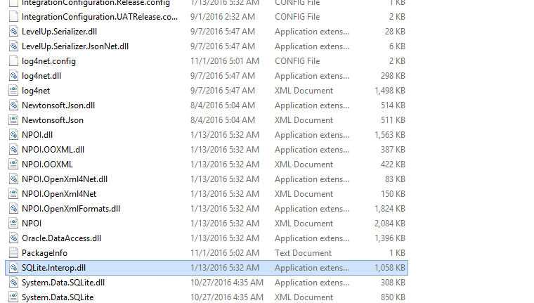

最近在使用 SQLite 讀取資料時，程式運行出現了 `System.AccessViolationException: Attempted to read or write protected
  memory` 這樣的訊息。  

<!-- More -->

 

反覆查驗後發現因為目錄有個殘留的 SQLite.Interop.dll 這個檔案所導致，將此檔刪除即可正常運作。  

 
