要將 Slack 與 Skype 串接，可在 Slack 中加入 Sameroom App。  

<!-- More -->

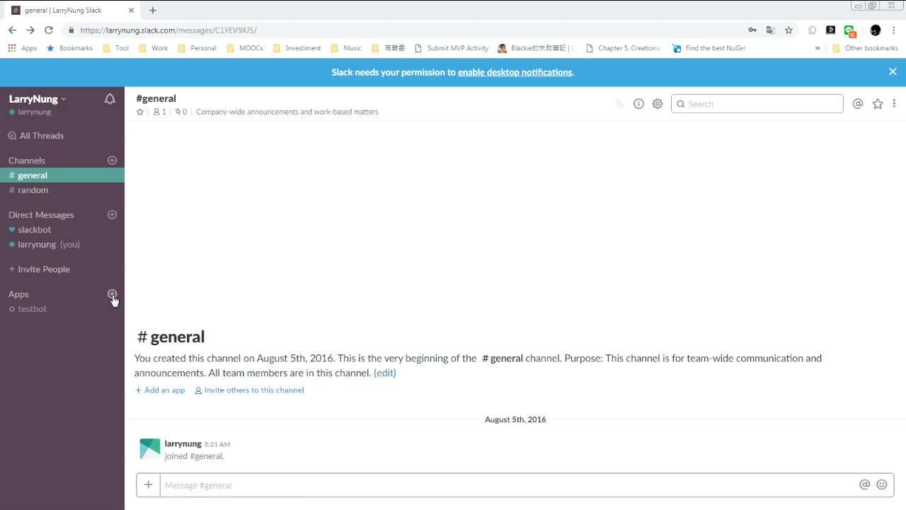

 

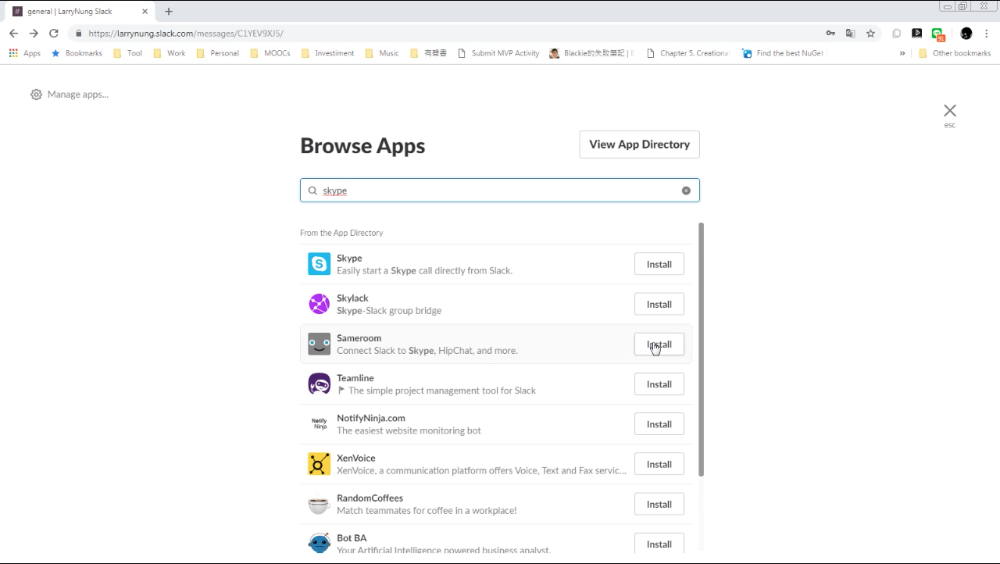

 

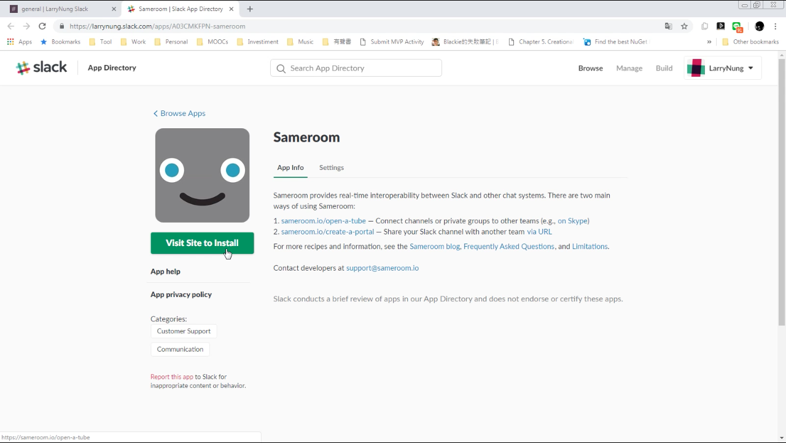

 

在 Samefoom 這邊選取連接 Skype。  

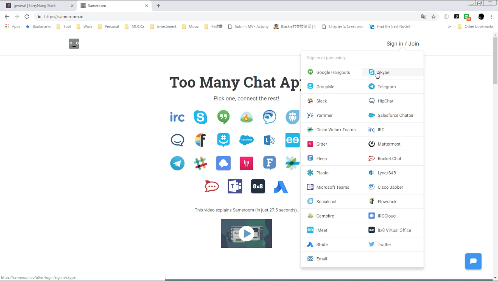

 

點選 add the Skype BridgeBot。  

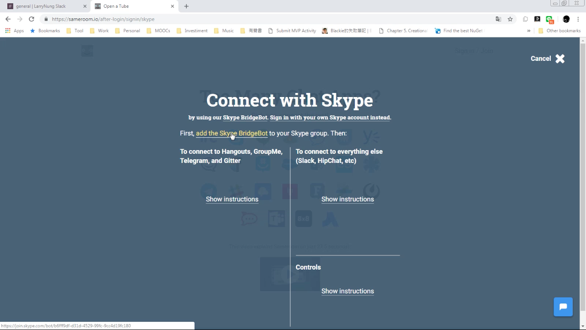

 

按下 Add to Contacts 按鈕將 Sameroom 加入 Skype 通訊人。  

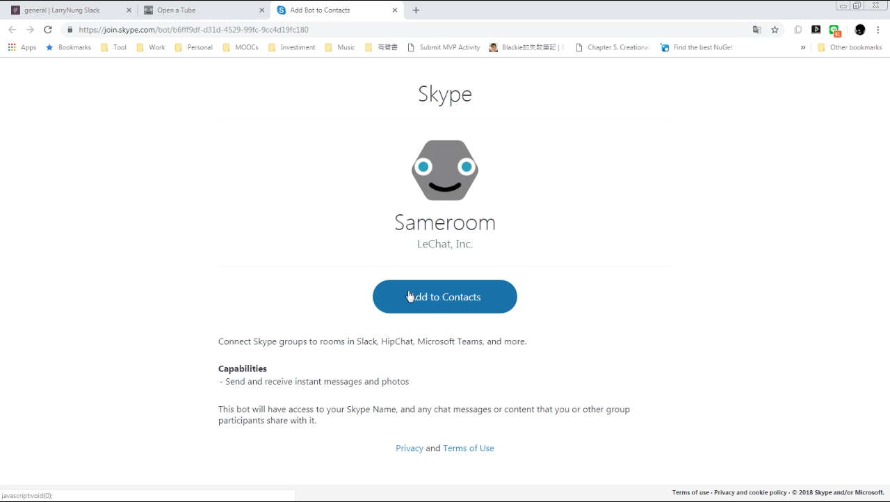

 

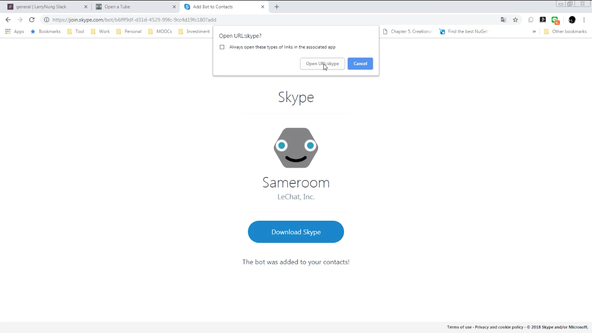

 

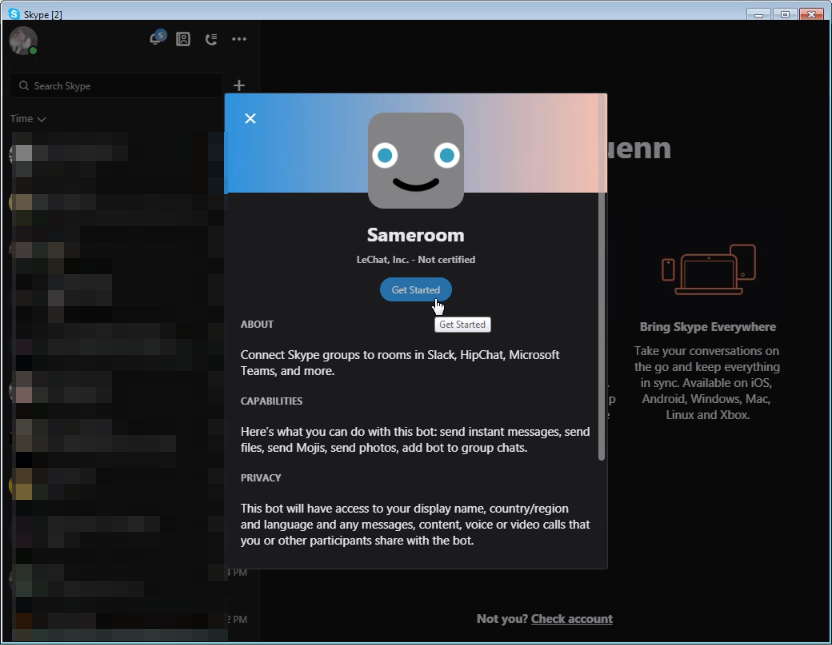

 

在要跟 Sameroom 連接的聊天室加入 Sameroom，然後發送 -sameroom portal 命令。Sameroom 會傳送一個連結，點擊該連結。  

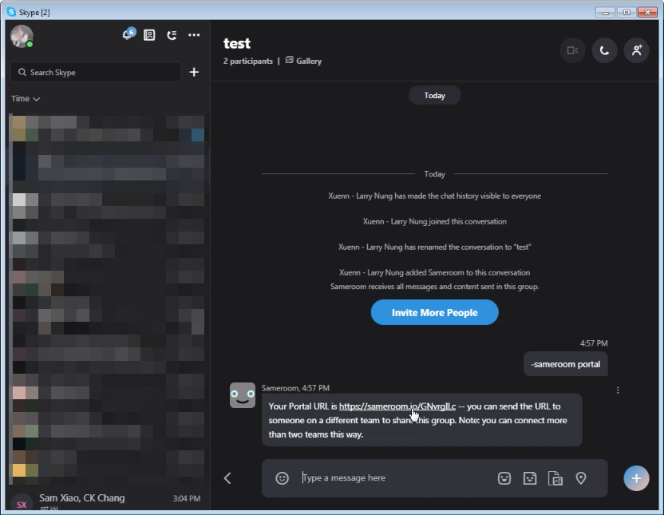

 

在開啟的頁面設定要連接的 Slack 帳號以及 channel。  

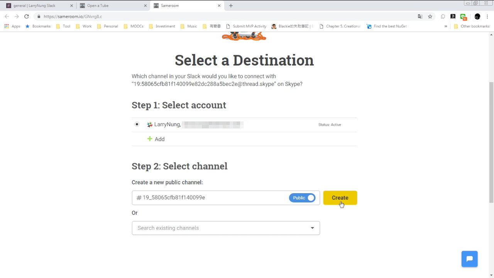

 

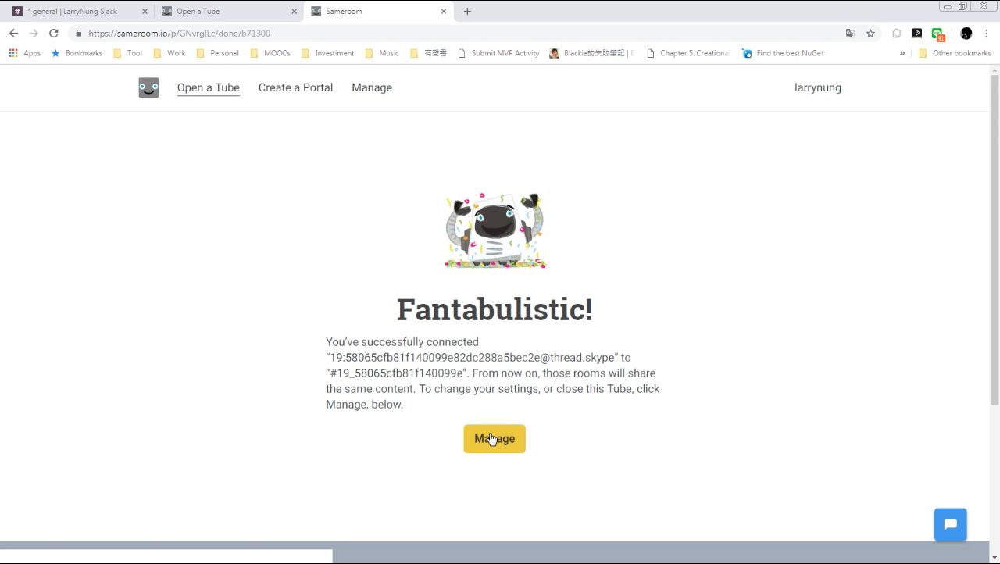

 

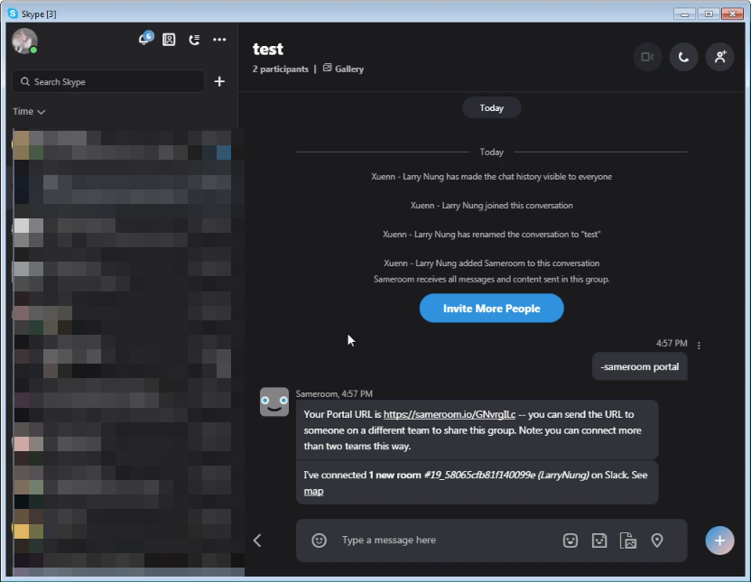

 

連接後我們在 Skype 發送的訊息就會被 Sameroom 轉送到 Slack 的指定 channel 上，在 Slack 中回應也會被 Sameroom 轉送到 Skype 上。  

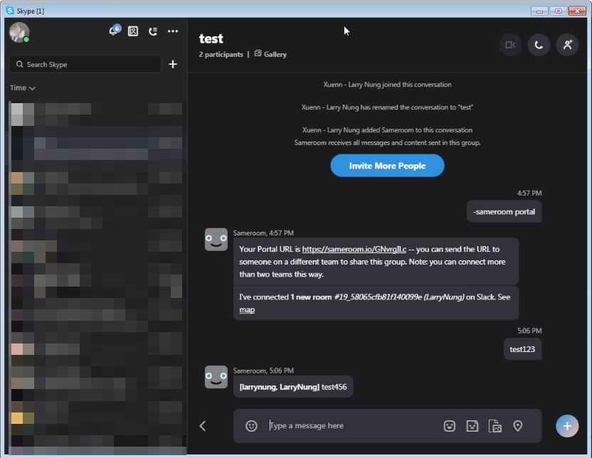

 

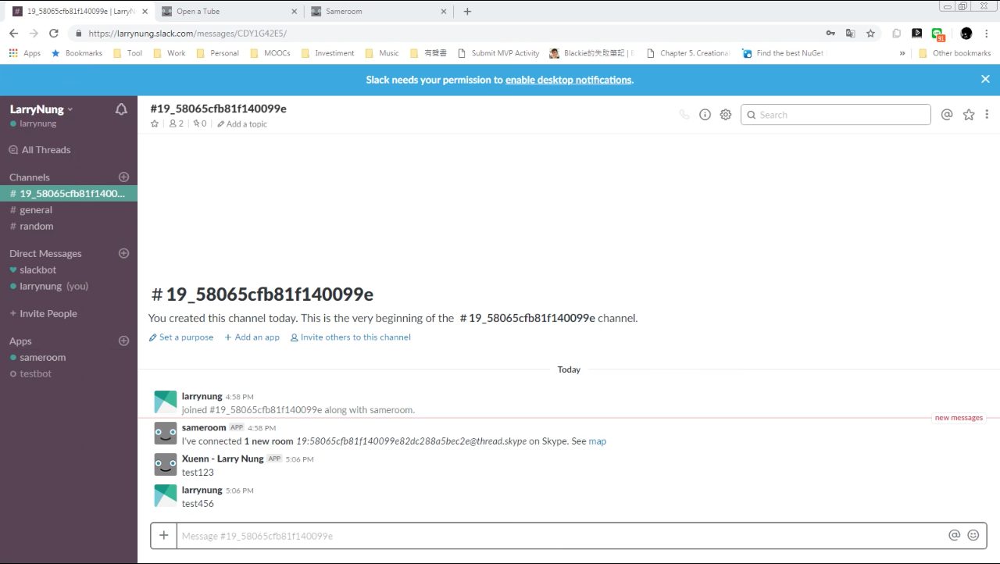

 

Link
----
* [Sameroom](https://sameroom.io/)
