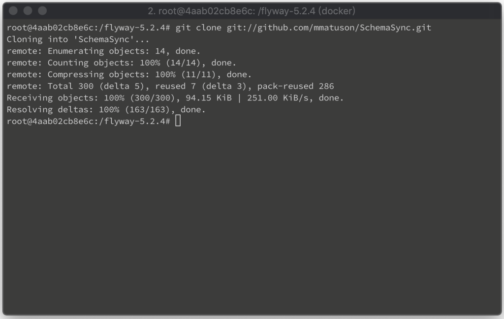
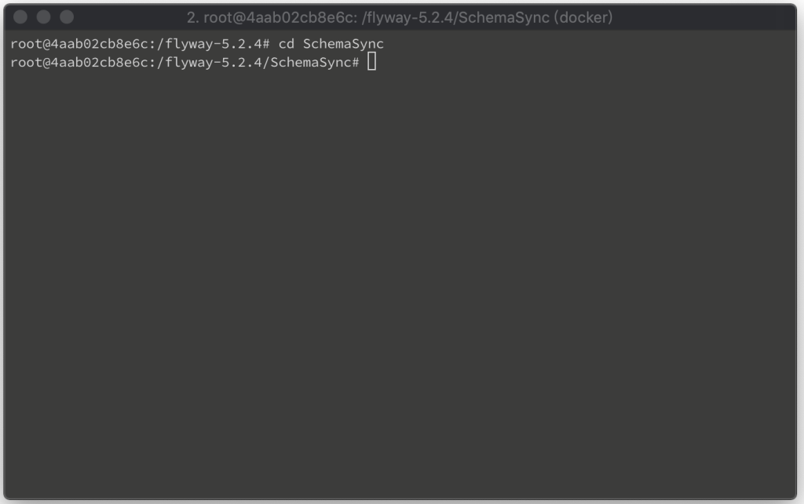
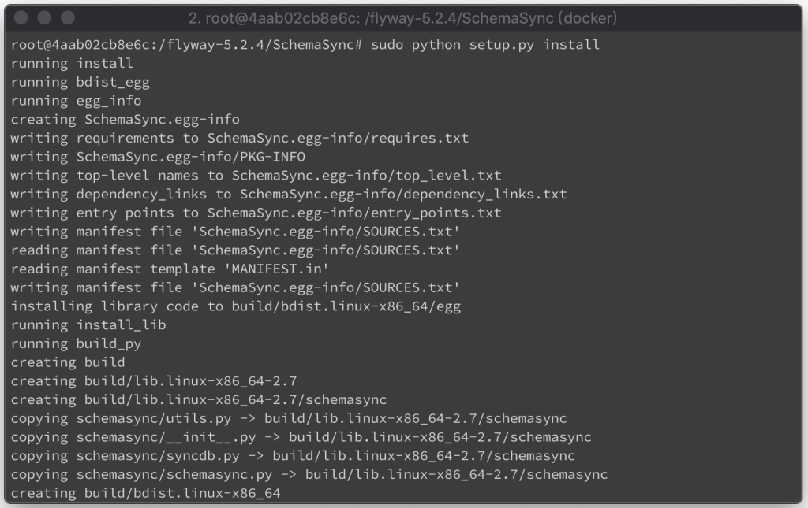
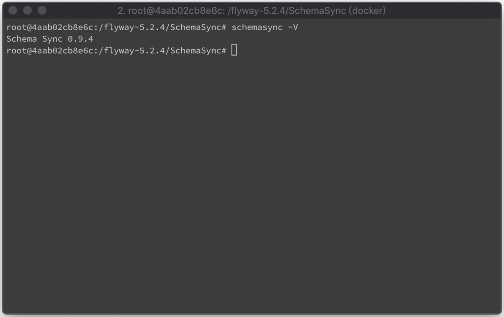

要安裝 SchemaSync 最新的開發版，先將 SchemaSync 用 git clone 下來。

<!-- More -->

    git clone git://github.com/mmatuson/SchemaSync.git

 

然後切到 clone 下來的目錄。 

    cd SchemaSync

 

透過 Python 調用 setup.py 進行安裝。  

    sudo python setup.py install

 

安裝完可調用命令查驗版本，確認安裝無誤。  

    schemasync -V

 

Link
=====
* [Schema Sync a MySQL Schema Versioning and Migration Utility](http://mmatuson.github.io/SchemaSync/)
