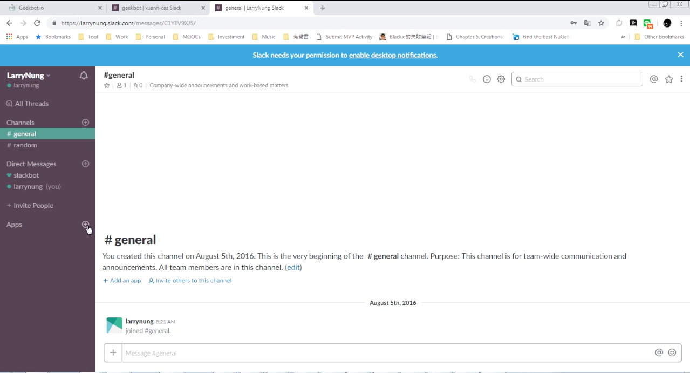
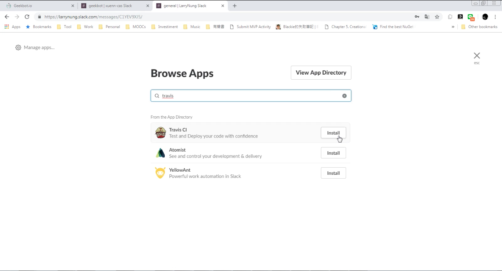
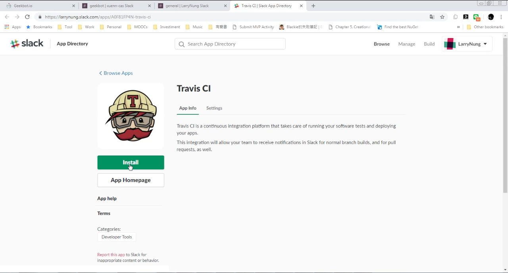
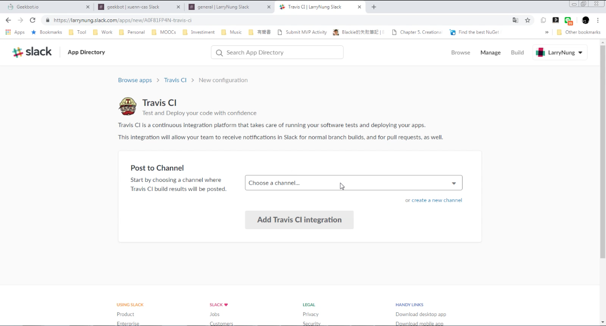
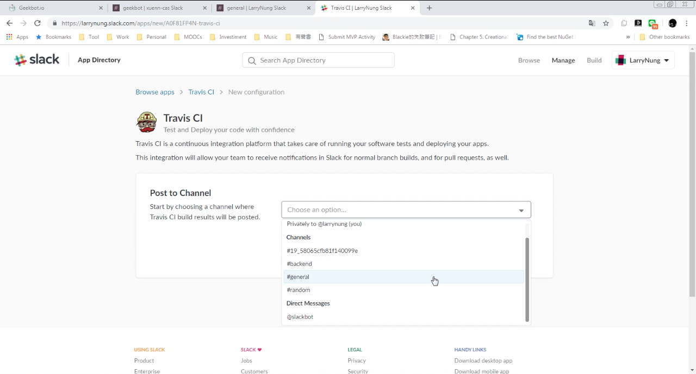
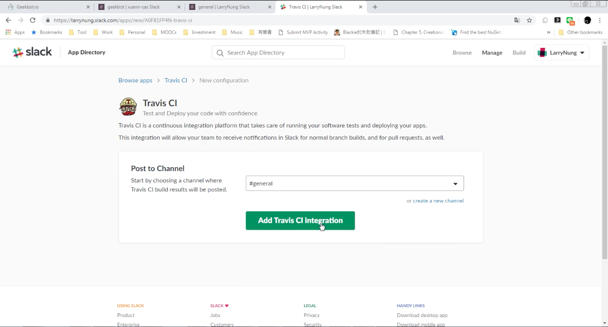
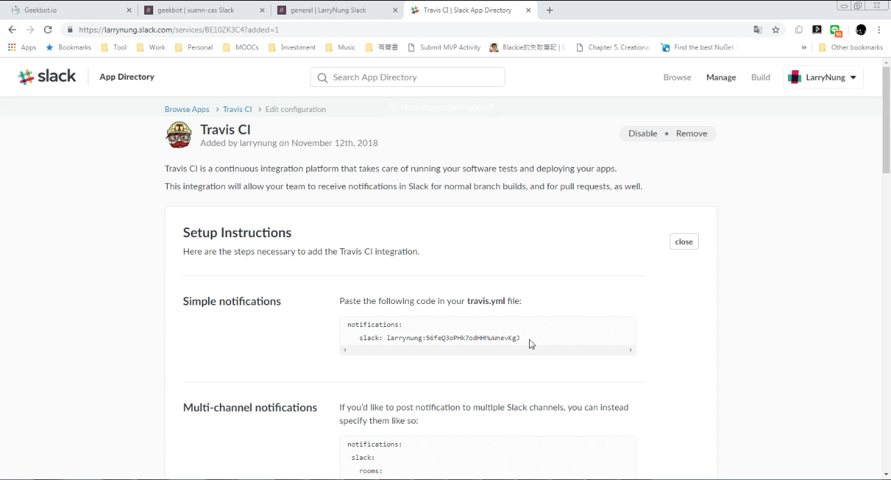
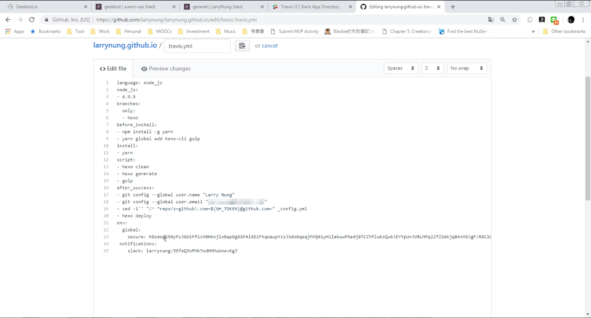
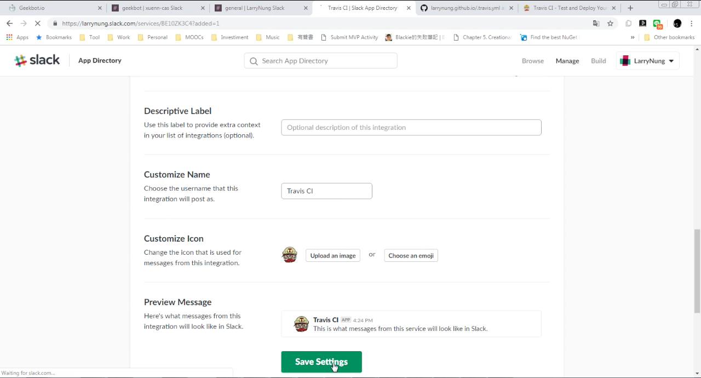
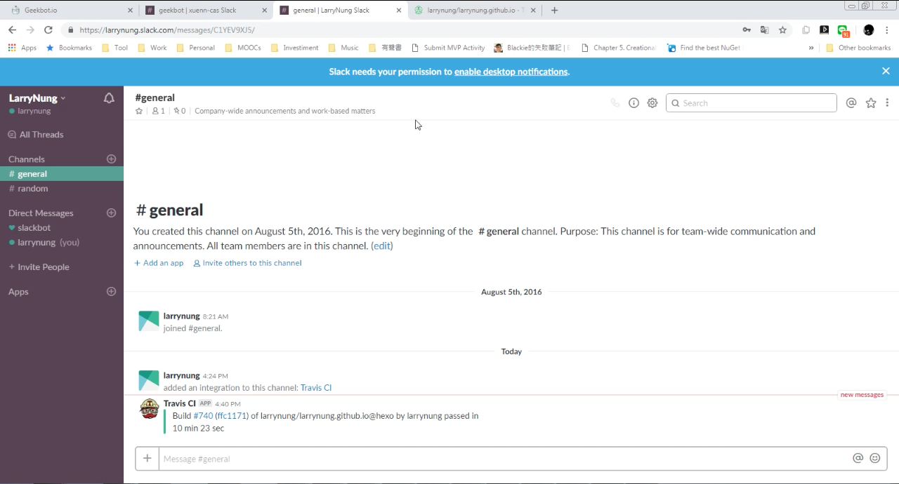

要使用 Slack 接收 Travis CI 的建置通知訊息，可在 Slack 中加入 Travis CI App。  

<!-- More -->

 

 

 

選取 Travis CI 建置通知訊息收到後要顯示在哪個 Channel。  

 

 

選好後按下 Add Travis CI Integration 按鈕。  

 

接著照著教學設置 Travis CI 的設定檔。  

 

 

再接著設置 Travis CI App 的名字、描述、圖示等，設置完後按下 Save Settings 按鈕存檔。  

 

後續 Travis CI 建置時。Slack 就可以在指定的 Channel 收到對應的建置通知。  

 

Link
