SonarQube 除了自行架設外，也提供了線上的版本可供使用，開源專案可以免費使用。  

<!-- More -->

 

透過點擊 SonarQube 網站上的 USE ONLINE 按鈕可直接連結過去。  

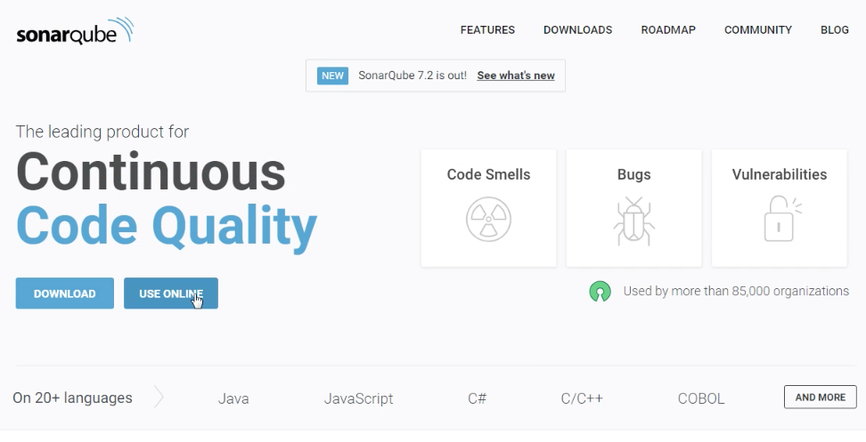
 
 

選擇要使用的登入帳號。  

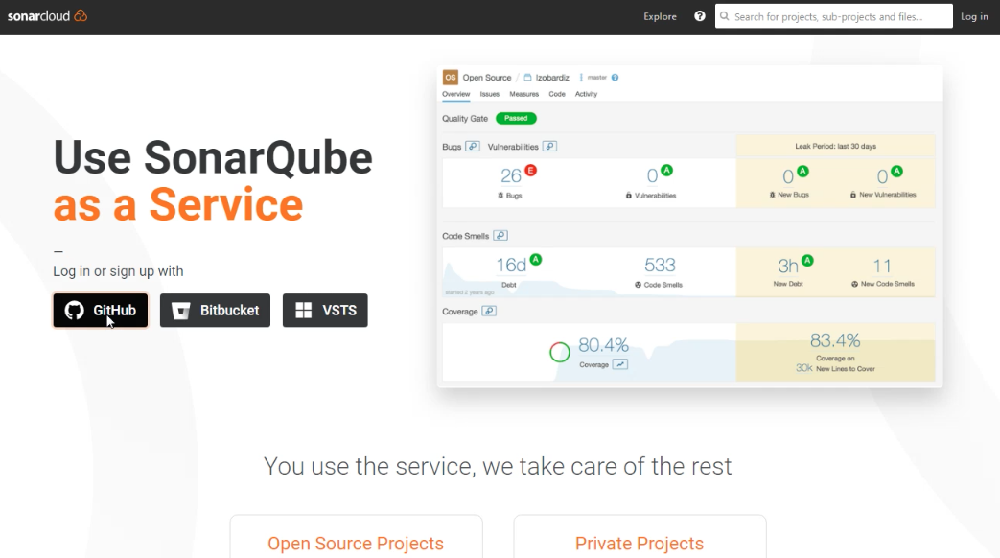
 
 

登入後會看到 SonarQube 的介面，點選 Analyze new project 開啟一個新的專案。  

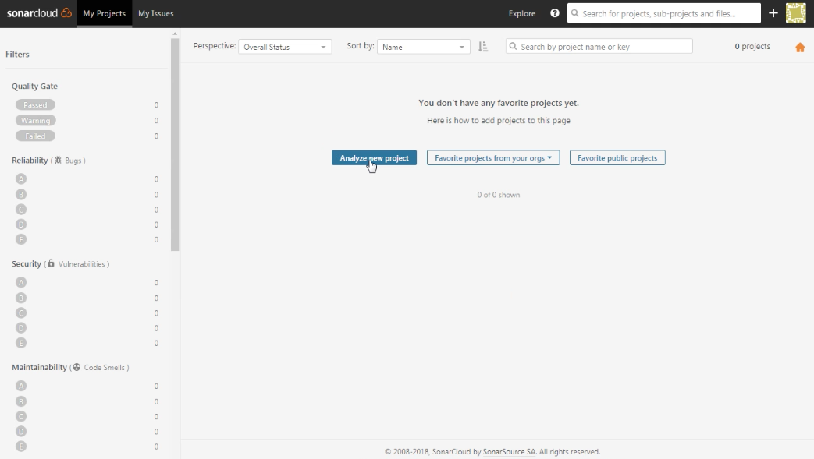
 
 

選取專案所屬的組織。  

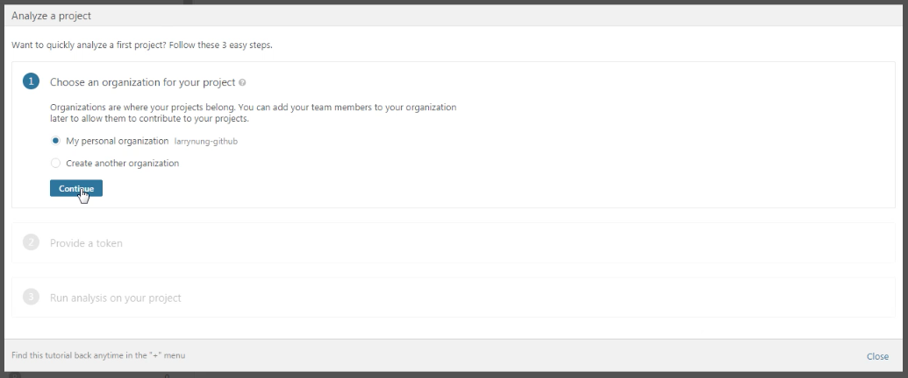
 
 

產生後續認證要用的 Token 或是直接使用已經存在的 Token。  

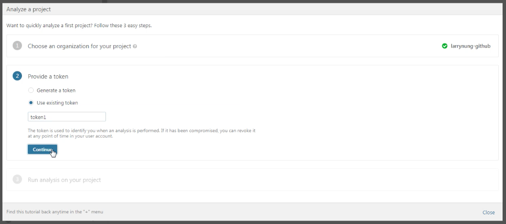
 
 

選取專案的主要開發語言。  

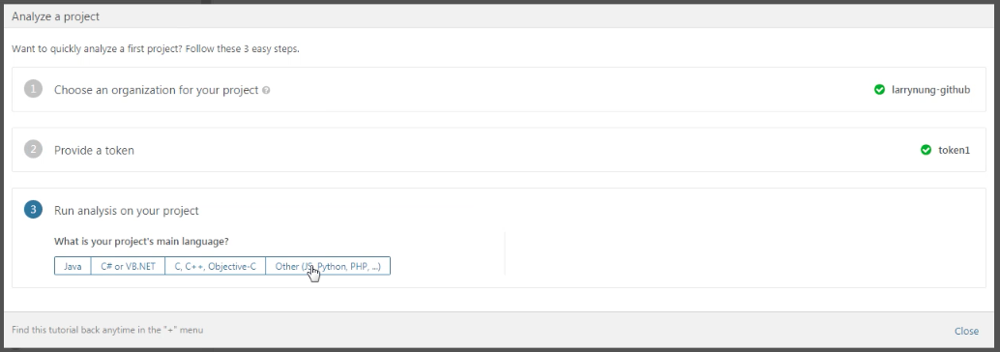
 
 

選取所使用的作業系統。  

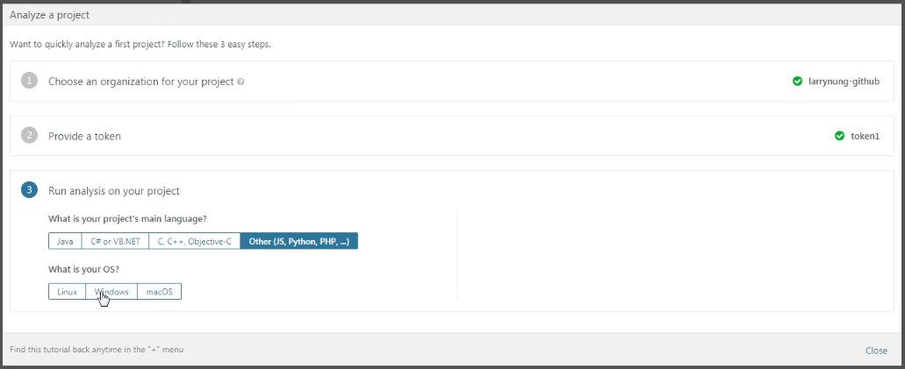
 
 

設定專案的 Project key。  

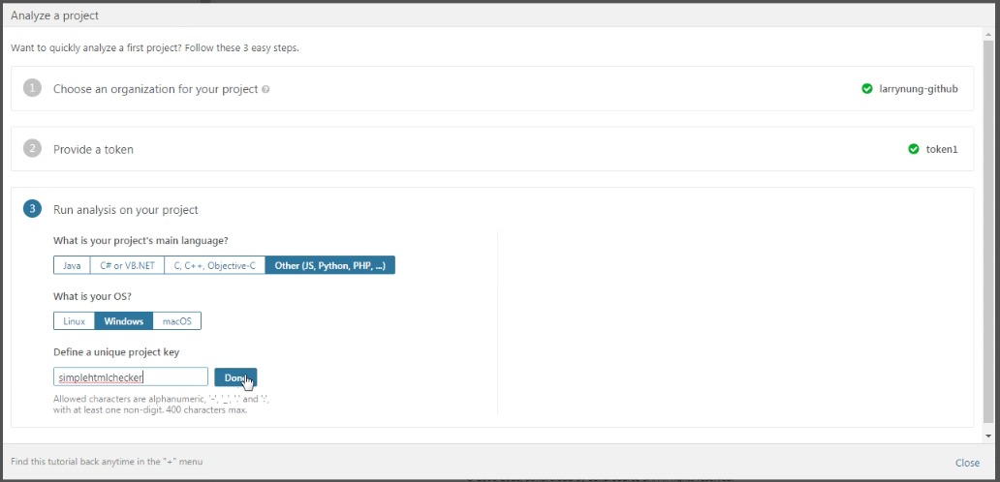
 
 

右側會帶出 Sonar scanner 的下載位置以及所屬作業系統下的指令下法，這邊可以按下 Copy 按鈕先將指令複製下來。  

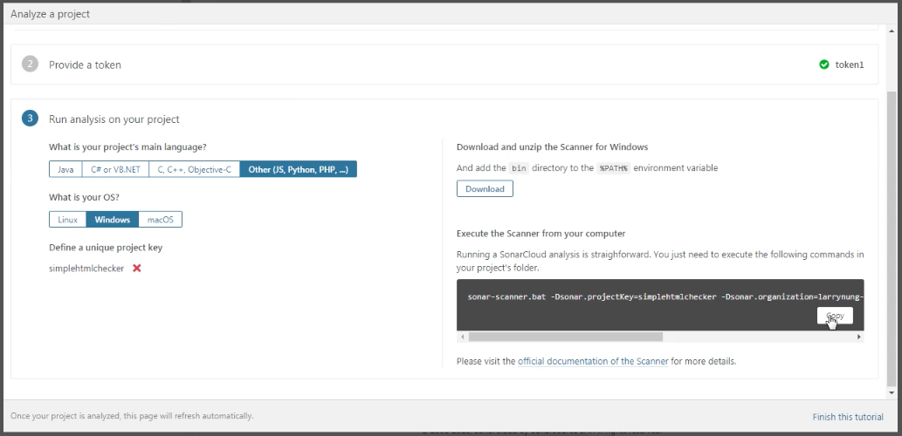
 
 

點選 Finish this tutorial 結束設定。  

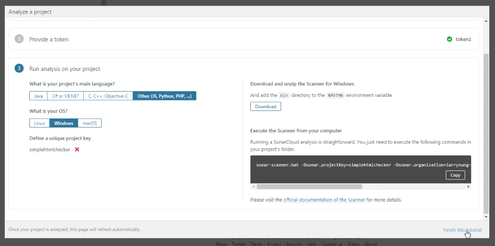
 
 

設定完會看到對應的專案已被建立在 SonarQube 上。  

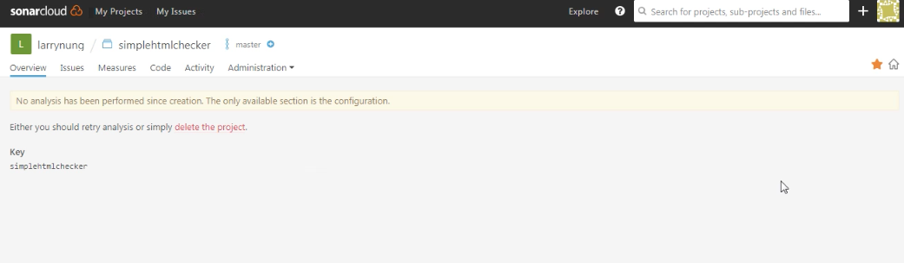
 
 

在專案程式目錄下實際調用剛剛所複製的命令，SonarQuber Scanner 即會開始分析專案程式，並將分析的結果送至 SonarQube。  

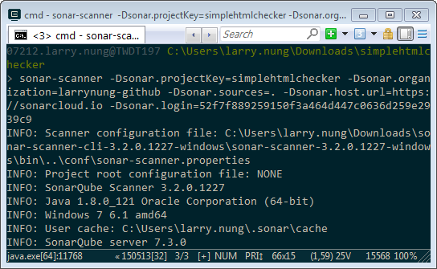
 
 

分析完就可以在 SonarQube 的專案頁面看到分析的結果。  

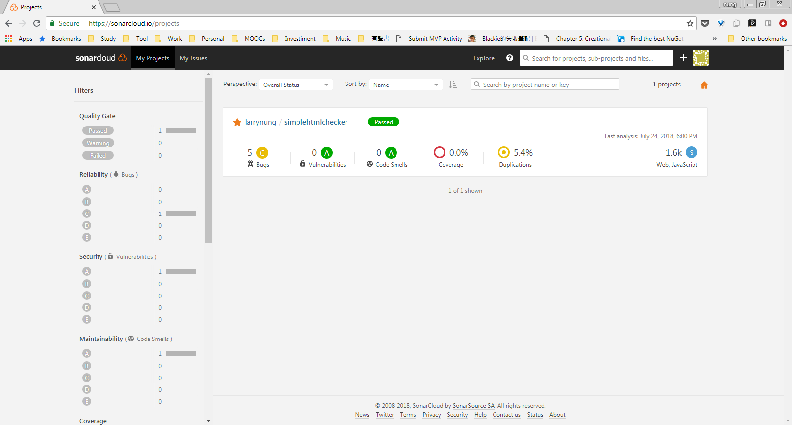
 
 

Link
----
* [Continuous Inspection | SonarQube](https://www.sonarqube.org/)
