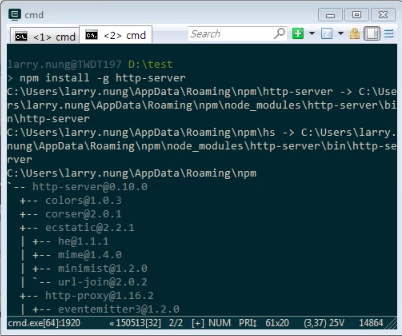
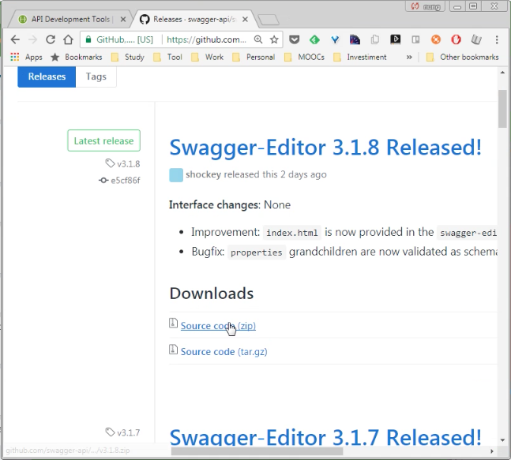
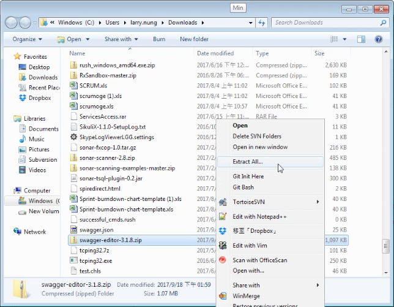
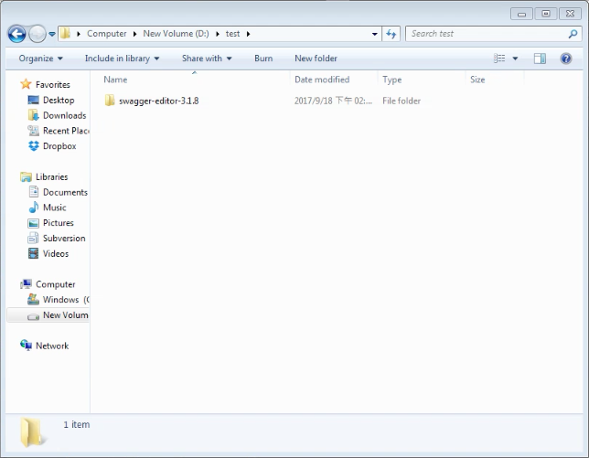
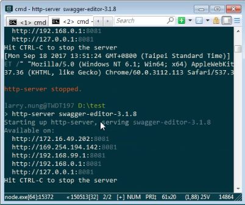
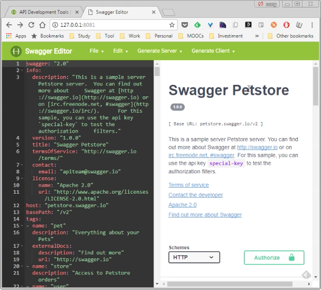

要使用 http-server 自行架設 Swagger Editor，可透過 npm 進行 http-server 的安裝，  
<!-- More -->

    npm install -g http-server

 

然後至 Swagger Editor 的 GitHub 上下載 Swagger Editor 的壓縮包。  

 

解開壓縮包。  

 

 

用 http-server 啟用 Swagger Editor 服務。  

 

即可使用啟用的 Swagger Editor 服務。  

 

Link
----
* [Swagger Editor - Swagger](https://swagger.io/swagger-editor/)
