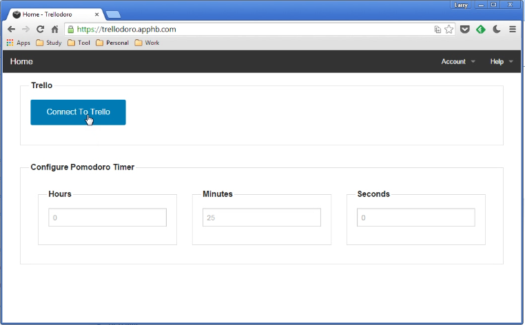
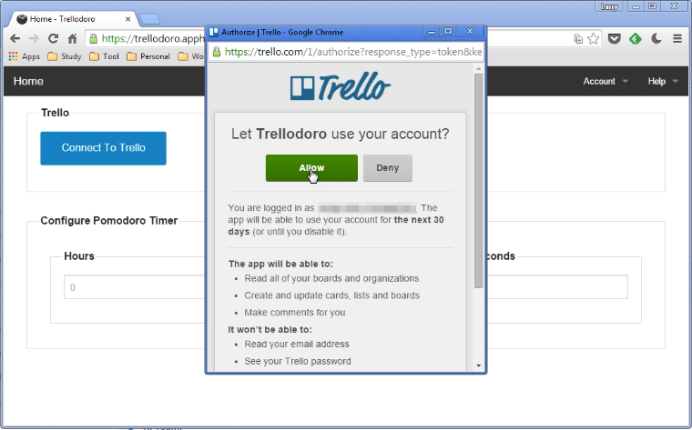
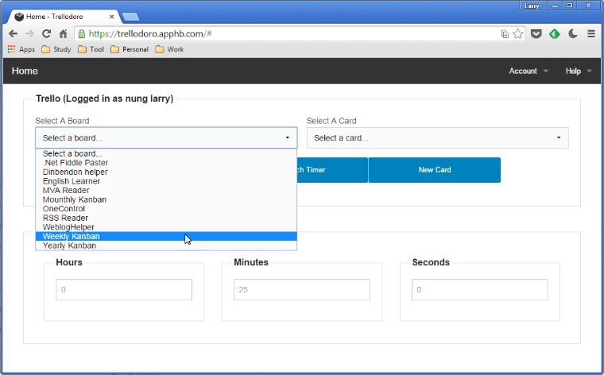
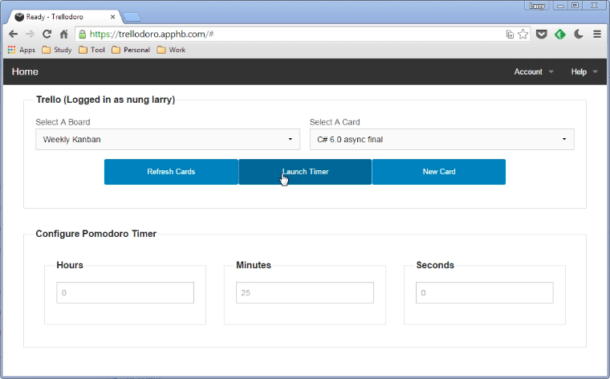
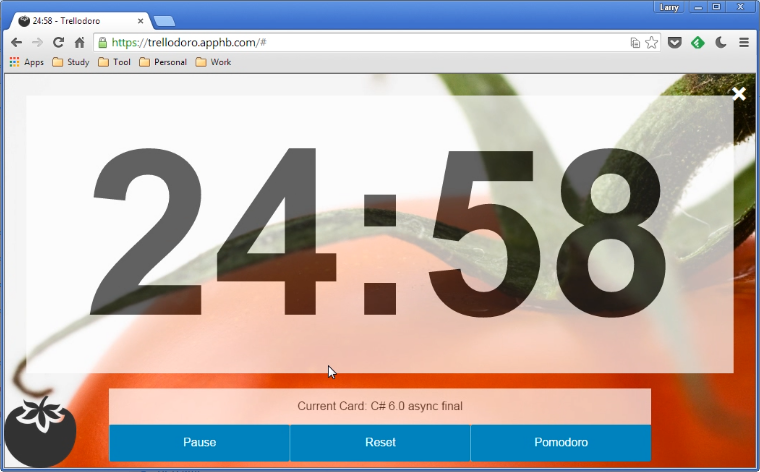

Trellodoro 是一整合 Trello 與蕃茄鐘的工具，使用時需連結 Trello。  

<!-- More -->

 
 

授與存取權限。  

 
 

選取要使用的 Trello board 及要進行的 Task。  

 
 

調整蕃茄鐘的時間設定，最後點選 Launch Time 按鈕。  

 
 

蕃茄鐘就會開始倒數。  

 
 

當蕃茄吃完，它會更改對應的 Trello card 讓你知道吃了幾顆蕃茄。  

Link
----
* [Home - Trellodoro](https://trellodoro.apphb.com/)
