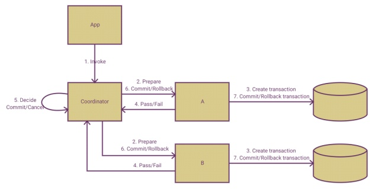

Two-phase commit protocol 簡稱 2PC，也就是所謂的二階段提交。可用來解決分散式服務架構下各服務之間交易資料一致性問題。  

<!-- More -->

 

該做法有幾個假設前提：  

1. 該分散式系統中，存在一個節點作為協調者(Coordinator)，其他節點作為參與者(Participants)。且節點之間可以進行網絡通信。
2. 所有節點都採用預寫式日誌，且日誌被寫入後即被保持在可靠的存儲設備上，即使節點損壞不會導致日誌數據的消失。
3. 所有節點不會永久性損壞，即使損壞後仍然可以恢復。

 

2PC 會有協調者與參與者兩個角色，參與者就是系統中的服務，協調者負責協調參與者。  

 

流程上可分為兩個階段，一個是提交請求階段(Commit request (or voting) phase)，一個是提交執行階段(Commit (or completion) phase)。  

 

提交請求階段是讓所有需參與的參與者決定是否能處理這次的請求。其細部流程如下：  

1. 首先協調者會先通知需要參與的參與者做準備
2. 參與者收到通知後做準備
3. 參與者將準備結果告知協調者

 

提交執行階段會依參與者的回應決定是否繼續請求，並通知所有的參與者，參與者做完對應的處理後回應協調者。其細部流程如下：      
1. 協調者匯整參與者的回報
2. 決定要提交還是回滾交易
3. 通知參與者提交或回滾交易
4. 參與者通知協調者完成動作

 

這邊在交易的提交或回滾協調者會由參與者的回報決定，如果所有需參與的參與者都準備成功，就提交交易。反之，若有需參與的參與者準備失敗，則回滾交易。  

 

整個 2PC 流程做起來會像這樣。  

 

該演算法雖然能解決分散式交易的問題，但因為是阻塞式的演算法，交易存留時間會比較長，會有效能上的問題。  

 

Link
----
* [Two-phase commit protocol - Wikipedia](https://en.wikipedia.org/wiki/Two-phase_commit_protocol)
* [二階段提交 - 維基百科，自由的百科全書](https://zh.wikipedia.org/wiki/%E4%BA%8C%E9%98%B6%E6%AE%B5%E6%8F%90%E4%BA%A4)
